# 🎨 C# and .NET Core Interview Q&A

> Simple explanations, practical examples, and high-contrast Mermaid diagrams. Read each topic as: **What → How it works → Interview point**.

> **Diagram theme:** 🟨 yellow = important step, 🟦 blue = processing, 🟩 green = success, 🟥 red = failure or risk.

---

## 1. Value Types vs Reference Types

### Q: What is the difference?

**Answer:** A value type stores its value directly. A reference type stores a reference to an object. Copying a value type copies the data; copying a reference copies the address-like reference.

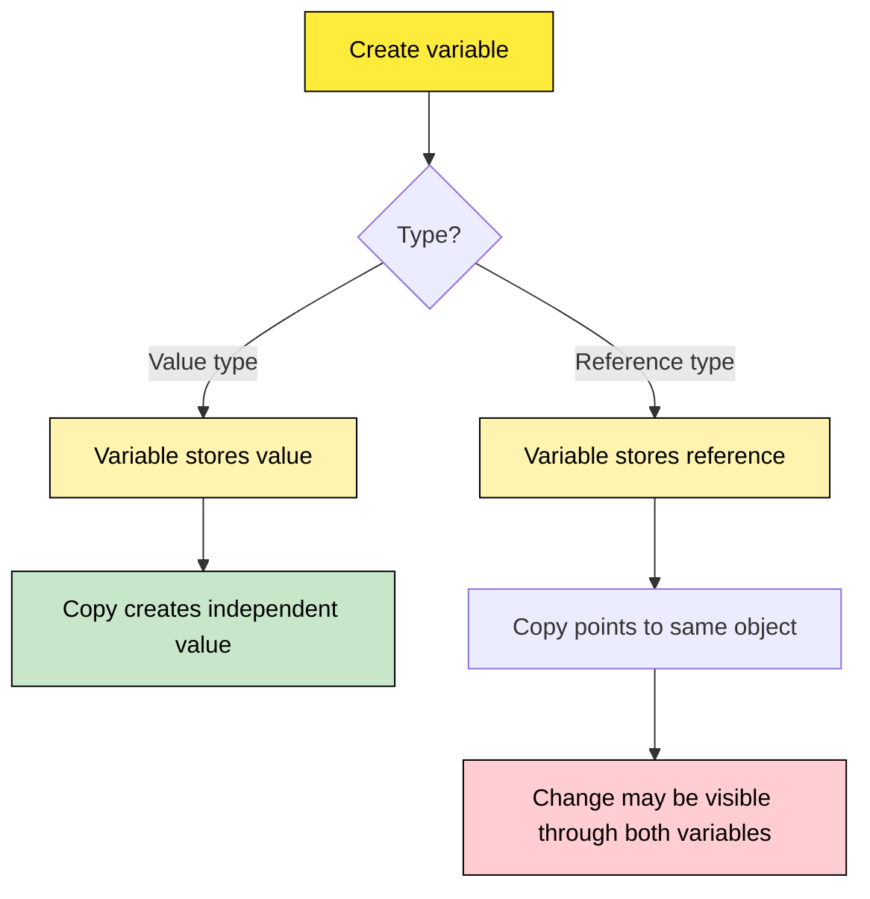
```mermaid
flowchart TD
    A[Create variable] --> B{Type?}
    B -->|Value type| C[Variable stores value]
    C --> D[Copy creates independent value]
    B -->|Reference type| E[Variable stores reference]
    E --> F[Copy points to same object]
    F --> G[Change may be visible through both variables]
    style A fill:#ffeb3b,color:#000,stroke:#000
    style C fill:#fff3b0,color:#000,stroke:#000
    style E fill:#fff3b0,color:#000,stroke:#000
    style D fill:#c8e6c9,color:#000,stroke:#000
    style G fill:#ffcdd2,color:#000,stroke:#000
```

**Interview point:** Boxing converts a value type into an object and may allocate on the managed heap.

---

## 2. Class vs Record vs Struct

### Q: When should you use each?

- **Class:** object identity, shared reference, inheritance.
- **Record:** data-focused model and value-based equality.
- **Struct:** small value-like data; avoid large mutable structs.

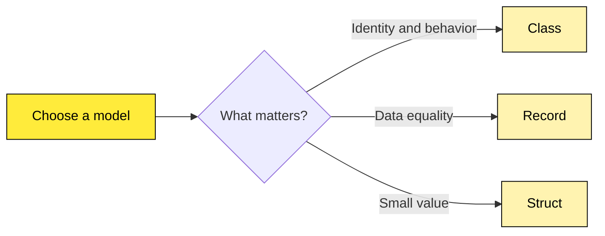
```mermaid
flowchart LR
    A[Choose a model] --> B{What matters?}
    B -->|Identity and behavior| C[Class]
    B -->|Data equality| D[Record]
    B -->|Small value| E[Struct]
    style A fill:#ffeb3b,color:#000,stroke:#000
    style C fill:#fff3b0,color:#000,stroke:#000
    style D fill:#fff3b0,color:#000,stroke:#000
    style E fill:#fff3b0,color:#000,stroke:#000
```

---

## 3. `async` and `await`

### Q: What happens internally when code reaches `await`?

**Answer:** The method runs normally until it meets an incomplete task. It then returns control to the caller. The compiler-generated state machine remembers where to continue. When the task completes, the continuation resumes the method.

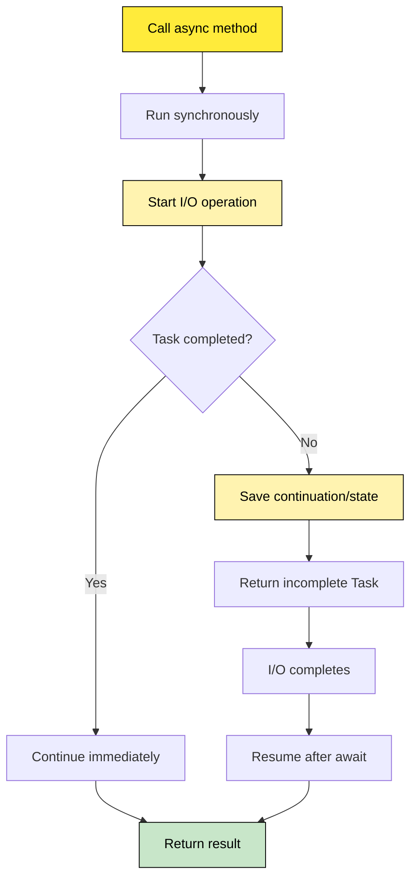
```mermaid
flowchart TD
    A[Call async method] --> B[Run synchronously]
    B --> C[Start I/O operation]
    C --> D{Task completed?}
    D -->|Yes| E[Continue immediately]
    D -->|No| F[Save continuation/state]
    F --> G[Return incomplete Task]
    G --> H[I/O completes]
    H --> I[Resume after await]
    E --> J[Return result]
    I --> J
    style A fill:#ffeb3b,color:#000,stroke:#000
    style C fill:#fff3b0,color:#000,stroke:#000
    style F fill:#fff3b0,color:#000,stroke:#000
    style J fill:#c8e6c9,color:#000,stroke:#000
```

**Remember:** `async` does not automatically create a new thread. For I/O, the thread is normally free while the external operation is pending.

---

## 4. `Task` vs `ValueTask`

### Q: What is the practical difference?

- `Task` is the normal, easy-to-use choice.
- `ValueTask` can help when a result is very often available synchronously and allocation reduction has been measured.
- `ValueTask` has usage restrictions and should not be introduced without a clear performance reason.

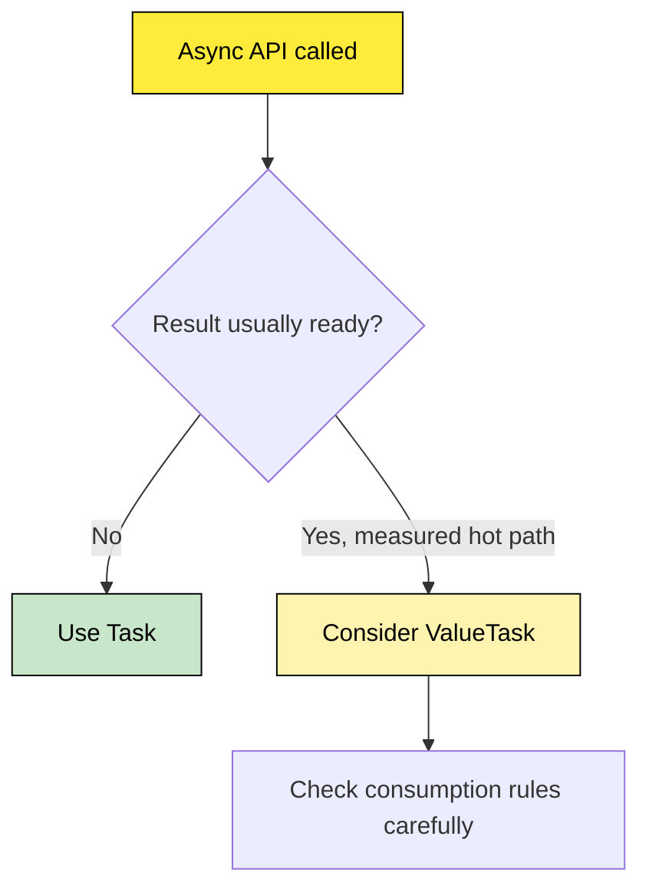
```mermaid
flowchart TD
    A[Async API called] --> B{Result usually ready?}
    B -->|No| C[Use Task]
    B -->|Yes, measured hot path| D[Consider ValueTask]
    D --> E[Check consumption rules carefully]
    style A fill:#ffeb3b,color:#000,stroke:#000
    style C fill:#c8e6c9,color:#000,stroke:#000
    style D fill:#fff3b0,color:#000,stroke:#000
```

---

## 5. `IEnumerable<T>` vs `IQueryable<T>`

### Q: Where does the filtering happen?

- `IEnumerable<T>`: usually filters in application memory.
- `IQueryable<T>`: builds an expression that a provider, such as EF Core, may translate into SQL.

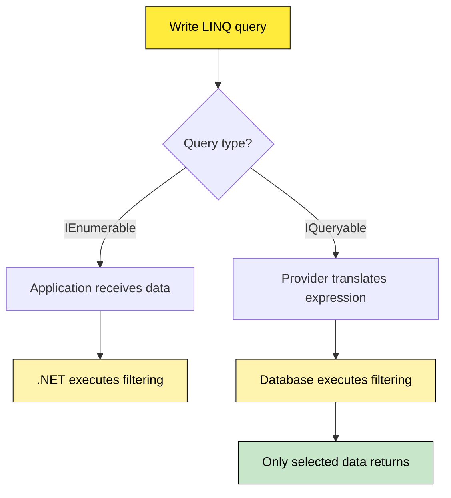
```mermaid
flowchart TD
    A[Write LINQ query] --> B{Query type?}
    B -->|IEnumerable| C[Application receives data]
    C --> D[.NET executes filtering]
    B -->|IQueryable| E[Provider translates expression]
    E --> F[Database executes filtering]
    F --> G[Only selected data returns]
    style A fill:#ffeb3b,color:#000,stroke:#000
    style D fill:#fff3b0,color:#000,stroke:#000
    style F fill:#fff3b0,color:#000,stroke:#000
    style G fill:#c8e6c9,color:#000,stroke:#000
```

**Interview point:** Filter and project before `ToList()` whenever possible.

---

## 6. LINQ Deferred Execution

### Q: Why does a LINQ query sometimes see later changes?

**Answer:** Many LINQ operators only build a query. The query runs when enumerated by `foreach`, `ToList()`, `First()`, and similar operations.

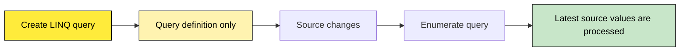
```mermaid
flowchart LR
    A[Create LINQ query] --> B[Query definition only]
    B --> C[Source changes]
    C --> D[Enumerate query]
    D --> E[Latest source values are processed]
    style A fill:#ffeb3b,color:#000,stroke:#000
    style B fill:#fff3b0,color:#000,stroke:#000
    style E fill:#c8e6c9,color:#000,stroke:#000
```

Use `ToList()` when you intentionally need a snapshot.

---

## 7. Dependency Injection Lifetimes

### Q: How does the DI container select an object?

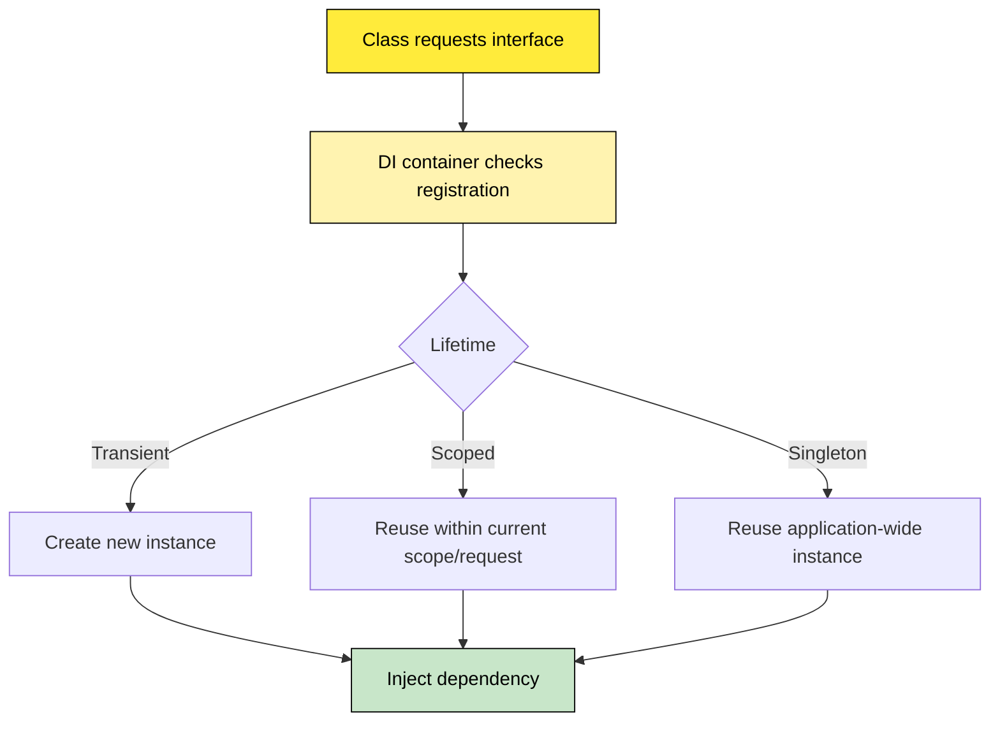
```mermaid
flowchart TD
    A[Class requests interface] --> B[DI container checks registration]
    B --> C{Lifetime}
    C -->|Transient| D[Create new instance]
    C -->|Scoped| E[Reuse within current scope/request]
    C -->|Singleton| F[Reuse application-wide instance]
    D --> G[Inject dependency]
    E --> G
    F --> G
    style A fill:#ffeb3b,color:#000,stroke:#000
    style B fill:#fff3b0,color:#000,stroke:#000
    style G fill:#c8e6c9,color:#000,stroke:#000
```

**Warning:** Do not inject a scoped service directly into a singleton. Singleton objects must also be thread-safe.

---

## 8. ASP.NET Core Middleware

### Q: How does middleware work internally?

**Answer:** Middleware is a chain of request delegates. Each component can run code before the next component, call the next component, and then run code after it. It can also stop the pipeline early.

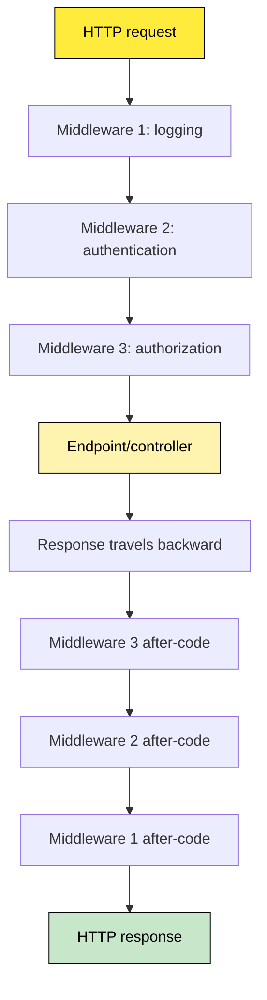
```mermaid
flowchart TD
    A[HTTP request] --> B[Middleware 1: logging]
    B --> C[Middleware 2: authentication]
    C --> D[Middleware 3: authorization]
    D --> E[Endpoint/controller]
    E --> F[Response travels backward]
    F --> G[Middleware 3 after-code]
    G --> H[Middleware 2 after-code]
    H --> I[Middleware 1 after-code]
    I --> J[HTTP response]
    style A fill:#ffeb3b,color:#000,stroke:#000
    style E fill:#fff3b0,color:#000,stroke:#000
    style J fill:#c8e6c9,color:#000,stroke:#000
```

```csharp
app.Use(async (context, next) =>
{
    // Before next middleware
    await next();
    // After next middleware
});
```

**Interview point:** Registration order matters. A middleware may short-circuit the request by not calling `next`.

---

## 9. Filters vs Middleware

### Q: What is the difference?

| Middleware | Filters |
|---|---|
| Works at the HTTP pipeline level | Works inside MVC/controller execution |
| Can run for many endpoint types | Usually tied to MVC/Razor execution stages |
| Good for logging, correlation, auth, exception handling | Good for action validation, action-specific behavior, result processing |
| Runs according to middleware order | Runs according to filter stage and order |

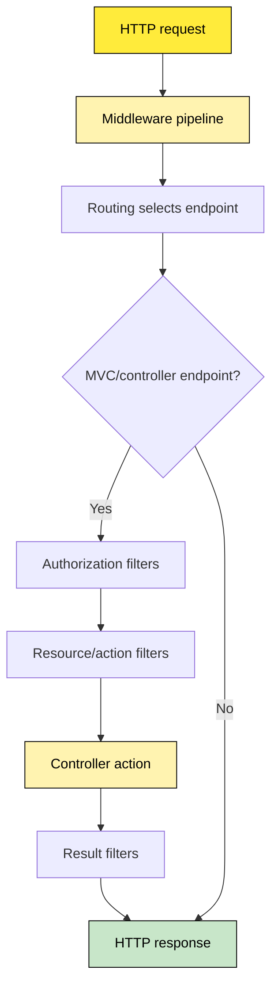
```mermaid
flowchart TD
    A[HTTP request] --> B[Middleware pipeline]
    B --> C[Routing selects endpoint]
    C --> D{MVC/controller endpoint?}
    D -->|Yes| E[Authorization filters]
    E --> F[Resource/action filters]
    F --> G[Controller action]
    G --> H[Result filters]
    H --> I[HTTP response]
    D -->|No| I
    style A fill:#ffeb3b,color:#000,stroke:#000
    style B fill:#fff3b0,color:#000,stroke:#000
    style G fill:#fff3b0,color:#000,stroke:#000
    style I fill:#c8e6c9,color:#000,stroke:#000
```

**Simple rule:** Use middleware for broad HTTP concerns; use filters for controller/action-specific concerns.

---

## 10. Exception Handling and Problem Details

### Q: What should happen when an exception is thrown?

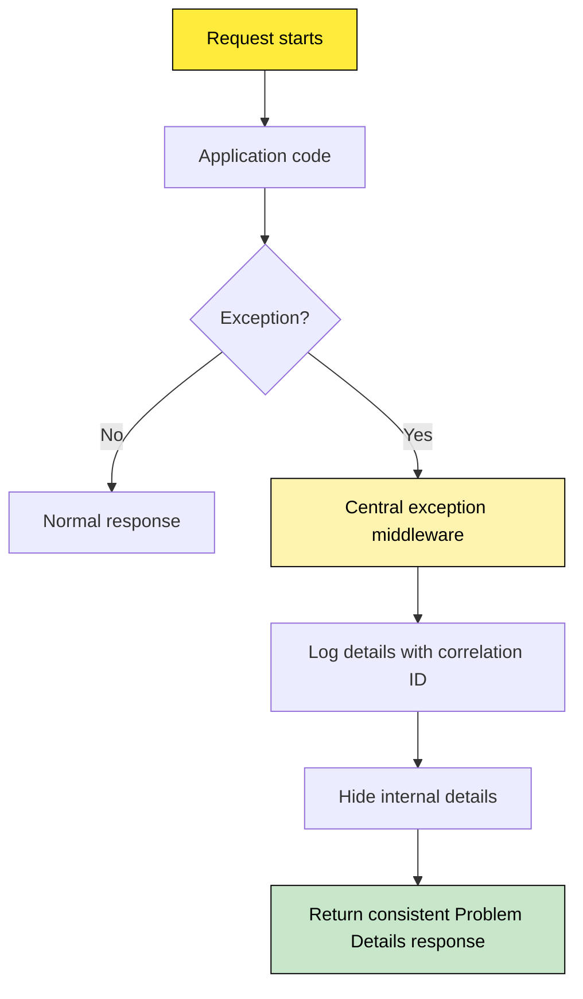
```mermaid
flowchart TD
    A[Request starts] --> B[Application code]
    B --> C{Exception?}
    C -->|No| D[Normal response]
    C -->|Yes| E[Central exception middleware]
    E --> F[Log details with correlation ID]
    F --> G[Hide internal details]
    G --> H[Return consistent Problem Details response]
    style A fill:#ffeb3b,color:#000,stroke:#000
    style E fill:#fff3b0,color:#000,stroke:#000
    style H fill:#c8e6c9,color:#000,stroke:#000
```

Never expose stack traces, secrets, connection strings, or internal implementation details to clients.

---

## 11. Minimal APIs vs Controllers

### Q: How do you choose?

- **Minimal APIs:** concise endpoints and smaller focused services.
- **Controllers:** useful when a project benefits from conventions, filters, model binding patterns, and structured organization.

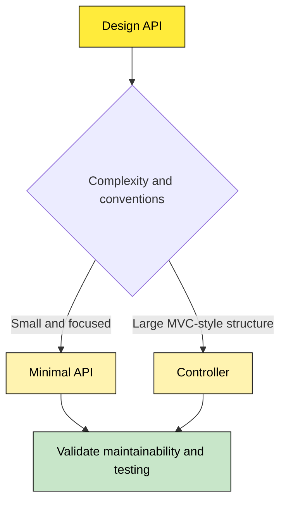
```mermaid
flowchart TD
    A[Design API] --> B{Complexity and conventions}
    B -->|Small and focused| C[Minimal API]
    B -->|Large MVC-style structure| D[Controller]
    C --> E[Validate maintainability and testing]
    D --> E
    style A fill:#ffeb3b,color:#000,stroke:#000
    style C fill:#fff3b0,color:#000,stroke:#000
    style D fill:#fff3b0,color:#000,stroke:#000
    style E fill:#c8e6c9,color:#000,stroke:#000
```

---

## 12. Resilient HTTP Clients

### Q: How should an API call handle failure?

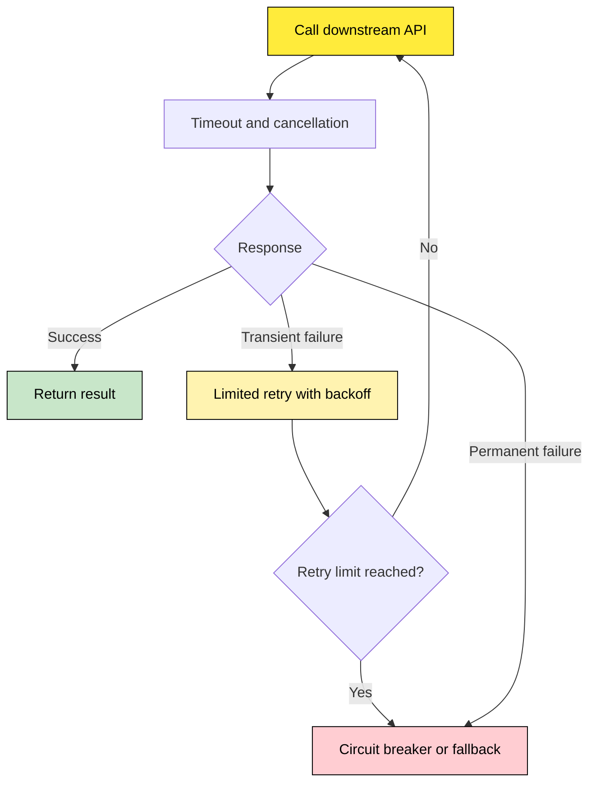
```mermaid
flowchart TD
    A[Call downstream API] --> B[Timeout and cancellation]
    B --> C{Response}
    C -->|Success| D[Return result]
    C -->|Transient failure| E[Limited retry with backoff]
    E --> F{Retry limit reached?}
    F -->|No| A
    F -->|Yes| G[Circuit breaker or fallback]
    C -->|Permanent failure| G
    style A fill:#ffeb3b,color:#000,stroke:#000
    style E fill:#fff3b0,color:#000,stroke:#000
    style G fill:#ffcdd2,color:#000,stroke:#000
    style D fill:#c8e6c9,color:#000,stroke:#000
```

Retries must be limited and safe. Be careful retrying non-idempotent operations such as payment creation.

---

## 13. Authentication vs Authorization

### Q: What happens when a secured request arrives?

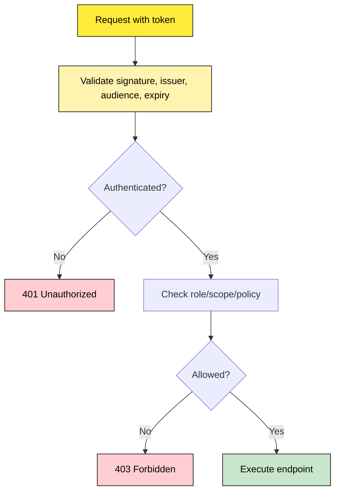
```mermaid
flowchart TD
    A[Request with token] --> B[Validate signature, issuer, audience, expiry]
    B --> C{Authenticated?}
    C -->|No| D[401 Unauthorized]
    C -->|Yes| E[Check role/scope/policy]
    E --> F{Allowed?}
    F -->|No| G[403 Forbidden]
    F -->|Yes| H[Execute endpoint]
    style A fill:#ffeb3b,color:#000,stroke:#000
    style B fill:#fff3b0,color:#000,stroke:#000
    style D fill:#ffcdd2,color:#000,stroke:#000
    style G fill:#ffcdd2,color:#000,stroke:#000
    style H fill:#c8e6c9,color:#000,stroke:#000
```

**Memory trick:** Authentication = **Who are you?** Authorization = **What can you do?**

---

## 14. API Design Checklist

### Q: What should a production API include?

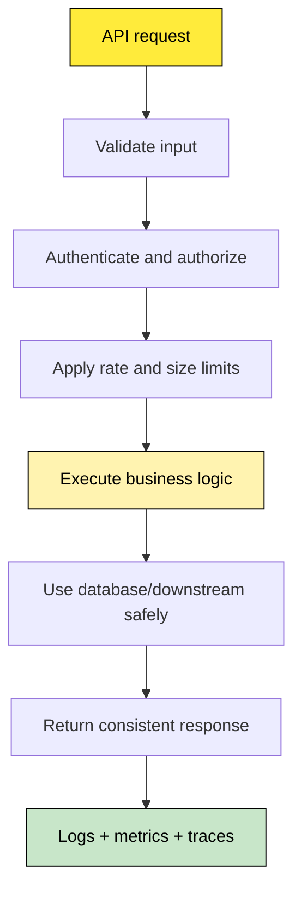
```mermaid
flowchart TD
    A[API request] --> B[Validate input]
    B --> C[Authenticate and authorize]
    C --> D[Apply rate and size limits]
    D --> E[Execute business logic]
    E --> F[Use database/downstream safely]
    F --> G[Return consistent response]
    G --> H[Logs + metrics + traces]
    style A fill:#ffeb3b,color:#000,stroke:#000
    style E fill:#fff3b0,color:#000,stroke:#000
    style H fill:#c8e6c9,color:#000,stroke:#000
```

Include pagination, correlation IDs, consistent errors, idempotency where required, and versioning for breaking changes.

---

## 15. Dispose vs Finalize

### Q: What is the difference?

- **Dispose:** explicit cleanup requested by code, usually through `using` or `Dispose()`.
- **Finalize:** runtime-triggered cleanup opportunity before an object is reclaimed; timing is nondeterministic and it adds GC overhead.

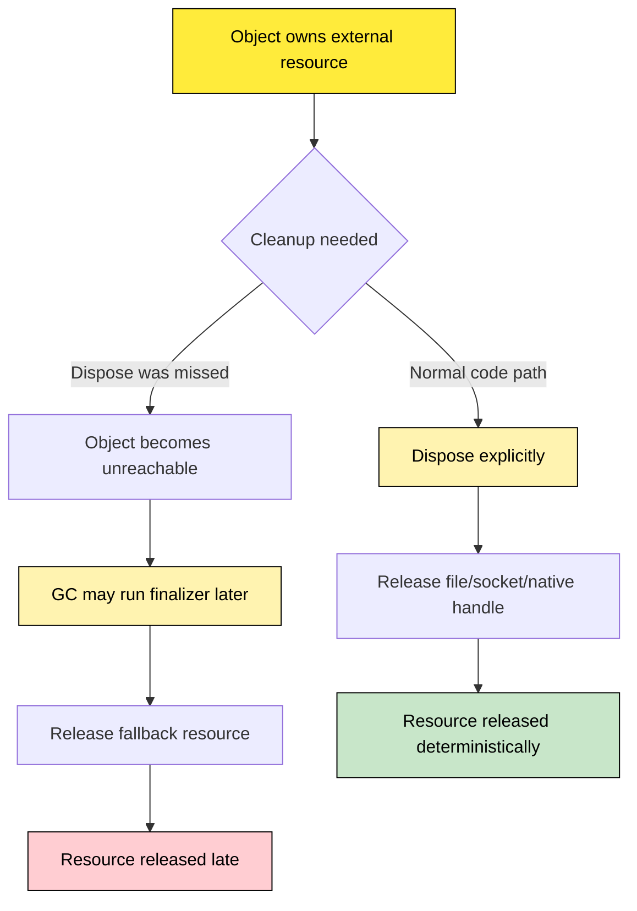
```mermaid
flowchart TD
    A[Object owns external resource] --> B{Cleanup needed}
    B -->|Normal code path| C[Dispose explicitly]
    C --> D[Release file/socket/native handle]
    B -->|Dispose was missed| E[Object becomes unreachable]
    E --> F[GC may run finalizer later]
    F --> G[Release fallback resource]
    D --> H[Resource released deterministically]
    G --> I[Resource released late]
    style A fill:#ffeb3b,color:#000,stroke:#000
    style C fill:#fff3b0,color:#000,stroke:#000
    style F fill:#fff3b0,color:#000,stroke:#000
    style H fill:#c8e6c9,color:#000,stroke:#000
    style I fill:#ffcdd2,color:#000,stroke:#000
```

**Interview point:** Prefer `IDisposable` and `SafeHandle` patterns. Do not depend on finalization for timely cleanup.

---

## 16. `IDisposable` vs Garbage Collector

### Q: Does the GC release everything?

**Answer:** GC manages the lifetime of managed objects. It does not guarantee immediate release of external resources such as file handles, sockets, database connections, or native memory.

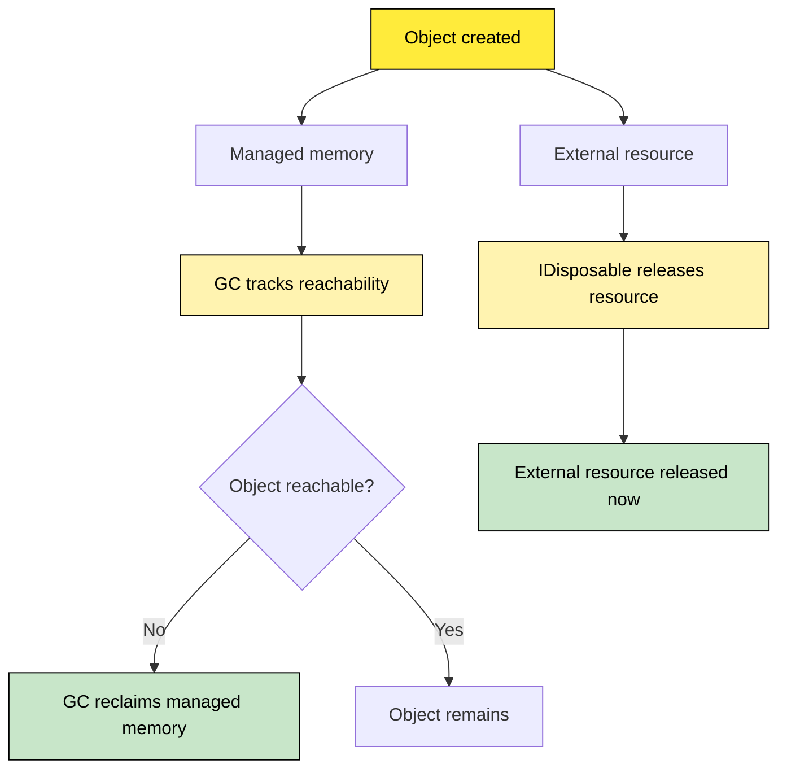
```mermaid
flowchart TD
    A[Object created] --> B[Managed memory]
    A --> C[External resource]
    B --> D[GC tracks reachability]
    C --> E[IDisposable releases resource]
    D --> F{Object reachable?}
    F -->|No| G[GC reclaims managed memory]
    E --> H[External resource released now]
    F -->|Yes| I[Object remains]
    style A fill:#ffeb3b,color:#000,stroke:#000
    style D fill:#fff3b0,color:#000,stroke:#000
    style E fill:#fff3b0,color:#000,stroke:#000
    style G fill:#c8e6c9,color:#000,stroke:#000
    style H fill:#c8e6c9,color:#000,stroke:#000
```

```csharp
using var stream = File.OpenRead("data.txt");
// The using statement calls Dispose even when an exception occurs.
```

**Rule:** GC = managed memory. `Dispose()` = deterministic release of resources you own.

---

## 17. Slow API During Traffic Spikes

### Q: How do you investigate high p99 latency?

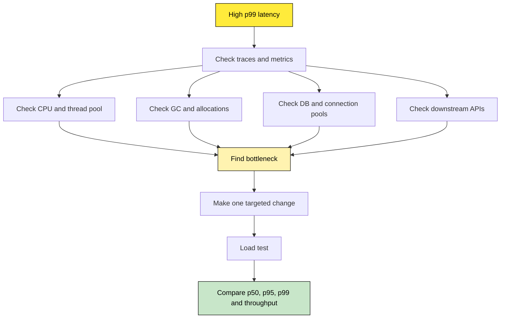
```mermaid
flowchart TD
    A[High p99 latency] --> B[Check traces and metrics]
    B --> C[Check CPU and thread pool]
    B --> D[Check GC and allocations]
    B --> E[Check DB and connection pools]
    B --> F[Check downstream APIs]
    C --> G[Find bottleneck]
    D --> G
    E --> G
    F --> G
    G --> H[Make one targeted change]
    H --> I[Load test]
    I --> J[Compare p50, p95, p99 and throughput]
    style A fill:#ffeb3b,color:#000,stroke:#000
    style G fill:#fff3b0,color:#000,stroke:#000
    style J fill:#c8e6c9,color:#000,stroke:#000
```

Do not immediately add more instances. First identify whether the limiting resource is CPU, thread pool, GC, database, network, or a downstream dependency.

---

## 18. Graceful Shutdown

### Q: How should a service stop safely?

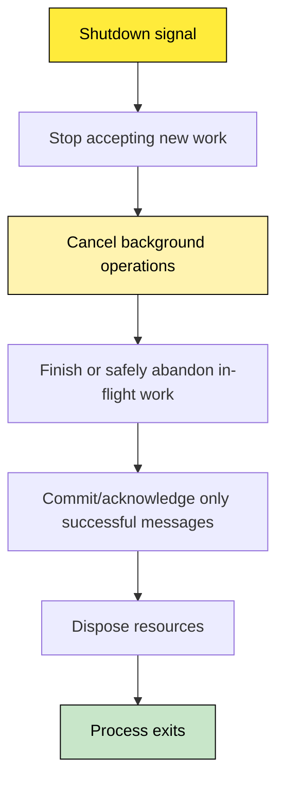
```mermaid
flowchart TD
    A[Shutdown signal] --> B[Stop accepting new work]
    B --> C[Cancel background operations]
    C --> D[Finish or safely abandon in-flight work]
    D --> E[Commit/acknowledge only successful messages]
    E --> F[Dispose resources]
    F --> G[Process exits]
    style A fill:#ffeb3b,color:#000,stroke:#000
    style C fill:#fff3b0,color:#000,stroke:#000
    style G fill:#c8e6c9,color:#000,stroke:#000
```

Use cancellation tokens, bounded shutdown time, and idempotent processing because messages may be delivered more than once.

---

## 19. Testing Strategy

### Q: What should each test level validate?

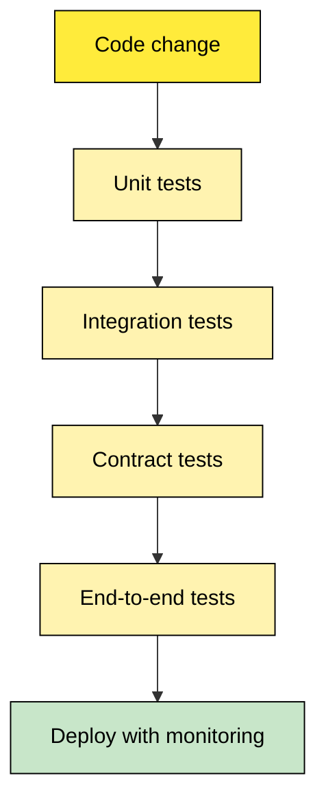
```mermaid
flowchart TD
    A[Code change] --> B[Unit tests]
    B --> C[Integration tests]
    C --> D[Contract tests]
    D --> E[End-to-end tests]
    E --> F[Deploy with monitoring]
    style A fill:#ffeb3b,color:#000,stroke:#000
    style B fill:#fff3b0,color:#000,stroke:#000
    style C fill:#fff3b0,color:#000,stroke:#000
    style D fill:#fff3b0,color:#000,stroke:#000
    style E fill:#fff3b0,color:#000,stroke:#000
    style F fill:#c8e6c9,color:#000,stroke:#000
```

- Unit: business logic in isolation.
- Integration: real boundaries such as database or HTTP.
- Contract: provider and consumer compatibility.
- End-to-end: critical user journeys.

---

## 20. Bounded Parallelism

### Q: Why not call `Task.WhenAll` for thousands of items?

Unbounded concurrency can overload the database, downstream API, connection pool, or CPU. Use a limit such as `SemaphoreSlim`, `Parallel.ForEachAsync`, or a queue-based worker model.

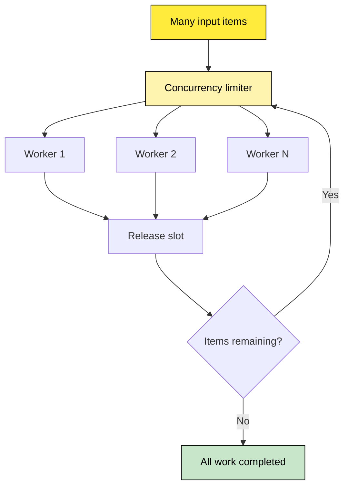
```mermaid
flowchart TD
    A[Many input items] --> B[Concurrency limiter]
    B --> C[Worker 1]
    B --> D[Worker 2]
    B --> E[Worker N]
    C --> F[Release slot]
    D --> F
    E --> F
    F --> G{Items remaining?}
    G -->|Yes| B
    G -->|No| H[All work completed]
    style A fill:#ffeb3b,color:#000,stroke:#000
    style B fill:#fff3b0,color:#000,stroke:#000
    style H fill:#c8e6c9,color:#000,stroke:#000
```

The correct concurrency limit should be measured against downstream capacity.

---

## Quick Interview Revision

| Question | One-line answer |
|---|---|
| Value vs reference | Value copies data; reference copies the object reference |
| `async`/`await` | Pauses and resumes using a task and continuation |
| `IEnumerable` vs `IQueryable` | In-memory execution vs provider-translated query |
| Middleware | Broad HTTP pipeline component |
| Filter | MVC/controller execution component |
| Dispose | Explicit deterministic cleanup |
| Finalize | Runtime fallback cleanup with nondeterministic timing |
| `IDisposable` vs GC | Resource cleanup vs managed memory reclamation |
| Authentication | Establish identity |
| Authorization | Check permission |
| Scoped DI | One instance per scope/request |
| Bounded concurrency | Prevent downstream overload |

## References

- [C# documentation](https://learn.microsoft.com/en-us/dotnet/csharp/)
- [.NET documentation](https://learn.microsoft.com/en-us/dotnet/)
- [ASP.NET Core middleware](https://learn.microsoft.com/en-us/aspnet/core/fundamentals/middleware/)
- [Custom middleware](https://learn.microsoft.com/en-us/aspnet/core/fundamentals/middleware/write)
- [Dependency injection](https://learn.microsoft.com/en-us/aspnet/core/fundamentals/dependency-injection)
- [ASP.NET Core error handling](https://learn.microsoft.com/en-us/aspnet/core/fundamentals/error-handling)
- [ASP.NET Core performance](https://learn.microsoft.com/en-us/aspnet/core/performance/performance-best-practices)
