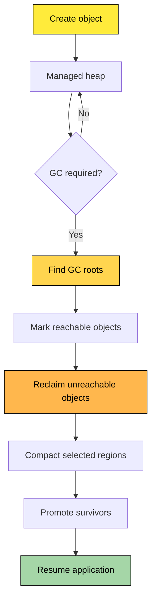
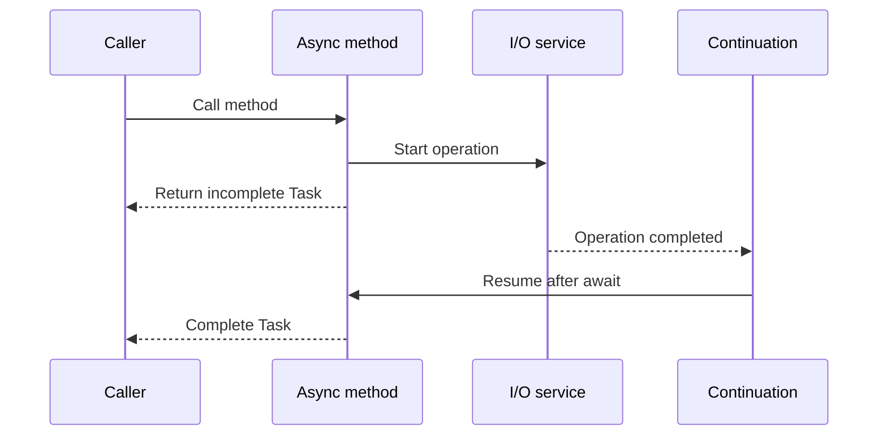
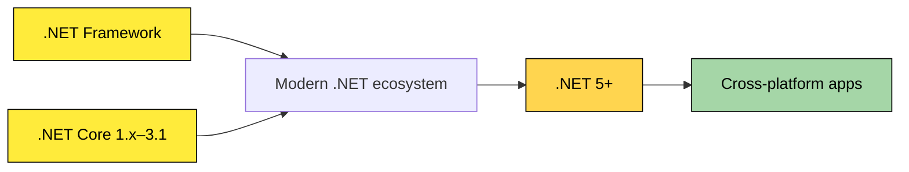
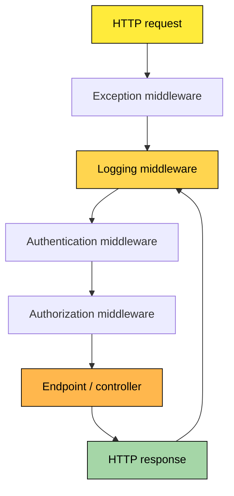
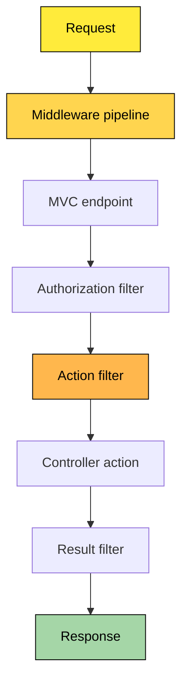
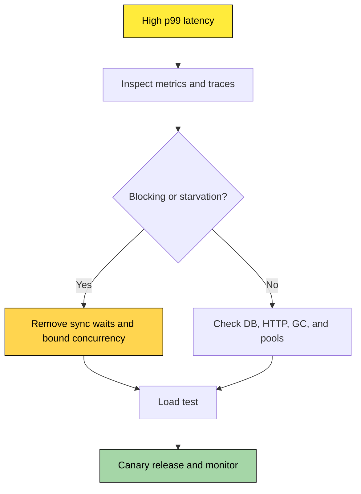

# 🎨 C# / .NET Internal Working — Visual Interview Q&A

> **Theme:** High-contrast diagrams for dark GitHub backgrounds. Yellow boxes use black text for readability.

---

## 🗑️ Q1. How does the .NET Garbage Collector work?

### ✅ Answer
The Garbage Collector (GC) automatically manages **managed memory**. It finds objects that are no longer reachable and reclaims their memory.

### 🔍 Internal flow
1. Objects are allocated on the managed heap.
2. GC identifies roots: local references, static fields, handles, and CPU registers.
3. Reachable objects are marked.
4. Unreachable objects are reclaimed.
5. Selected areas may be compacted.
6. Surviving objects may be promoted from Gen 0 → Gen 1 → Gen 2.



### 🎤 Interview points
- Gen 0 usually contains short-lived objects.
- Gen 2 contains long-lived objects.
- LOH stores large allocations and is collected with older generations.
- A memory leak can happen when unwanted objects remain reachable.
- GC manages managed memory; it does not automatically close files, sockets, or database connections.

---

## ⚡ Q2. TPL vs `async`/`await` — what is the difference?

### ✅ Answer
**TPL (Task Parallel Library)** is a .NET library for task scheduling, parallelism, cancellation, and coordination. **`async`/`await`** is a C# language feature that simplifies asynchronous control flow.

| Topic | TPL | `async` / `await` |
|---|---|---|
| Type | .NET library | C# language feature |
| Main purpose | Create and coordinate tasks | Pause and resume asynchronous methods |
| CPU work | `Task.Run`, `Parallel` | Does not automatically create a thread |
| I/O work | Represents operations using `Task` | Awaits completion without blocking during I/O |
| Examples | `Task.WhenAll`, `Task.Delay` | `await client.GetAsync(...)` |

### 🔍 What happens at `await`?
1. The method executes synchronously until an incomplete task is reached.
2. The method returns control to its caller.
3. The compiler-generated state machine stores continuation state.
4. The I/O operation completes.
5. The continuation resumes and the returned task completes.



### 🎤 Interview rule
Use asynchronous APIs for I/O-bound work. Use parallelism or `Task.Run` for CPU-bound work only after measuring CPU usage and throughput. Avoid `.Result` and `.Wait()` in web request paths.

---

## 📦 Q3. Generics vs Collections — how are they related?

### ✅ Answer
A **generic** allows reusable, strongly typed code. A **collection** stores multiple values. `List<T>` is an example of a generic collection.

| Generics | Collections |
|---|---|
| Define reusable type-safe behavior | Store and manage groups of values |
| Example: `Repository<T>` | Example: `List<T>` |
| Helps avoid casting and boxing | Provides lookup, insertion, removal, and iteration |

```csharp
public static T FirstItem<T>(IReadOnlyList<T> items)
{
    if (items.Count == 0)
        throw new ArgumentException("Collection is empty.");

    return items[0];
}
```

| Collection | Use case |
|---|---|
| `List<T>` | Ordered, dynamically sized list |
| `Dictionary<TKey,TValue>` | Key-based lookup |
| `HashSet<T>` | Unique values |
| `Queue<T>` | FIFO processing |
| `Stack<T>` | LIFO processing |
| Array | Fixed-size indexed data |

---

## ✨ Q4. What is a lambda expression?

### ✅ Answer
A lambda is a compact function expression commonly used with delegates, callbacks, and LINQ.

```csharp
Func<int, int> doubleValue = value => value * 2;
var evenNumbers = numbers.Where(number => number % 2 == 0);
```

| Syntax | Meaning |
|---|---|
| `x => x * 2` | One parameter, expression body |
| `(x, y) => x + y` | Two parameters |
| `() => DateTime.UtcNow` | No parameters |
| `x => { return x * 2; }` | Statement body |

A lambda can capture outer variables. This is called a **closure** and can extend the lifetime of captured state.

---

## 🎯 Q5. What are `Func`, `Action`, `Predicate`, and delegates?

### ✅ Answer
A delegate is a type-safe reference to a method. It allows behavior to be passed as a parameter or stored in a variable.

| Type | Return value | Typical use |
|---|---|---|
| `Action<T>` | `void` | Execute an operation |
| `Func<T, TResult>` | `TResult` | Transform or calculate |
| `Predicate<T>` | `bool` | Validate a condition |
| Custom delegate | Defined by you | Domain-specific contracts |

```csharp
Action<string> log = message => Console.WriteLine(message);
Func<int, int, int> add = (a, b) => a + b;
Predicate<int> isEven = number => number % 2 == 0;
```

The final generic parameter of `Func` is always the return type.

---

## 🌐 Q6. What is the difference between .NET and .NET Core?

### ✅ Answer
**.NET Core** was Microsoft's cross-platform, open-source implementation introduced as the successor to the .NET Framework. Starting with **.NET 5**, Microsoft unified the platform under the name **.NET**.

| .NET Framework | .NET Core / modern .NET |
|---|---|
| Windows-focused | Cross-platform: Windows, Linux, macOS |
| Mature legacy applications | Modern cloud-native and container workloads |
| Windows-specific technologies available | High-performance, modular, cross-platform APIs |
| Versions such as 4.8 | .NET Core 1–3.1, then .NET 5+ |

### 🎤 Interview answer
For new APIs and cloud-native services, modern .NET is generally preferred. Existing .NET Framework applications may require migration planning because some Windows-only APIs are unavailable cross-platform.



---

## 🧩 Q7. What is middleware in ASP.NET Core?

### ✅ Answer
Middleware is a component in the HTTP request pipeline. It can inspect, modify, or short-circuit a request and response.



### 💻 Example
```csharp
app.Use(async (context, next) =>
{
    Console.WriteLine("Request started");

    await next();

    Console.WriteLine("Response completed");
});
```

### 🎤 Key points
- Middleware order matters.
- It can run code before and after `next()`.
- It can short-circuit by not calling `next()`.
- Typical examples: exception handling, logging, CORS, authentication, routing, and rate limiting.

---

## 🛡️ Q8. Filters vs Middleware — what is the difference?

### ✅ Answer
Middleware works at the **HTTP pipeline level**. Filters work mainly within the **MVC/controller execution pipeline** and have access to action-specific context.

| Middleware | Filters |
|---|---|
| Runs for requests entering the pipeline | Runs at selected MVC/action stages |
| Can apply to almost every request | Can be global, controller-level, or action-level |
| Has `HttpContext` | Has action/controller-specific context |
| Good for logging, auth, exception handling, headers | Good for validation, action logging, result processing |
| Executes before endpoint selection in relevant pipeline stages | Executes around MVC action execution |

### 🎤 Selection rule
Use middleware for cross-cutting concerns that apply broadly to HTTP requests. Use filters when the logic needs MVC action, model state, action arguments, or result context.



---

## ♻️ Q9. `Dispose` vs `Finalize` — how are they different?

### ✅ Answer
`Dispose` is a deterministic cleanup pattern initiated by application code. `Finalize` is a runtime-triggered cleanup mechanism that runs before an object is reclaimed, when applicable.

| `Dispose` | `Finalize` |
|---|---|
| Called explicitly or through `using` | Called by GC finalization process |
| Deterministic | Non-deterministic |
| Usually implemented through `IDisposable` | Implemented through a finalizer `~TypeName()` |
| Suitable for files, sockets, handles | Last-resort cleanup for unmanaged resources |
| Can be called multiple times if designed safely | Adds GC/finalization overhead |

```csharp
public sealed class FileResource : IDisposable
{
    private bool _disposed;

    public void Dispose()
    {
        if (_disposed) return;
        _disposed = true;
        // Release unmanaged or owned resources.
        GC.SuppressFinalize(this);
    }
}
```

### 🎤 Interview point
Prefer `SafeHandle` and `IDisposable` for unmanaged resources. Do not rely on finalizers for timely cleanup. A finalizer should be rare and carefully designed.

---

## 🧹 Q10. `IDisposable` vs Garbage Collector — who cleans what?

### ✅ Answer
The GC reclaims memory for unreachable managed objects. `IDisposable` provides a contract for releasing resources that need explicit cleanup.

| Concern | Garbage Collector | `IDisposable` |
|---|---|---|
| Main responsibility | Reclaim managed object memory | Release owned resources promptly |
| Trigger | Runtime decides | Code calls `Dispose` / `using` |
| Timing | Non-deterministic | Deterministic when called correctly |
| Examples | Managed objects, arrays, strings | Files, streams, sockets, DB connections |
| Replaces the other? | No | No |

```csharp
using (var stream = File.OpenRead("data.txt"))
{
    // Use stream.
} // Dispose is called automatically.
```

### ⚠️ Common misconception
Calling `Dispose()` does not necessarily destroy the object immediately, and GC does not guarantee that an external resource is closed at the exact time you need. Use `using`, `await using`, or explicit disposal according to the resource contract.

---

## 🟠 Q11. How would you troubleshoot high API latency during traffic spikes?

### ✅ Answer structure
1. Clarify affected endpoints and latency percentiles.
2. Inspect distributed traces and dependency timings.
3. Check thread-pool starvation, sync-over-async, GC pauses, database waits, connection pools, and downstream services.
4. Bound concurrency and remove blocking calls.
5. Load test with realistic traffic.
6. Roll out gradually and compare p50, p95, p99, error rate, and throughput.



---

## 🔗 Official documentation

- [Garbage collection](https://learn.microsoft.com/en-us/dotnet/standard/garbage-collection/)
- [Task Parallel Library](https://learn.microsoft.com/en-us/dotnet/standard/parallel-programming/task-parallel-library-tpl)
- [Asynchronous programming](https://learn.microsoft.com/en-us/dotnet/csharp/asynchronous-programming/)
- [ASP.NET Core middleware](https://learn.microsoft.com/en-us/aspnet/core/fundamentals/middleware/)
- [ASP.NET Core filters](https://learn.microsoft.com/en-us/aspnet/core/mvc/controllers/filters)
- [Implementing `Dispose`](https://learn.microsoft.com/en-us/dotnet/standard/garbage-collection/implementing-dispose)
- [Generics](https://learn.microsoft.com/en-us/dotnet/standard/generics/)
- [Delegates](https://learn.microsoft.com/en-us/dotnet/csharp/programming-guide/delegates/)
