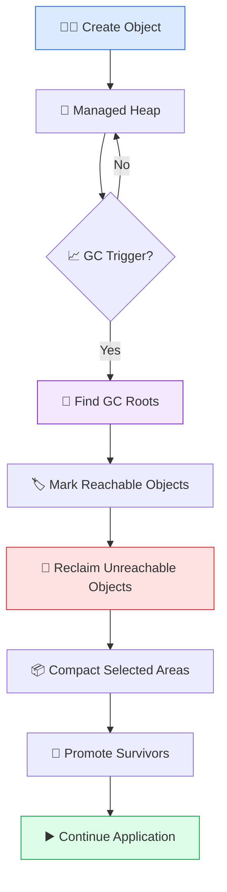
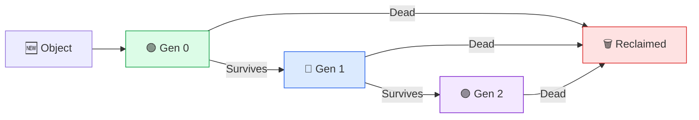
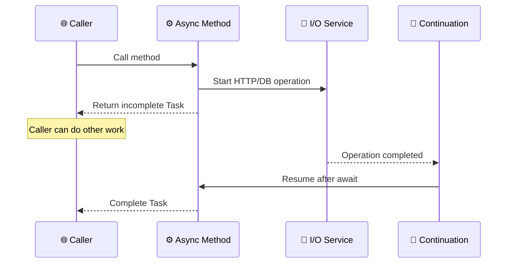
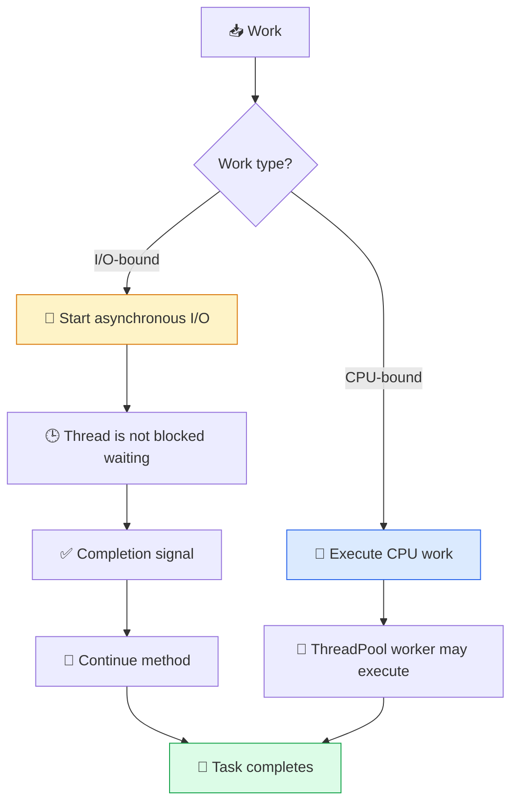
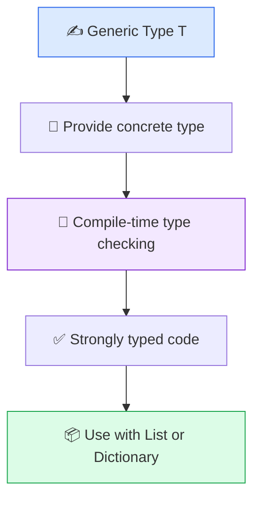
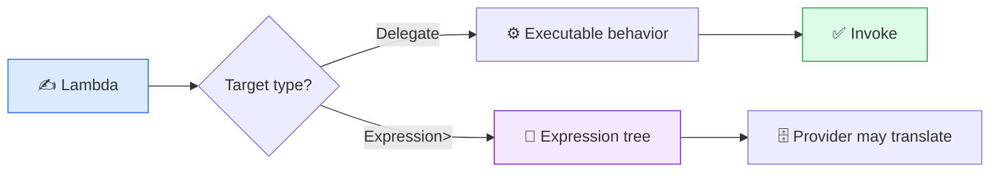
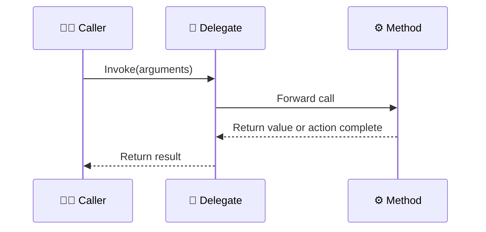
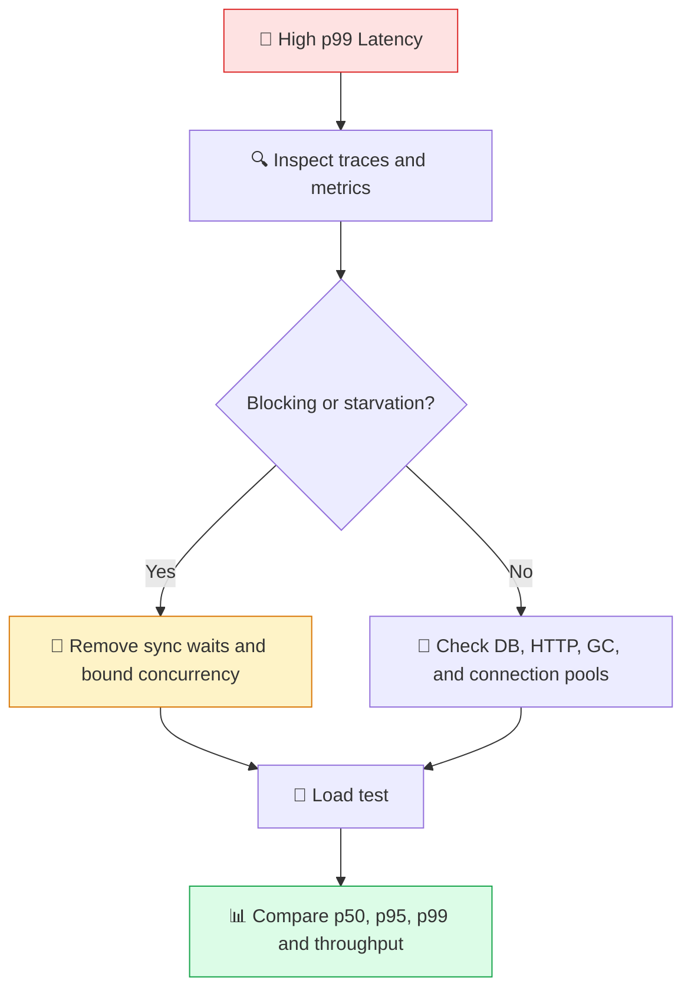

# 🎨 C# Internal Working — Beginner-Friendly Visual Q&A

> Learn the **what**, **why**, and **how it works internally**. Each topic includes simple language, comparisons, code, and colorful Mermaid diagrams.

---

## 🗑️ Q1. How Does the .NET Garbage Collector Work?

### 🟢 Simple Explanation
The Garbage Collector (GC) automatically reclaims memory occupied by objects that the application can no longer reach. You create objects; the runtime decides when collection is needed.

### 🔵 Internal Working
1. Objects are allocated on the managed heap.
2. GC identifies roots such as local references, static fields, and handles.
3. Reachable objects are marked as alive.
4. Unreachable objects become eligible for reclamation.
5. Selected heap areas may be compacted.
6. Surviving objects can be promoted from Gen 0 to Gen 1 and Gen 2.



### 📊 Generations

| Generation | Simple meaning |
|---|---|
| Gen 0 | New and usually short-lived objects |
| Gen 1 | Objects that survived a Gen 0 collection |
| Gen 2 | Long-lived objects |
| LOH | Large Object Heap for large allocations |



### 💻 Code
```csharp
public static void CreateTemporaryObjects()
{
    for (int i = 0; i < 100_000; i++)
    {
        // Temporary allocations can create GC pressure.
        string message = $"Order-{i}";
        _ = message.Length;
    }
}
```

### ⚠️ Interview Points
- A memory leak is possible when unwanted objects remain reachable.
- `IDisposable` releases resources such as files and sockets; GC manages managed memory.
- Do not call `GC.Collect()` as a default performance fix.
- Profile allocation rate, heap size, Gen 2 activity, and pause time before optimizing.

---

## ⚡ Q2. TPL vs `async`/`await`: How Do They Work?

### 🟢 Simple Explanation
**TPL** is a task-based library for scheduling and coordinating work. **`async`/`await`** is a C# language feature that makes asynchronous code easier to write.

### 📊 Comparison

| Feature | TPL | `async`/`await` |
|---|---|---|
| Category | .NET library | C# language feature |
| Main role | Create, schedule, combine, and cancel tasks | Pause and resume async methods |
| CPU work | `Task.Run`, parallel APIs | Does not automatically create a thread |
| I/O work | Represents operation completion with tasks | Awaits I/O without normally blocking a thread |
| Examples | `Task.WhenAll`, `Parallel.ForEachAsync` | `await client.GetAsync(...)` |

### 🔵 What Happens at `await`?
1. The method starts running synchronously.
2. It reaches an incomplete task.
3. The method returns an incomplete `Task` to its caller.
4. The remaining code is stored as a continuation/state machine.
5. When the operation completes, the continuation resumes.
6. The task completes with a result or exception.



### 🧵 I/O vs CPU Flow


### 💻 I/O Example
```csharp
public async Task<string> GetTextAsync(
    HttpClient client,
    CancellationToken cancellationToken)
{
    return await client.GetStringAsync(
        "https://example.com",
        cancellationToken);
}
```

### 💻 CPU Example
```csharp
public Task<long> CalculateAsync(int limit)
{
    return Task.Run(() =>
    {
        long total = 0;
        for (int i = 0; i < limit; i++)
            total += i;
        return total;
    });
}
```

### 🟠 Interview Rule
Use async I/O for waiting on external systems. Consider parallelism for CPU-bound work only after checking CPU capacity and measuring the result. Avoid `.Result` and `.Wait()` in request paths.

---

## 📦 Q3. Generics vs Collections

### 🟢 Simple Explanation
A **generic** makes code reusable for different types. A **collection** stores multiple values. They work together: `List<T>` is a generic collection.

| Topic | Generics | Collections |
|---|---|---|
| Purpose | Reusable, strongly typed code | Store and manage groups of values |
| Example | `Repository<T>` | `List<T>`, `Dictionary<TKey,TValue>` |
| Main benefit | Compile-time type safety | Access, add, remove, search, iterate |
| Relationship | Can be used to build collections | Many modern collections are generic |



### 💻 Generic Method
```csharp
public static T FirstItem<T>(IReadOnlyList<T> items)
{
    if (items.Count == 0)
        throw new ArgumentException("Collection is empty.");

    return items[0];
}

int number = FirstItem(new[] { 10, 20 });
string name = FirstItem(new[] { "Azam", "Sara" });
```

### 📊 Collection Selection
| Collection | Choose it when |
|---|---|
| `List<T>` | You need an ordered dynamic list |
| `Dictionary<TKey,TValue>` | You need key-based lookup |
| `HashSet<T>` | Values must be unique |
| `Queue<T>` | You process first-in-first-out work |
| `Stack<T>` | You process last-in-first-out work |
| `T[]` | Size is fixed or array semantics are useful |

---

## ✨ Q4. What Is a Lambda Expression?

### 🟢 Simple Explanation
A lambda is a short function expression. It is often passed to LINQ methods, callbacks, and delegates.

```csharp
Func<int, int> doubleValue = value => value * 2;
Console.WriteLine(doubleValue(5)); // 10
```

### 📊 Syntax
| Example | Meaning |
|---|---|
| `x => x * 2` | One parameter and expression body |
| `(x, y) => x + y` | Two parameters |
| `() => DateTime.UtcNow` | No parameters |
| `x => { return x * 2; }` | Statement body |

### 🔵 Lambda Flow


### 💻 Lambda with LINQ
```csharp
var evenNumbers = new[] { 1, 2, 3, 4, 5 }
    .Where(number => number % 2 == 0)
    .Select(number => number * 10)
    .ToList();
```

### 🧠 Closure
A lambda can capture a variable from the surrounding scope. Captured state may live longer than expected, so be careful with mutable values and long-lived callbacks.

```csharp
int multiplier = 3;
Func<int, int> multiply = value => value * multiplier;
Console.WriteLine(multiply(5)); // 15
```

---

## 🎯 Q5. `Func`, `Action`, `Predicate`, and Delegates

### 🟢 Simple Explanation
A delegate is a type-safe reference to a method. It allows behavior to be passed around like data.

| Type | Return | Common use |
|---|---|---|
| `Action` | `void` | Perform an operation |
| `Func<T>` | Value | Calculate or transform |
| `Predicate<T>` | `bool` | Check a condition |
| Custom delegate | Defined by you | Domain-specific signatures |

```csharp
Action<string> log = message => Console.WriteLine(message);
Func<int, int, int> add = (a, b) => a + b;
Predicate<int> isEven = number => number % 2 == 0;

log("Created");
int total = add(10, 20);
bool valid = isEven(4);
```

### 🔵 Delegate Invocation Flow


### 📊 `Func` Shape
| Type | Meaning |
|---|---|
| `Func<TResult>` | No input; returns `TResult` |
| `Func<T, TResult>` | One input; returns `TResult` |
| `Func<T1,T2,TResult>` | Two inputs; returns `TResult` |

The final generic parameter of `Func` is the return type.

---

## 🟠 Principal Engineer Scenario: API Is Slow During Traffic Spikes

Use this sequence instead of guessing:



### 🎤 Answer Structure
1. Clarify the symptoms and affected endpoints.
2. Check traces, CPU, GC, thread pool, database waits, and downstream latency.
3. Apply a targeted change.
4. Test under realistic load.
5. Roll out gradually and monitor.

---

## 🔗 Official Documentation

- [Garbage collection](https://learn.microsoft.com/en-us/dotnet/standard/garbage-collection/)
- [Garbage collection fundamentals](https://learn.microsoft.com/en-us/dotnet/standard/garbage-collection/fundamentals)
- [Task Parallel Library](https://learn.microsoft.com/en-us/dotnet/standard/parallel-programming/task-parallel-library-tpl)
- [Async programming](https://learn.microsoft.com/en-us/dotnet/csharp/asynchronous-programming/)
- [Generics](https://learn.microsoft.com/en-us/dotnet/standard/generics/)
- [Collections](https://learn.microsoft.com/en-us/dotnet/standard/collections/)
- [Delegates](https://learn.microsoft.com/en-us/dotnet/csharp/programming-guide/delegates/)
- [Lambda expressions](https://learn.microsoft.com/en-us/dotnet/csharp/language-reference/operators/lambda-expressions)
- [LINQ](https://learn.microsoft.com/en-us/dotnet/csharp/linq/)
