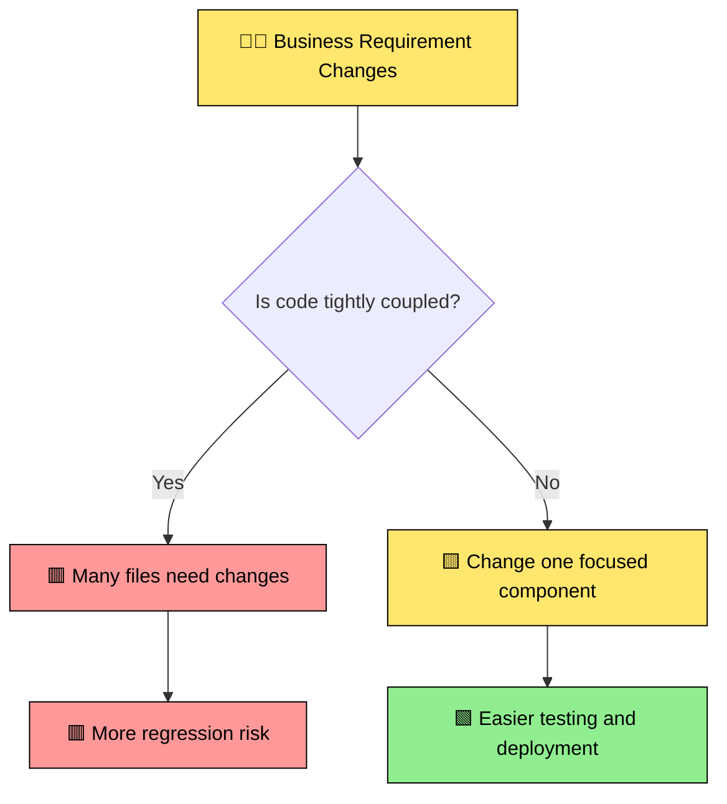
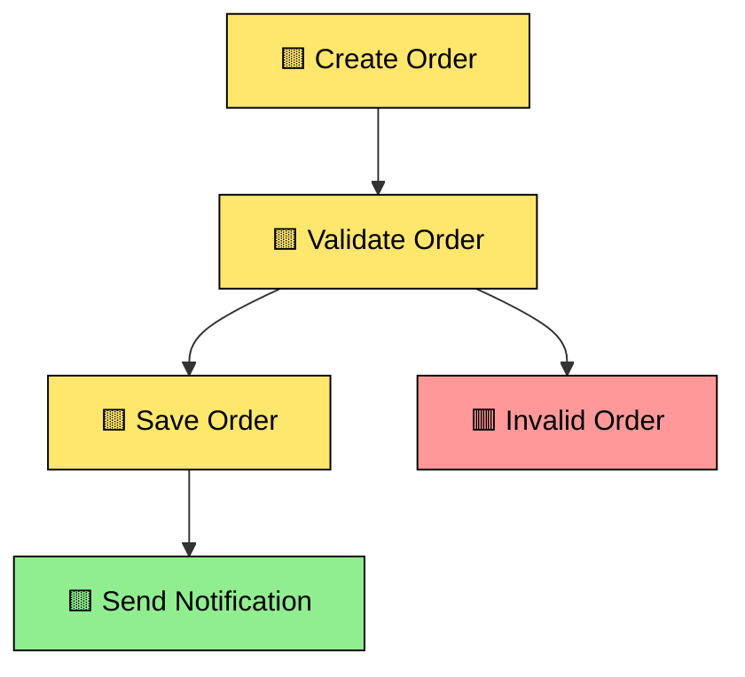
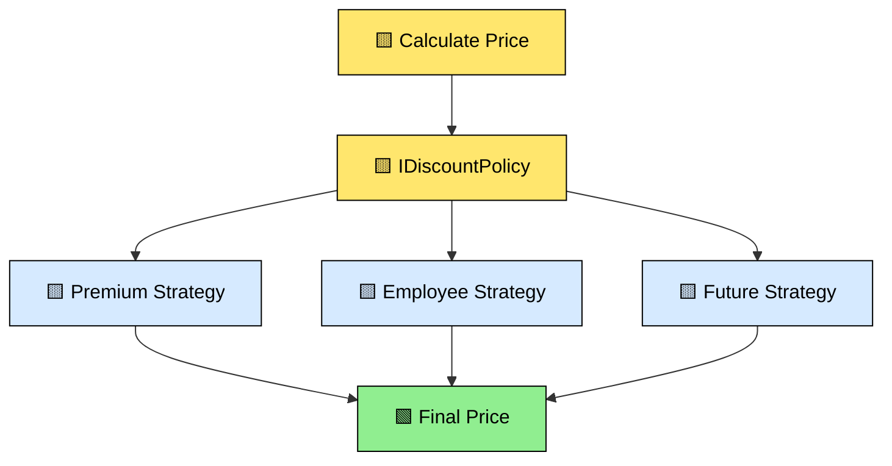
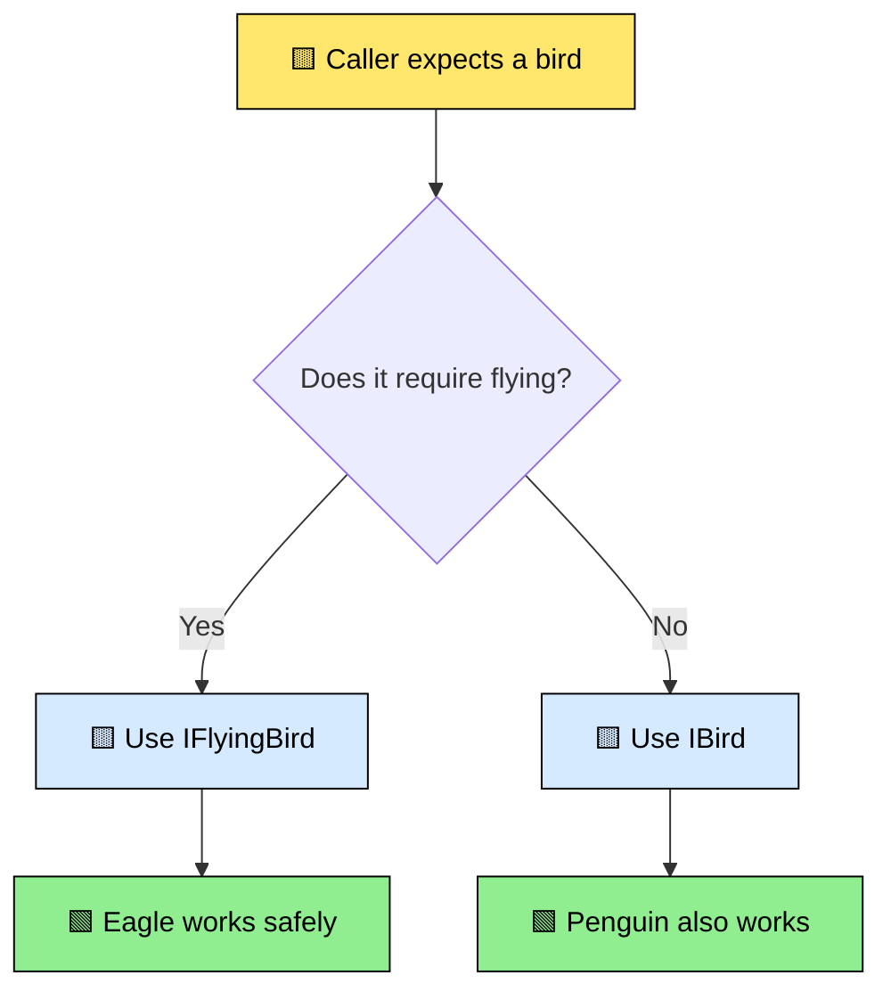
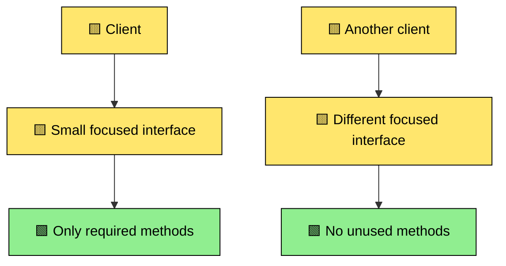
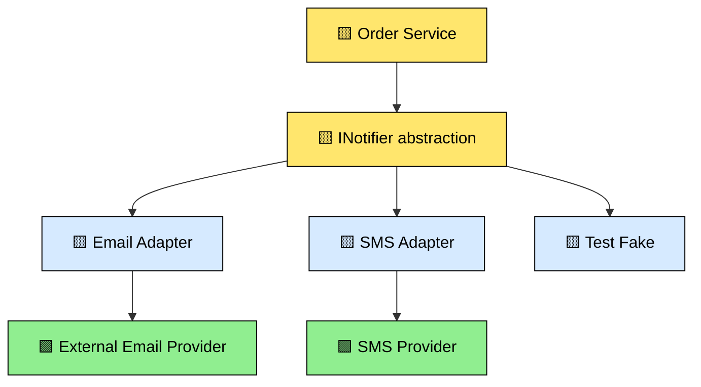
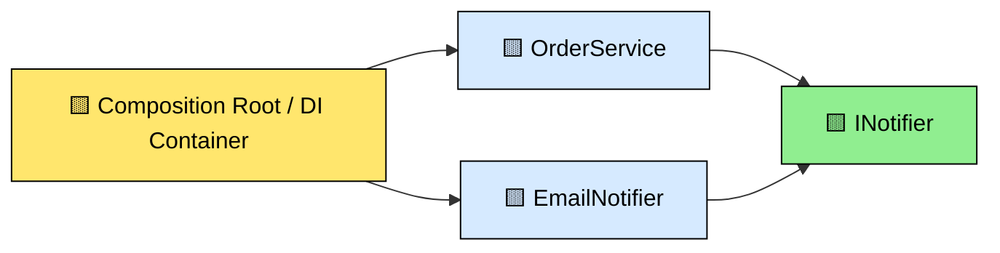
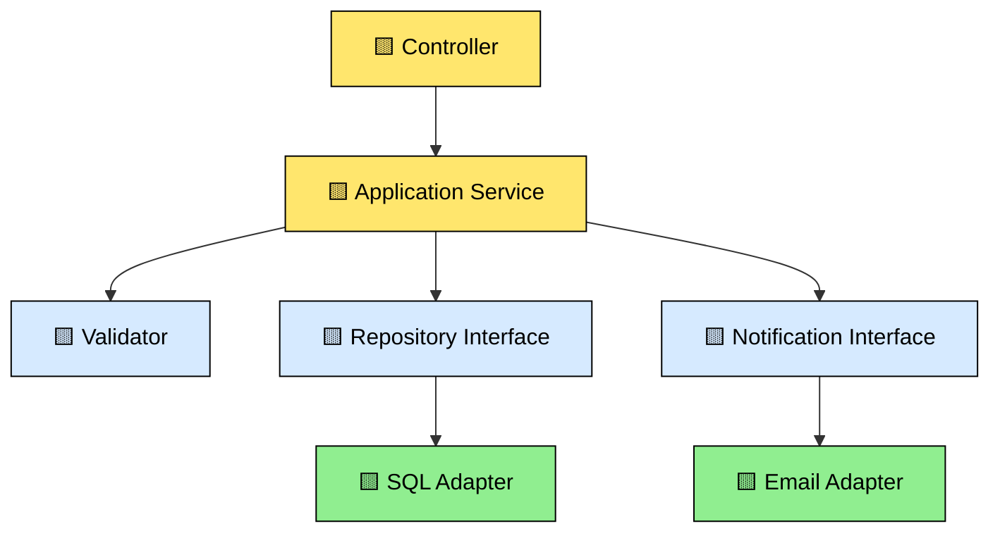
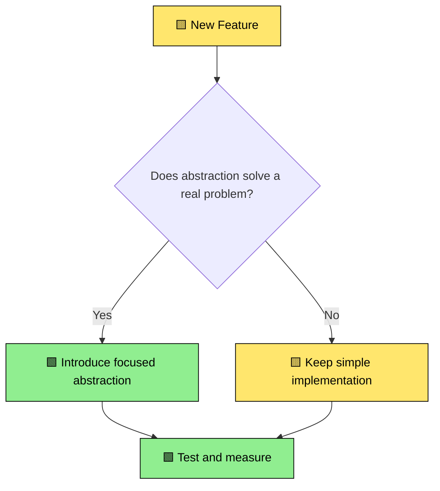

# 🎨 SOLID Principles — Beginner-Friendly Visual Interview Q&A

> **Goal:** Understand SOLID using simple language, practical C# examples, and visual flow diagrams. SOLID is guidance—not a rule that requires creating interfaces for every class.

## 🟨 Q1. What is SOLID and why do we use it?

**Answer:** SOLID is a group of five design principles that help us write code that is easier to change, test, and maintain.

Think of a large application like a house. If electricity, plumbing, and furniture are tightly mixed together, every change becomes risky. SOLID helps us keep responsibilities and dependencies organized.



| Letter | Principle | Simple meaning |
|---|---|---|
| S | Single Responsibility | One class should focus on one main job |
| O | Open/Closed | Add new behavior without repeatedly changing stable code |
| L | Liskov Substitution | A child type should behave correctly wherever the parent is expected |
| I | Interface Segregation | Do not force a class to implement methods it does not need |
| D | Dependency Inversion | Business logic should depend on abstractions, not infrastructure details |

---

## 🟨 Q2. What is the Single Responsibility Principle (SRP)?

**Answer:** A class should have one primary responsibility and one main reason to change.

### ❌ Problem: One class doing everything

```csharp
public class OrderService
{
    public void ValidateOrder() { }
    public void SaveToDatabase() { }
    public void SendEmail() { }
    public void CreatePdfInvoice() { }
}
```

If database logic changes, email logic changes, and invoice formatting changes all affect the same class, the class becomes difficult to maintain.

### ✅ Better design

```csharp
public interface IOrderValidator { bool IsValid(Order order); }
public interface IOrderRepository { Task SaveAsync(Order order, CancellationToken ct); }
public interface INotificationService { Task SendAsync(string message, CancellationToken ct); }

public sealed class OrderApplicationService(
    IOrderValidator validator,
    IOrderRepository repository,
    INotificationService notification)
{
    public async Task CreateAsync(Order order, CancellationToken ct)
    {
        if (!validator.IsValid(order))
            throw new ArgumentException("Invalid order");

        await repository.SaveAsync(order, ct);
        await notification.SendAsync("Order created", ct);
    }
}
```



**Interview shortcut:** SRP does not mean every method must be in a separate class. It means responsibilities that change for different reasons should not be unnecessarily bundled together.

---

## 🟨 Q3. What is the Open/Closed Principle (OCP)?

**Answer:** Existing stable code should not need constant modification whenever a new variation is added. Extend behavior through a suitable abstraction.

### ❌ Hard-to-maintain approach

```csharp
public decimal CalculateDiscount(string customerType, decimal amount)
{
    if (customerType == "Premium") return amount * 0.90m;
    if (customerType == "Employee") return amount * 0.80m;
    return amount;
}
```

Every new customer type requires editing the same method.

### ✅ Strategy-based approach

```csharp
public interface IDiscountPolicy
{
    decimal Apply(decimal amount);
}

public sealed class PremiumDiscount : IDiscountPolicy
{
    public decimal Apply(decimal amount) => amount * 0.90m;
}

public sealed class EmployeeDiscount : IDiscountPolicy
{
    public decimal Apply(decimal amount) => amount * 0.80m;
}
```



**Important:** OCP does not mean you must predict every future feature. Introduce an abstraction when change is likely or already happening repeatedly.

---

## 🟨 Q4. What is the Liskov Substitution Principle (LSP)?

**Answer:** If code expects a base type, any valid derived type should work without surprising failures or changed rules.

### ❌ Example of a broken abstraction

```csharp
public class Bird
{
    public virtual void Fly() { }
}

public class Penguin : Bird
{
    public override void Fly()
        => throw new NotSupportedException();
}
```

A method expecting `Bird` may call `Fly()` and fail for `Penguin`.

### ✅ Better design

```csharp
public interface IBird { }
public interface IFlyingBird
{
    void Fly();
}

public sealed class Eagle : IBird, IFlyingBird
{
    public void Fly() { }
}

public sealed class Penguin : IBird
{
}
```



**Interview smell:** `NotSupportedException`, unexpected validation restrictions, or a subclass that violates the promises of the parent abstraction.

---

## 🟨 Q5. What is the Interface Segregation Principle (ISP)?

**Answer:** Keep interfaces focused so consumers depend only on methods they actually need.

### ❌ Fat interface

```csharp
public interface IWorker
{
    void Work();
    void Eat();
}
```

A robot worker may not need `Eat()`.

### ✅ Smaller interfaces

```csharp
public interface IWorkable
{
    void Work();
}

public interface IEatable
{
    void Eat();
}
```



**Simple test:** If an implementation contains empty methods or throws `NotImplementedException` because it does not need part of an interface, the interface may be too large.

---

## 🟨 Q6. What is the Dependency Inversion Principle (DIP)?

**Answer:** High-level business logic should not directly depend on low-level infrastructure. Both should depend on an abstraction.

### ❌ Direct dependency

```csharp
public sealed class OrderService
{
    private readonly SmtpEmailSender _sender = new();
}
```

This makes testing and replacing email infrastructure harder.

### ✅ Depend on an abstraction

```csharp
public interface INotifier
{
    Task SendAsync(string message, CancellationToken ct);
}

public sealed class OrderService(INotifier notifier)
{
    public Task NotifyAsync(CancellationToken ct)
        => notifier.SendAsync("Order created", ct);
}
```

```csharp
builder.Services.AddScoped<INotifier, EmailNotifier>();
```



**Remember:** DIP does not mean every class needs an interface. Use abstractions where implementation changes, external systems, testing, or ownership boundaries justify them.

---

## 🟨 Q7. What is the difference between Dependency Inversion and Dependency Injection?

| Concept | Simple meaning |
|---|---|
| Dependency Inversion | Design principle: high-level code depends on abstractions |
| Dependency Injection | Technique: provide dependencies from outside the class |



**Easy memory trick:** DIP is the design idea; DI is one practical way to implement it.

---

## 🟨 Q8. How do SOLID principles work together in a real API?

Imagine an order API:



- **SRP:** Controller, service, validator, and repository have focused responsibilities.
- **OCP:** Add a new notification or pricing strategy without changing the whole business flow.
- **LSP:** Implementations honor the contracts of their abstractions.
- **ISP:** Interfaces expose only related operations.
- **DIP:** Business logic depends on interfaces rather than SQL or email SDK classes.

---

## 🟨 Q9. Is SOLID always required?

**Answer:** No. SOLID is guidance, not a checklist to apply blindly.

Avoid unnecessary abstractions when:

- The code is small and stable.
- There is no real variation.
- An interface only forwards one method without value.
- Additional layers make debugging harder.
- The design is being created only to satisfy a rule.

Use SOLID when it helps manage change, testing, ownership, or complexity.

---

## 🟨 Q10. How can SOLID be misused?

Common problems include:

- Creating interfaces for every class automatically.
- Adding factories and wrappers without a real reason.
- Using inheritance where composition is clearer.
- Splitting one simple operation into many pass-through layers.
- Designing for imaginary future requirements.
- Treating SOLID as more important than readability and delivery.



---

## 🟨 Q11. Principal Engineer scenario: A team created 40 interfaces for 40 classes. Is that good SOLID?

**Answer:** Not automatically. Review why each interface exists.

Ask:

1. Does the implementation change independently?
2. Is it an external boundary such as payment, database, queue, or time?
3. Is the interface useful for testing or multiple implementations?
4. Does the abstraction make the business language clearer?
5. Does it reduce coupling or only add another forwarding layer?

The goal is **controlled change**, not the maximum number of interfaces.

---

## 🟨 Q12. How do you handle a payment provider that changes its SDK frequently?

**Answer:** Place an adapter boundary between the application and the vendor SDK. Keep vendor-specific types outside the domain and application layers.

```csharp
public interface IPaymentGateway
{
    Task<PaymentResult> AuthorizeAsync(
        Money amount,
        CancellationToken ct);
}

public sealed class VendorPaymentAdapter(VendorClient client)
    : IPaymentGateway
{
    public async Task<PaymentResult> AuthorizeAsync(
        Money amount,
        CancellationToken ct)
    {
        var response = await client.AuthorizeAsync(
            amount.Value,
            amount.Currency,
            ct);

        return new PaymentResult(
            response.Success,
            response.Reference);
    }
}
```


This approach limits the impact of vendor SDK changes and makes the adapter easier to contract-test.

---

## 🟨 Quick Revision Table

| Principle | Ask yourself | Common code smell |
|---|---|---|
| SRP | Does this class have unrelated reasons to change? | God class |
| OCP | Can a new variation be added cleanly? | Large conditional chain |
| LSP | Can every implementation honor the same contract? | Unexpected exception or behavior |
| ISP | Are clients forced to depend on unused methods? | Fat interface |
| DIP | Is business logic tied to infrastructure? | `new` infrastructure inside service |

## 🎤 Interview Answer Formula

When asked about any SOLID principle:

1. Explain it in one simple sentence.
2. Show a small problematic example.
3. Explain the real-world problem.
4. Show a focused improvement.
5. Mention when **not** to overuse the principle.

## 🔗 References

- [Microsoft: SOLID design patterns](https://learn.microsoft.com/en-us/shows/visual-studio-toolbox/solid-design-patterns)
- [Microsoft: Dangers of violating SOLID principles in C#](https://learn.microsoft.com/en-us/archive/msdn-magazine/2014/may/csharp-best-practices-dangers-of-violating-solid-principles-in-csharp)
- [Microsoft .NET architecture guidance](https://learn.microsoft.com/en-us/dotnet/architecture/)
