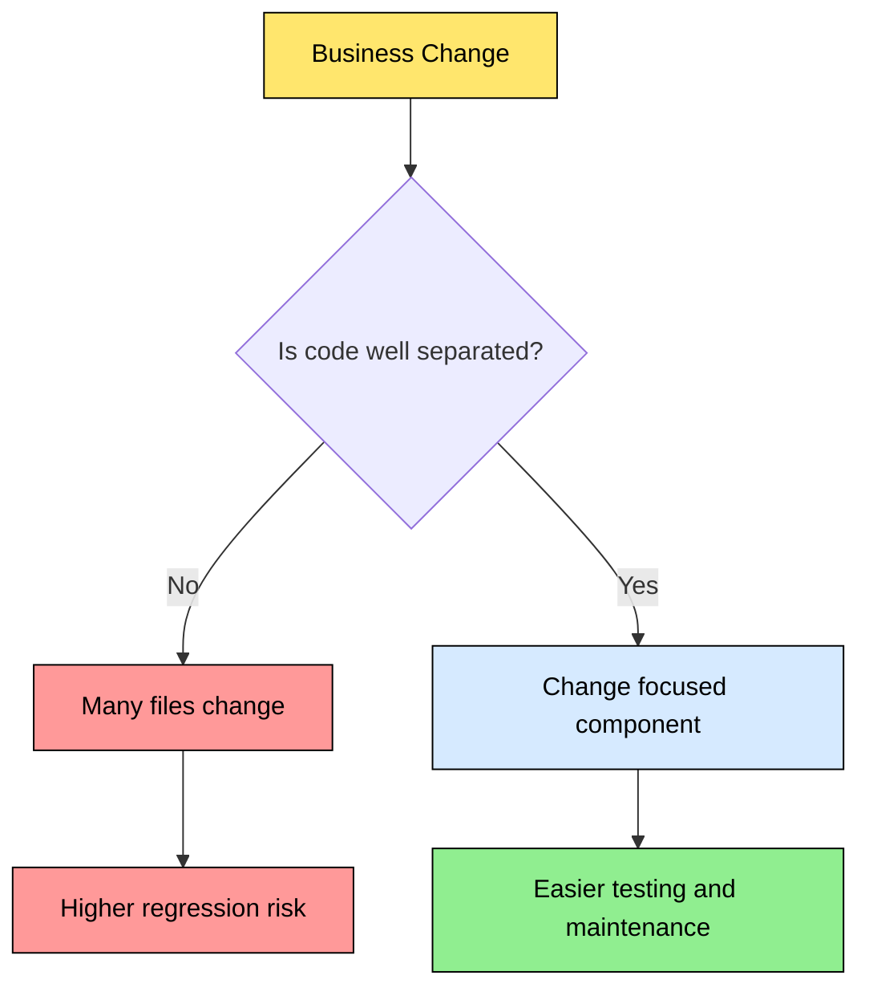
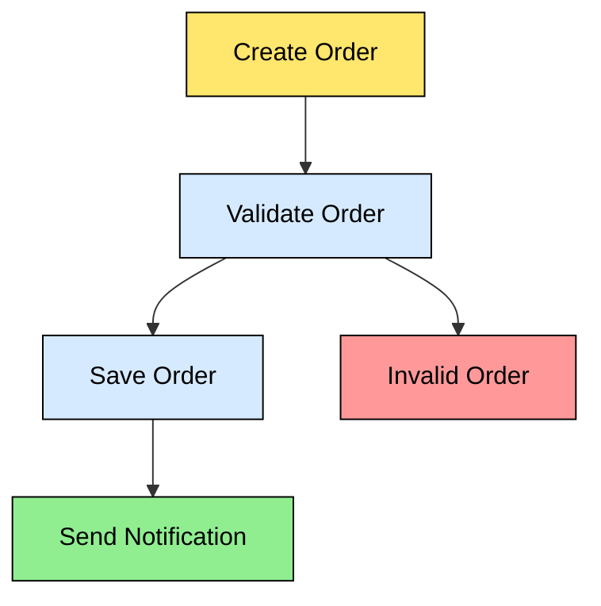
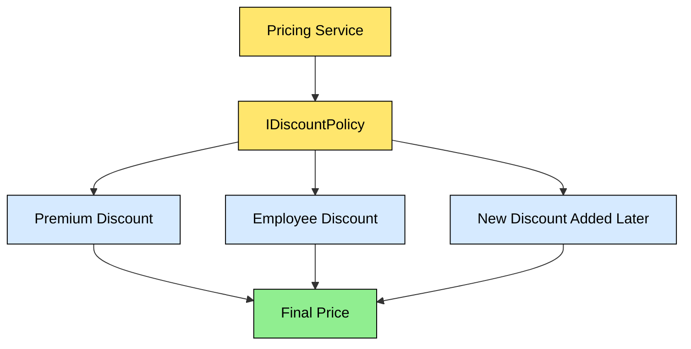
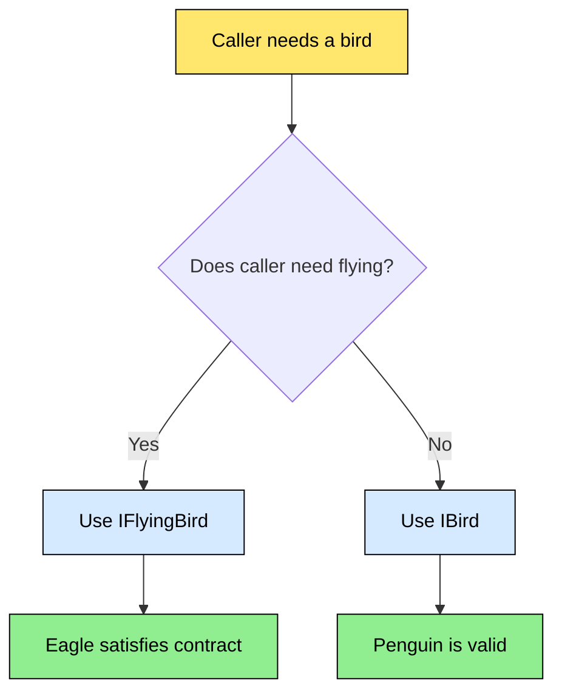
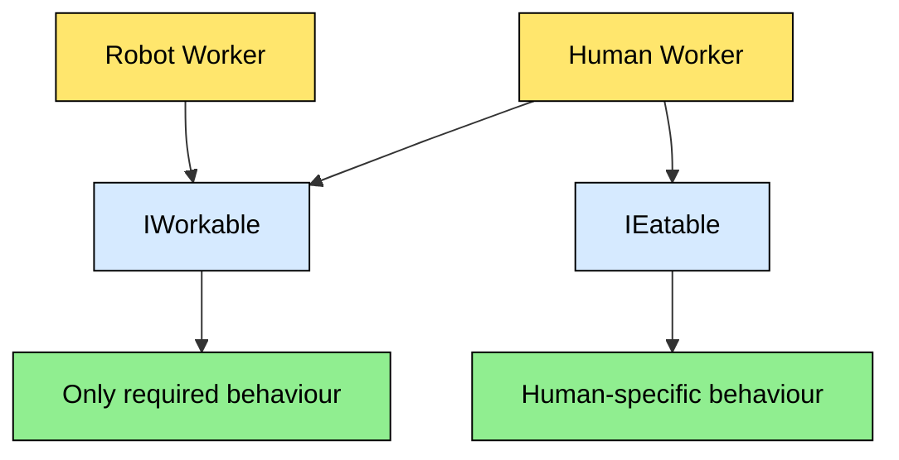
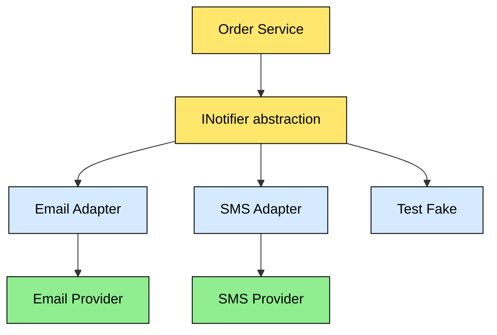
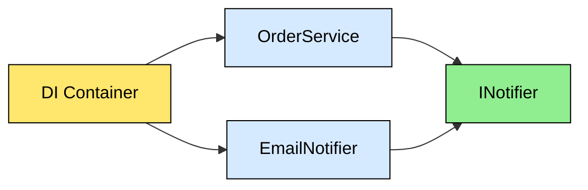
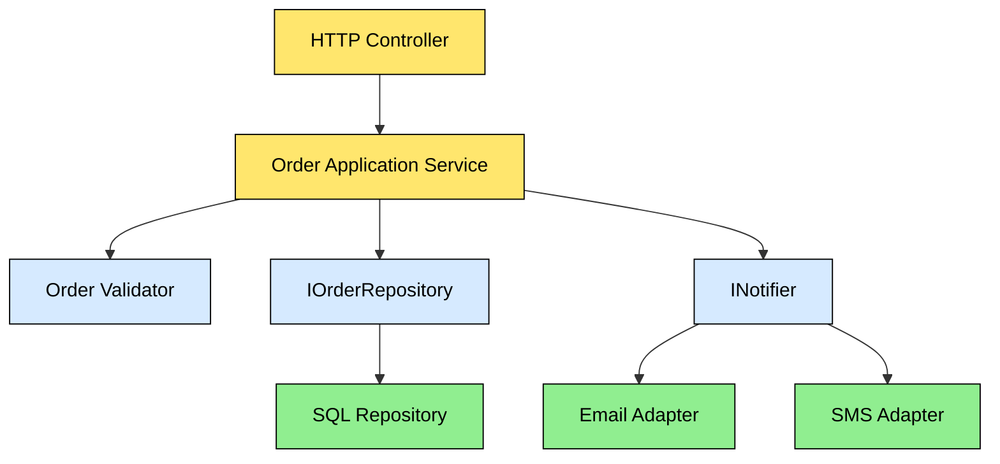

# 🎨 SOLID Principles — Easy English + Visual Interview Guide

> **Learning pattern used in every section:** Actual Definition → Simple English → Example → Flow Diagram → Scenario Questions → Answers → Interview Shortcut.

## 1. What is SOLID?

### Actual Definition
SOLID is a group of five object-oriented design principles that help software remain understandable, maintainable, testable, and easier to change.

### Simple English
SOLID is not about creating many classes or interfaces. It is about keeping code organised so that one business change does not break unrelated parts of the application.

| Letter | Principle | Easy meaning |
|---|---|---|
| S | Single Responsibility | One class should focus on one type of work |
| O | Open/Closed | Add new behaviour without repeatedly changing stable code |
| L | Liskov Substitution | A replacement implementation must honour the expected contract |
| I | Interface Segregation | Do not force clients to depend on methods they do not use |
| D | Dependency Inversion | Business code should depend on abstractions, not infrastructure details |



---

## 2. S — Single Responsibility Principle (SRP)

### Actual Definition
A class should have one reason to change.

### Simple English
A class should concentrate on one main responsibility. If database rules, email rules, and invoice formatting change for different reasons, they should not all be tightly mixed in one class.

**Important:** SRP does not mean one class can contain only one method. It means its responsibilities should belong to the same area of change.

### Example

❌ **Problem:**

```csharp
public class OrderService
{
    public void ValidateOrder() { }
    public void SaveToDatabase() { }
    public void SendEmail() { }
    public void CreateInvoicePdf() { }
}
```

✅ **Better:**

```csharp
public sealed class OrderValidator
{
    public bool IsValid(Order order) => order.Total > 0;
}

public sealed class OrderRepository
{
    public Task SaveAsync(Order order) => Task.CompletedTask;
}

public sealed class OrderNotificationService
{
    public Task SendAsync(string message) => Task.CompletedTask;
}
```

### Flow Diagram



### Scenario-Based Questions and Answers

**Q1. A class validates orders, writes to SQL, sends emails, and generates PDFs. What is wrong?**

**Answer:** It has multiple reasons to change. Validation, persistence, notification, and document formatting are separate responsibilities. Split them into focused components and let an application service coordinate them.

**Q2. Does SRP require a separate class for every method?**

**Answer:** No. Splitting every method creates unnecessary complexity. Group methods that belong to the same responsibility and change for the same reason.

**Interview Shortcut:** “SRP means one class should have one main responsibility and one primary reason to change—not necessarily one method.”

---

## 3. O — Open/Closed Principle (OCP)

### Actual Definition
Software entities should be open for extension but closed for modification.

### Simple English
When a new variation is introduced, we should preferably add a new implementation instead of repeatedly editing and risking stable business logic.

### Example

❌ **Problem:**

```csharp
public decimal CalculateDiscount(string type, decimal amount)
{
    if (type == "Premium") return amount * 0.90m;
    if (type == "Employee") return amount * 0.80m;
    return amount;
}
```

Every new discount type requires changing the method.

✅ **Better:**

```csharp
public interface IDiscountPolicy
{
    decimal Apply(decimal amount);
}

public sealed class PremiumDiscount : IDiscountPolicy
{
    public decimal Apply(decimal amount) => amount * 0.90m;
}

public sealed class EmployeeDiscount : IDiscountPolicy
{
    public decimal Apply(decimal amount) => amount * 0.80m;
}
```

### Flow Diagram



### Scenario-Based Questions and Answers

**Q1. Should we create an interface for every possible future feature?**

**Answer:** No. Use an abstraction when variation is real, likely, or already causing repeated changes. Do not predict imaginary requirements.

**Q2. A new payment method requires editing a large switch statement. What can you do?**

**Answer:** Consider a strategy or handler abstraction, such as `IPaymentMethod`, and register separate implementations for card, UPI, and wallet payments.

**Interview Shortcut:** “OCP reduces the risk of modifying stable code when adding a new variation.”

---

## 4. L — Liskov Substitution Principle (LSP)

### Actual Definition
Objects of a subtype should be replaceable for objects of the base type without changing the correctness of the program.

### Simple English
If a method expects a parent type, every child implementation must follow the promises of that parent. A child should not unexpectedly throw errors, weaken rules, or change the meaning of operations.

### Example

❌ **Broken inheritance:**

```csharp
public class Bird
{
    public virtual void Fly() { }
}

public class Penguin : Bird
{
    public override void Fly()
        => throw new NotSupportedException();
}
```

The caller expects every `Bird` to fly, but `Penguin` cannot satisfy that promise.

✅ **Better design:**

```csharp
public interface IBird { }

public interface IFlyingBird
{
    void Fly();
}

public sealed class Eagle : IBird, IFlyingBird
{
    public void Fly() { }
}

public sealed class Penguin : IBird
{
}
```

### Flow Diagram



### Scenario-Based Questions and Answers

**Q1. A subclass throws `NotSupportedException` for a method defined by the parent. Is that a warning sign?**

**Answer:** Yes. It may mean the parent contract is too broad or inheritance is being used incorrectly. Revisit the abstraction or use composition/interfaces.

**Q2. Can a child class add extra validation?**

**Answer:** It must not break expectations established by the parent contract. Stronger preconditions can make a valid parent operation fail when the subtype is substituted.

**Interview Shortcut:** “LSP means implementations must honour the promises made by the abstraction.”

---

## 5. I — Interface Segregation Principle (ISP)

### Actual Definition
Clients should not be forced to depend on interfaces they do not use.

### Simple English
Avoid one huge interface containing unrelated methods. Create smaller interfaces based on what each client actually needs.

### Example

❌ **Fat interface:**

```csharp
public interface IWorker
{
    void Work();
    void Eat();
}
```

A robot may work but does not need `Eat()`.

✅ **Focused interfaces:**

```csharp
public interface IWorkable
{
    void Work();
}

public interface IEatable
{
    void Eat();
}
```

### Flow Diagram



### Scenario-Based Questions and Answers

**Q1. An implementation contains empty methods or `NotImplementedException`. What does it suggest?**

**Answer:** The interface may contain operations that the implementation does not need. Split the interface into smaller client-focused contracts.

**Q2. Is having many small interfaces always better?**

**Answer:** No. Interfaces should represent meaningful contracts. Excessive splitting can make the code harder to understand.

**Interview Shortcut:** “ISP prevents clients from depending on methods they do not need.”

---

## 6. D — Dependency Inversion Principle (DIP)

### Actual Definition
High-level modules should not depend on low-level modules. Both should depend on abstractions. Details should depend on abstractions.

### Simple English
Business logic should not directly create or control infrastructure such as SQL clients, SMTP libraries, cloud SDKs, or vendor APIs. It should communicate through a contract.

### Example

❌ **Tightly coupled:**

```csharp
public sealed class OrderService
{
    private readonly SmtpEmailSender _sender = new();
}
```

✅ **Abstraction-based:**

```csharp
public interface INotifier
{
    Task SendAsync(string message, CancellationToken ct);
}

public sealed class OrderService(INotifier notifier)
{
    public Task NotifyAsync(CancellationToken ct)
        => notifier.SendAsync("Order created", ct);
}
```

### Flow Diagram



### Scenario-Based Questions and Answers

**Q1. Why should an application service not directly call an Azure SDK?**

**Answer:** Direct SDK usage couples business logic to infrastructure, makes unit testing harder, and increases the impact of vendor or implementation changes. Put the SDK behind an adapter or abstraction when that boundary adds value.

**Q2. Does DIP mean every class needs an interface?**

**Answer:** No. Use abstractions at meaningful boundaries such as external services, databases, queues, clocks, payment gateways, and implementations that need substitution.

**Interview Shortcut:** “DIP is about the direction of dependency; high-level business rules should not be controlled by low-level implementation details.”

---

## 7. DIP vs Dependency Injection (DI)

| Term | Meaning |
|---|---|
| DIP | A design principle: depend on abstractions |
| DI | A technique: provide dependencies from outside a class |



**Simple memory trick:** DIP is the architectural idea; DI is one way to implement that idea.

---

## 8. Integrated Real-World API Scenario

### Question
Design an order API that validates an order, saves it, sends a notification, and supports changing notification providers.

### Answer
Use a controller for HTTP concerns, an application service for orchestration, focused validators, repository abstractions, and notification abstractions.



**How the principles appear:**

- **SRP:** Each component has a focused responsibility.
- **OCP:** New notification strategies can be added behind `INotifier`.
- **LSP:** Each implementation must honour its interface contract.
- **ISP:** Contracts contain only related operations.
- **DIP:** The application service depends on abstractions rather than SQL or email SDKs.

---

## 9. Principal Engineer Scenario Questions

### Q1. A team created 40 interfaces for 40 classes. Is that good SOLID?

**Answer:** Not automatically. Review whether each interface represents a real boundary, multiple implementations, testing need, independent change, or business contract. Interfaces created only by habit can add indirection without reducing coupling.

### Q2. A payment vendor changes its SDK frequently. What design would you use?

**Answer:** Create an `IPaymentGateway` contract and a vendor-specific adapter. Keep vendor request/response models inside the adapter and translate them into application models.

### Q3. A large switch statement handles card, UPI, wallet, and bank transfer.

**Answer:** First check whether the variations are stable and genuinely different. If they change independently, use a strategy/handler design. If the switch is small and unlikely to change, keeping it simple may be better.

### Q4. A developer says, “We must apply all SOLID principles everywhere.” How do you respond?

**Answer:** SOLID is guidance, not a compliance checklist. The design should balance maintainability, readability, delivery speed, performance, testing, and operational complexity.

---

## 10. Quick Revision Table

| Principle | Main question to ask |
|---|---|
| SRP | Does this class have unrelated reasons to change? |
| OCP | Can a new variation be added without risky edits to stable code? |
| LSP | Can this implementation safely replace the expected abstraction? |
| ISP | Is the client forced to depend on unused methods? |
| DIP | Does business logic directly depend on infrastructure details? |

## 11. Interview Answer Formula

Use this sequence in interviews:

1. State the actual definition.
2. Explain it in simple English.
3. Give a bad example.
4. Give a better C# design.
5. Explain the trade-off.
6. Describe a real production scenario.

**Final reminder:** Good architecture is not the architecture with the most interfaces. Good architecture makes change safer while keeping the code understandable.

### References

- Robert C. Martin’s SOLID principle definitions.
- University of Toronto — SOLID design principles lecture material.
- FHNW Software Engineering Fundamentals — SOLID principles and design trade-offs.
