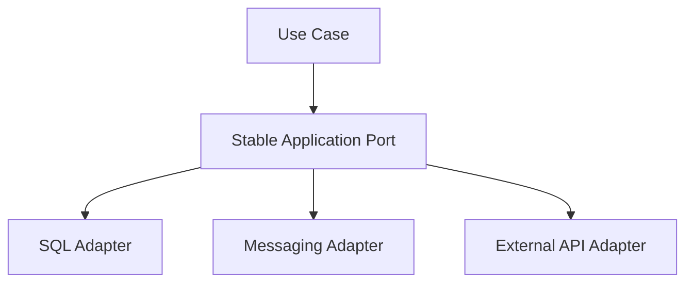

# SOLID Principles — Interview Q&A

SOLID is a set of design guidelines that improve maintainability, testability, and changeability. Apply them pragmatically; excessive abstraction can increase complexity.

## S — Single Responsibility Principle
A class should have one primary responsibility and one reason to change.

```csharp
public interface IOrderRepository { Task SaveAsync(Order order, CancellationToken ct); }
public interface IOrderValidator { bool IsValid(Order order); }

public sealed class OrderApplicationService(IOrderRepository repository, IOrderValidator validator)
{
    public async Task CreateAsync(Order order, CancellationToken ct)
    {
        if (!validator.IsValid(order)) throw new ArgumentException("Invalid order");
        await repository.SaveAsync(order, ct);
    }
}
```

## O — Open/Closed Principle
Software entities should be open for extension but closed for repeated modification. Replace growing conditional pricing logic with strategies when rules change frequently.

```csharp
public interface IDiscountPolicy { decimal Apply(decimal amount); }
public sealed class PremiumDiscount : IDiscountPolicy { public decimal Apply(decimal amount) => amount * 0.90m; }
public sealed class NoDiscount : IDiscountPolicy { public decimal Apply(decimal amount) => amount; }
```

## L — Liskov Substitution Principle
A subtype must honor the behavioral contract of its base abstraction. Frequent `NotSupportedException`, weakened validation, or surprising behavior can indicate a broken abstraction.

```csharp
public interface IReadable { string Read(); }
public interface IWritable { void Write(string value); }
```

## I — Interface Segregation Principle
Clients should not depend on methods they do not need.

```csharp
public interface IReportReader { Task<Report> GetAsync(Guid id, CancellationToken ct); }
public interface IReportWriter { Task SaveAsync(Report report, CancellationToken ct); }
```

## D — Dependency Inversion Principle
High-level business rules should depend on abstractions rather than concrete infrastructure implementations.

```csharp
public interface INotifier { Task SendAsync(string message, CancellationToken ct); }
public sealed class OrderService(INotifier notifier)
{
    public Task NotifyAsync(CancellationToken ct) => notifier.SendAsync("Order created", ct);
}
```

The composition root wires implementations:
```csharp
builder.Services.AddScoped<INotifier, EmailNotifier>();
```

## Common interview questions

### Is SOLID always required?
No. SOLID is guidance. A small stable feature may not need multiple interfaces or patterns. Consider change frequency, cohesion, testability, and operational complexity.

### Does dependency inversion mean every class needs an interface?
No. Use abstractions at volatile or externally controlled boundaries such as payment providers, databases, queues, and time. A simple pure domain class may not need one.

### SRP vs separation of concerns?
Separation of concerns is the broader idea; SRP applies it to the reasons a particular module or class changes.

### How can SOLID be misused?
- Interfaces for every class without a substitution need.
- Layers that only forward calls.
- Excessive inheritance instead of composition.
- Unnecessary factories.
- Treating principles as rigid rules instead of trade-offs.

## Principal Engineer scenario: 40 interfaces for 40 classes
Do not defend the design by saying SOLID requires interfaces. Inspect why abstractions exist. Keep interfaces at volatile boundaries, collapse pass-through abstractions, and favor cohesive modules. The goal is controlled change, not maximum interface count.



## Scenario: payment vendor changes SDK every quarter
Use an adapter/anti-corruption boundary. Keep domain models independent of vendor types, contract-test the adapter, and make provider replacement possible without changing business rules.

```csharp
public interface IPaymentGateway { Task<PaymentResult> AuthorizeAsync(Money amount, CancellationToken ct); }
public sealed class VendorPaymentAdapter(VendorClient client) : IPaymentGateway
{
    public async Task<PaymentResult> AuthorizeAsync(Money amount, CancellationToken ct)
    {
        var r = await client.AuthorizeAsync(amount.Value, amount.Currency, ct);
        return new PaymentResult(r.Success, r.Reference);
    }
}
```

## Quick review table
| Principle | Interview keyword | Typical smell |
|---|---|---|
| SRP | One reason to change | God class |
| OCP | Extend without modifying core logic | Large conditional chains |
| LSP | Behavioral substitutability | Unsupported inherited methods |
| ISP | Focused interfaces | Fat interfaces |
| DIP | Depend on abstractions | Newing infrastructure inside business logic |

## References
- [Microsoft dependency injection](https://learn.microsoft.com/en-us/dotnet/core/extensions/dependency-injection)
- [Microsoft architecture guidance](https://learn.microsoft.com/en-us/dotnet/architecture/)
