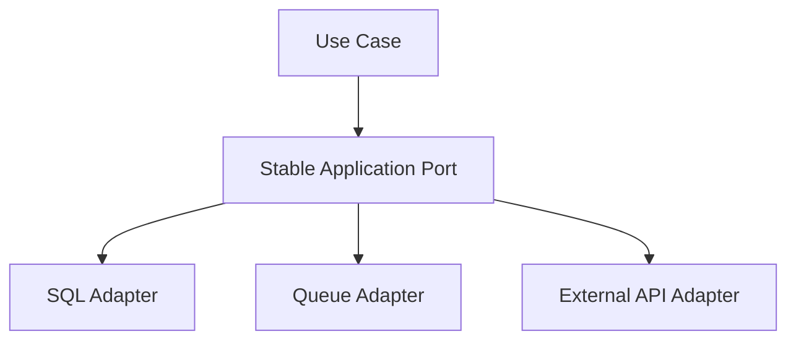

# SOLID Principles — Interview Q&A

SOLID is a set of design guidelines that improve maintainability, testability, and changeability. Apply them pragmatically; excessive abstraction can increase complexity.

## S — Single Responsibility Principle

A class should have one primary responsibility and one reason to change.

**Poor design:** an `OrderService` validates orders, writes to SQL, generates PDFs, and sends emails.

**Better design:** separate application orchestration from validation, persistence, and notification.

```csharp
public interface IOrderRepository
{
    Task SaveAsync(Order order, CancellationToken ct);
}

public interface IOrderValidator
{
    bool IsValid(Order order);
}

public sealed class OrderApplicationService(
    IOrderRepository repository,
    IOrderValidator validator)
{
    public async Task CreateAsync(Order order, CancellationToken ct)
    {
        if (!validator.IsValid(order))
            throw new ArgumentException("Invalid order");

        await repository.SaveAsync(order, ct);
    }
}
```

## O — Open/Closed Principle

Software entities should be open for extension but closed for repeated modification.

Replace growing `if/else` pricing logic with a strategy abstraction when new pricing rules are expected frequently.

```csharp
public interface IDiscountPolicy
{
    decimal Apply(decimal amount);
}

public sealed class PremiumDiscount : IDiscountPolicy
{
    public decimal Apply(decimal amount) => amount * 0.90m;
}

public sealed class NoDiscount : IDiscountPolicy
{
    public decimal Apply(decimal amount) => amount;
}
```

## Liskov Substitution Principle

A subtype must honor the behavioral contract of its base abstraction. If a subtype cannot support an operation, the abstraction may be incorrect.

## Interface Segregation Principle

Clients should not depend on methods they do not need.

## Dependency Inversion Principle

High-level business rules should depend on abstractions rather than concrete infrastructure implementations.

```csharp
public interface INotifier
{
    Task SendAsync(string message, CancellationToken ct);
}

public sealed class OrderService(INotifier notifier)
{
    public Task NotifyAsync(CancellationToken ct) =>
        notifier.SendAsync("Order created", ct);
}
```

## Common interview questions

### Is SOLID always required?
No. SOLID is guidance. A small, stable feature may not need multiple interfaces or patterns. Consider change frequency, cohesion, testability, and operational complexity.

### Does dependency inversion mean every class needs an interface?
No. Use abstractions at volatile or externally controlled boundaries, such as payment providers, databases, queues, and time. A simple pure domain class may not need an interface.

### SRP vs separation of concerns?
Separation of concerns is the broader idea of isolating different concerns. SRP applies that idea to the reasons a particular module or class changes.

### How can SOLID be misused?
- Creating interfaces for every class without a real substitution need.
- Adding layers that only forward calls.
- Overusing inheritance instead of composition.
- Hiding simple logic behind unnecessary factories.
- Treating principles as rigid rules instead of trade-offs.

## Principal Engineer scenario: a codebase has 40 interfaces for 40 classes
Do not defend the design by saying “SOLID requires interfaces.” Inspect why abstractions exist. Keep interfaces at boundaries where implementations vary or need isolation, collapse pass-through abstractions, and favor cohesive modules. The architectural goal is controlled change, not maximum interface count.



### Scenario: a payment provider changes its SDK every quarter
Use an anti-corruption/adapter boundary around the vendor SDK. Keep domain models independent of vendor types, contract-test the adapter, and make provider replacement possible without changing business rules.

```csharp
public interface IPaymentGateway
{
    Task<PaymentResult> AuthorizeAsync(Money amount, CancellationToken ct);
}

public sealed class VendorPaymentAdapter(VendorClient client) : IPaymentGateway
{
    public async Task<PaymentResult> AuthorizeAsync(Money amount, CancellationToken ct)
    {
        var response = await client.AuthorizeAsync(amount.Value, amount.Currency, ct);
        return new PaymentResult(response.Success, response.Reference);
    }
}
```

## Quick review table

| Principle | Interview keyword | Typical smell |
|---|---|---|
| SRP | One reason to change | God class |
| OCP | Extend without modifying core logic | Large conditional chains |
| LSP | Behavioral substitutability | Unsupported inherited methods |
| ISP | Focused interfaces | Fat interfaces |
| DIP | Depend on abstractions | Newing infrastructure inside business logic |

## References

- [Microsoft dependency injection](https://learn.microsoft.com/en-us/dotnet/core/extensions/dependency-injection)
- [Microsoft architecture guidance](https://learn.microsoft.com/en-us/dotnet/architecture/)
- [Microsoft .NET dependency inversion guidance](https://learn.microsoft.com/en-us/dotnet/architecture/microservices/microservice-ddd-cqrs-patterns/infrastructure-persistence-layer-design)
