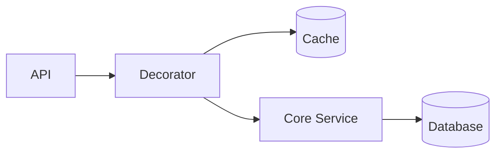

# Top 5 Design Patterns — Interview Q&A

Design patterns are reusable approaches to recurring design problems. They are not copy-paste frameworks; select a pattern only when it reduces coupling or clarifies intent.

## 1. Factory Pattern
Centralizes object creation and hides concrete implementation details.

## 2. Strategy Pattern
Encapsulates interchangeable algorithms behind a common interface.

```csharp
public interface IDiscountStrategy { decimal Apply(decimal total); }
public sealed class VipDiscount : IDiscountStrategy { public decimal Apply(decimal total) => total * 0.90m; }
public sealed class CheckoutService(IDiscountStrategy strategy) { public decimal Calculate(decimal total) => strategy.Apply(total); }
```

## 3. Decorator Pattern
Wraps an object to add behavior such as logging, caching, metrics, authorization, retries, or validation without changing the wrapped implementation.

## 4. Adapter Pattern
Converts an incompatible interface into one expected by the client; useful around legacy or third-party APIs.

## 5. Observer Pattern
Notifies subscribers about state changes. For distributed systems, prefer durable messaging when delivery, retries, dead-lettering, or replay are requirements.

## Pattern selection guide

| Requirement | Suitable pattern |
|---|---|
| Select implementation based on input | Factory |
| Swap business algorithms | Strategy |
| Add cross-cutting behavior | Decorator |
| Integrate incompatible APIs | Adapter |
| Notify multiple subscribers | Observer or durable messaging |

## Principal Engineer scenario: when does a pattern become overengineering?
Ask whether the behavior varies, whether the abstraction reduces coupling, and whether the team can understand the indirection. If a requirement is stable and simple, direct code can be the better design. Patterns should solve a demonstrated change problem, not satisfy a checklist.

## Scenario: add caching without modifying business logic
Decorator is a strong fit when caching is orthogonal to the service contract.

```csharp
public sealed class CachedProductService(
    IProductService inner,
    IMemoryCache cache) : IProductService
{
    public Task<Product> GetAsync(Guid id, CancellationToken ct) =>
        cache.GetOrCreateAsync($"product:{id}", _ => inner.GetAsync(id, ct))!;
}
```

**Trade-off:** cache invalidation, stampede protection, and stale-data policy must be designed explicitly.



## References
- [Microsoft dependency injection](https://learn.microsoft.com/en-us/dotnet/core/extensions/dependency-injection)
- [.NET architecture guidance](https://learn.microsoft.com/en-us/dotnet/architecture/)
- [Azure Cloud Design Patterns](https://learn.microsoft.com/en-us/azure/architecture/patterns/)
