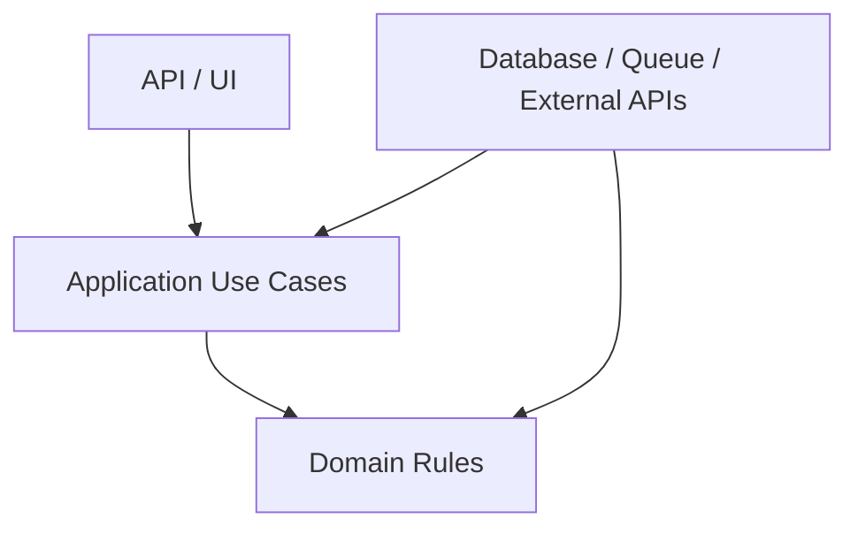
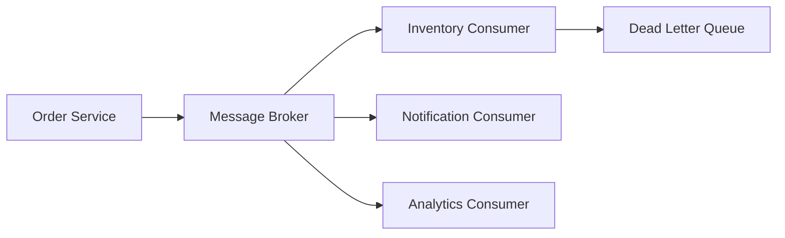
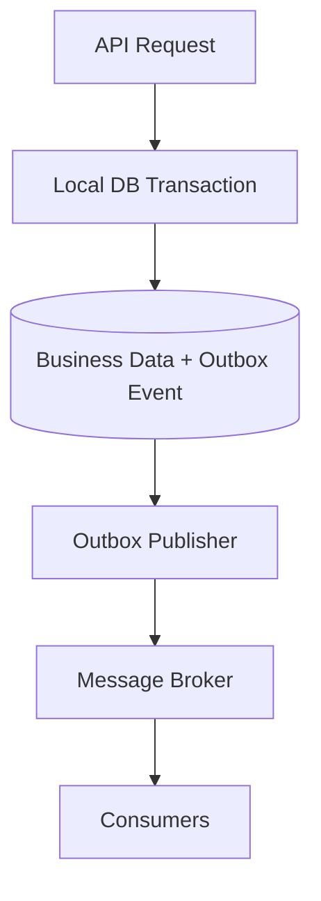

# 🏛️ Architectural Patterns — Interview Q&A

## 1. Layered Architecture
Separates presentation, application, domain, and infrastructure concerns. It is easy to understand but can become tightly coupled when every layer depends on database details.

## 2. Clean Architecture
Dependencies point inward toward business rules. Infrastructure implements interfaces defined closer to the application or domain.



## 3. Hexagonal Architecture
The application exposes **ports** and external systems connect through **adapters**.

```text
External Adapter → Input Port → Application Core → Output Port → External Adapter
```

This makes unit testing easier because infrastructure can be replaced with fakes.

## 4. CQRS
Command Query Responsibility Segregation separates write operations from read operations. The models may be different because reads and writes have different optimization needs.

**Trade-offs:** more code, synchronization challenges, eventual consistency, and operational complexity.

## 5. Event-Driven Architecture
Producers publish events and consumers react asynchronously.



Consumers should be idempotent because messages may be delivered more than once.

## Interview Questions

### Q1. How do you choose between a monolith and microservices?
Start with business boundaries, team ownership, deployment needs, scaling differences, and operational maturity. A modular monolith can provide strong boundaries without introducing distributed-system complexity.

### Q2. What makes a good microservice boundary?
A boundary should align with a business capability, have clear ownership of data, minimize synchronous dependencies, and allow independent evolution. Avoid splitting services only by technical layers such as `ControllerService` or `DatabaseService`.

### Q3. How do you handle distributed transactions?
Prefer local transactions with an outbox pattern and asynchronous events. For multi-step business workflows, use a Saga with compensating actions. Avoid distributed two-phase commit unless there is a strong, justified requirement.

### Q4. What is the Outbox Pattern?
The application writes business data and an event record in the same local database transaction. A background publisher then sends the event to the broker.



### Q5. How do you make event consumers reliable?
Use idempotency keys, retries with backoff, dead-letter queues, poison-message handling, observability, schema versioning, and controlled concurrency. Store processed event identifiers when necessary.

### Q6. What is eventual consistency?
Different data views become consistent after propagation delay rather than within one synchronous transaction. Expose meaningful status to users and design reconciliation processes for failures.

### Q7. How do you prevent a distributed system from cascading failures?
Use timeouts, bounded retries, circuit breakers, bulkheads, queue buffering, rate limits, load shedding, and graceful degradation. Retries must not amplify traffic during an outage.

### Q8. What should you discuss in a Principal Engineer architecture interview?
Clarify requirements, define quality attributes, explain boundaries and data ownership, identify failure modes, describe migration strategy, quantify assumptions, and state trade-offs. Explain why alternatives were rejected.

## Architecture Review Checklist

- **Scalability:** What scales independently?
- **Reliability:** What happens when a dependency fails?
- **Security:** How are identity, authorization, and secrets handled?
- **Observability:** Can failures be traced across services?
- **Data:** Who owns the data and how is consistency maintained?
- **Delivery:** Can changes be deployed and rolled back safely?
- **Cost:** What are the major infrastructure and operational drivers?

## References

- [Azure Architecture Center](https://learn.microsoft.com/en-us/azure/architecture/)
- [Azure Cloud Design Patterns](https://learn.microsoft.com/en-us/azure/architecture/patterns/)
- [Microsoft microservices guidance](https://learn.microsoft.com/en-us/dotnet/architecture/microservices/)
