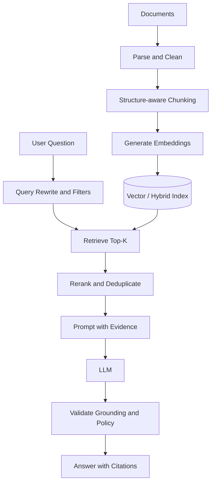
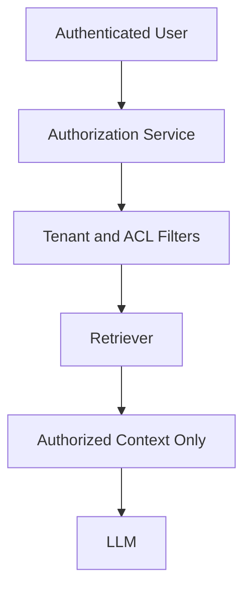

# 🤖 GenAI and RAG — Interview Q&A

## RAG Overview
Retrieval-Augmented Generation retrieves relevant external context and supplies it to an LLM to improve grounding and freshness.

## Interview Questions

### Q1. Why can a RAG system hallucinate even when retrieval works?
Retrieved documents may be irrelevant, incomplete, contradictory, outdated, or poorly represented in the prompt. The model may also infer unsupported information. Use evidence-aware prompts, abstention rules, citation validation, and separate retrieval and answer-quality evaluation.

### Q2. How do you select chunk size?
Start with document structure rather than a universal token count. Preserve headings, tables, paragraphs, and relationships. Evaluate retrieval recall, answer quality, latency, and token cost. Use overlap only when it improves boundary continuity.

### Q3. Vector search vs keyword search vs hybrid search?
- **Keyword:** strong for exact names, identifiers, and rare terms.
- **Vector:** strong for semantic similarity and paraphrases.
- **Hybrid:** combines both and is often useful for enterprise search.

The choice should be validated against a representative evaluation set.

### Q4. What is reranking?
A first-stage retriever quickly returns candidates. A reranker applies a more expensive relevance model to reorder them before prompt construction. This can improve precision but adds latency and cost.

### Q5. How do you secure multi-tenant RAG?
Apply tenant and document-level authorization during retrieval, not only in the prompt. Enforce access independently in the application layer, use metadata filters, prevent cross-tenant caching, audit access, and test unauthorized retrieval explicitly.

### Q6. How do you defend against prompt injection in retrieved documents?
Treat retrieved text as untrusted data. Separate instructions from evidence, avoid executing commands found in documents, restrict tool permissions, validate tool arguments, apply allowlists, and require confirmation for high-impact actions.

### Q7. How do you evaluate a RAG application?
Create a representative, versioned dataset containing questions, expected evidence, and acceptable answers. Measure:

- Retrieval recall and precision
- Context relevance
- Answer relevance
- Groundedness / faithfulness
- Citation correctness
- Latency and token usage
- Safety and refusal behavior

Use automated metrics as signals and human review for difficult cases.

### Q8. How would you reduce RAG latency?
Use metadata filtering, efficient indexes, query caching where safe, parallel retrieval, tuned top-k, reranking only when needed, streaming responses, and precomputed document representations. Measure each stage separately before optimizing.

### Q9. When should an agent use tools instead of RAG?
Use RAG for retrieving knowledge from indexed content. Use tools for actions or live information such as querying a system of record, creating a ticket, or checking current status. Tool access requires authentication, authorization, validation, rate limits, and auditability.

### Q10. How do you prevent an agent from running indefinitely?
Set maximum steps, execution timeouts, token budgets, retry limits, tool-specific permissions, and termination criteria. Return a controlled failure with diagnostic information when limits are reached.

### Q11. What is hybrid RAG?
Hybrid RAG may combine keyword retrieval, vector retrieval, metadata filters, graph relationships, structured database queries, and iterative retrieval. It should be introduced when the data or questions require multiple retrieval strategies—not simply because it is more complex.

### Q12. How do you handle document updates and deletion?
Track document versions, source identifiers, timestamps, and ACL metadata. Re-index changed content and remove deleted content from all relevant indexes and caches. Design for eventual propagation and verify deletion through automated tests.

## Production Design Checklist

- 🔐 Authentication, authorization, and tenant isolation
- 🧪 Offline evaluation and regression tests
- 📈 Tracing across ingestion, retrieval, reranking, and generation
- 💰 Token and infrastructure cost controls
- 🛡️ Prompt injection and data exfiltration defenses
- 🔁 Retry, timeout, and fallback behavior
- 📝 Citations, feedback, and audit logs
- 🚦 Human approval for consequential actions

## References

- [Azure AI Search](https://learn.microsoft.com/en-us/azure/search/)
- [Azure OpenAI](https://learn.microsoft.com/en-us/azure/ai-services/openai/)
- [Azure architecture for RAG](https://learn.microsoft.com/en-us/azure/architecture/ai-ml/guide/rag/)
- [OWASP Top 10 for LLM Applications](https://owasp.org/www-project-top-10-for-large-language-model-applications/)
