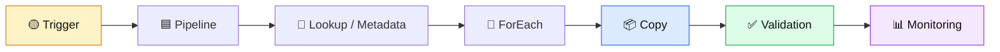
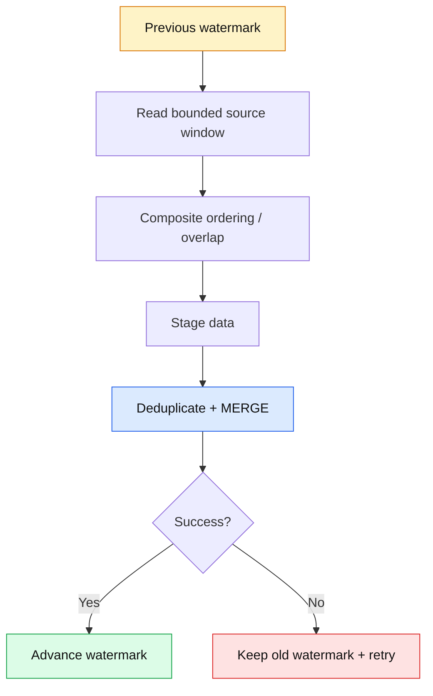
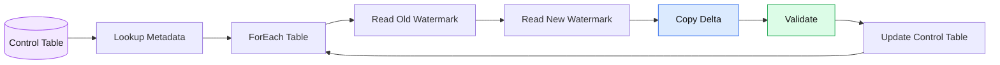

# Azure Data Factory Interview Q&A

> 🎯 Focus: practical ETL/ELT design, incremental ingestion, failure recovery, security, performance, and Principal Engineer trade-offs.

## Core concepts
- **Pipeline:** logical workflow.
- **Activity:** unit of work such as Copy, Lookup, ForEach, or Data Flow.
- **Dataset:** data structure or location reference.
- **Linked service:** connection information for a data store or compute service.
- **Integration Runtime:** compute and network bridge for data movement and activities.
- **Trigger:** starts a pipeline on schedule, event, or tumbling window.



## Interview questions

### 🟡 Q1. How do you implement incremental loading safely?

🟢 **Answer:** Store a durable high-watermark such as `LastModifiedTime` or an increasing ID. Read the previous watermark, calculate a bounded upper watermark, extract only the range, load/merge the target, validate success, and advance the watermark **only after successful processing**. Microsoft’s ADF tutorial uses this Lookup → Copy → Stored Procedure pattern. citeturn0search1turn0search4

```sql
-- Example source extraction window
SELECT Id, LastModifiedTime, Amount
FROM dbo.Orders
WHERE LastModifiedTime > @OldWatermark
  AND LastModifiedTime <= @NewWatermark;
```

🔴 **Failure mode:** Advancing the watermark before the target commit can permanently skip records after a failed run.

### 🟡 Q2. What if two records have the same timestamp?

🟢 **Answer:** A timestamp-only watermark can be ambiguous. Prefer a monotonic key when possible, or use a composite watermark such as `(LastModifiedTime, Id)` with deterministic ordering. Another practical option is a small overlap window combined with idempotent upsert/deduplication.



### 🟡 Q3. How do you handle late-arriving updates?

🟢 **Answer:** Separate **event time** from **processing time**. Allow a controlled look-back window, reprocess affected partitions, and make downstream writes idempotent. For high-value data, use change tracking/CDC where available rather than assuming timestamps perfectly describe every update.

### 🟡 Q4. How do you make an ADF pipeline restartable?

🟢 **Answer:** Design activities around durable checkpoints, deterministic inputs, idempotent target writes, and explicit run metadata. A retry should not duplicate business records or advance state incorrectly.

🟣 **Principal Engineer signal:** Explain the difference between **retrying an activity** and **replaying a business batch**. The latter requires stronger idempotency and reconciliation.

### 🟡 Q5. How do you troubleshoot a pipeline that suddenly becomes slow?

🟢 **Answer:** Break the duration into source read, network/IR, transformation, sink write, queueing, and downstream database time. Check DIU/parallelism, source query plans, partition skew, throttling, file counts, and sink contention. Do not increase parallelism blindly.

### 🟡 Q6. What is the difference between Copy Activity and Mapping Data Flow?

🟢 **Answer:** Copy Activity is primarily for reliable data movement and simple mapping. Mapping Data Flow provides visual, managed transformation capabilities. If the source database can efficiently perform a SQL transformation, pushing work to the database may be simpler and cheaper than introducing a distributed transformation layer.

### 🟡 Q7. How do you secure ADF in an enterprise environment?

🟢 **Answer:** Prefer managed identities, least-privilege RBAC, Key Vault for unavoidable secrets, private endpoints/network controls where required, secure input/output settings, and separate development/test/production identities. Keep credentials out of pipeline source code.

### 🟡 Q8. How would you design multi-table incremental ingestion?

🟢 **Answer:** Maintain a control table containing table name, watermark column, previous watermark, current watermark, batch/run ID, status, and error information. Parameterize a reusable pipeline and iterate over metadata. Microsoft documents this Lookup → Copy → watermark-update pattern for multiple tables. citeturn0search2



### 🟡 Q9. Scenario: source load succeeds but watermark update fails. What happens?

🟢 **Answer:** The next run may process the same range again. That is acceptable only if the target write is idempotent. Use a stable business key plus `MERGE`/upsert or a deduplication strategy. The design should favor **at-least-once processing + idempotent consumption** over assuming perfect exactly-once execution.

### 🟡 Q10. Scenario: millions of small files make an ADF pipeline slow.

🟢 **Answer:** File enumeration itself can become the bottleneck even if the copied byte volume is small. Consolidate files upstream where practical, use partitioning intelligently, reduce unnecessary scans, and measure metadata/listing latency separately from transfer time. Microsoft notes that scanning large numbers of files can remain time-consuming even when the copied data is reduced. citeturn0search7

## 💻 Practical control-table example

```sql
CREATE TABLE dbo.AdfWatermark
(
    PipelineName      varchar(200) NOT NULL,
    SourceObject      varchar(200) NOT NULL,
    LastWatermark     datetime2(7) NOT NULL,
    LastSuccessfulRun uniqueidentifier NULL,
    UpdatedAt         datetime2(7) NOT NULL DEFAULT SYSUTCDATETIME(),
    CONSTRAINT PK_AdfWatermark PRIMARY KEY (PipelineName, SourceObject)
);

-- Advance state only after the target transaction succeeds.
UPDATE dbo.AdfWatermark
SET LastWatermark = @NewWatermark,
    LastSuccessfulRun = @RunId,
    UpdatedAt = SYSUTCDATETIME()
WHERE PipelineName = @PipelineName
  AND SourceObject = @SourceObject;
```

## 🧠 Principal Engineer checklist

- Define the **source-of-truth** and watermark semantics.
- Make target writes **idempotent**.
- Separate extraction, validation, commit, and checkpointing.
- Design for retries, replay, and partial failure.
- Track batch/run IDs for auditability.
- Measure source, IR, transformation, and sink bottlenecks independently.
- Use least privilege and managed identity.
- Test late data, duplicate data, schema changes, and failed watermark updates.

## References

- [ADF overview](https://learn.microsoft.com/en-us/azure/data-factory/introduction)
- [Pipelines and activities](https://learn.microsoft.com/en-us/azure/data-factory/concepts-pipelines-activities)
- [Transform data](https://learn.microsoft.com/en-us/azure/data-factory/transform-data)
- [Incremental copy with watermark](https://learn.microsoft.com/en-us/azure/data-factory/tutorial-incremental-copy-portal)
- [Incremental copy for multiple tables](https://learn.microsoft.com/en-us/azure/data-factory/tutorial-incremental-copy-multiple-tables-portal)
- [Delta copy with control table](https://learn.microsoft.com/en-us/azure/data-factory/solution-template-delta-copy-with-control-table)
