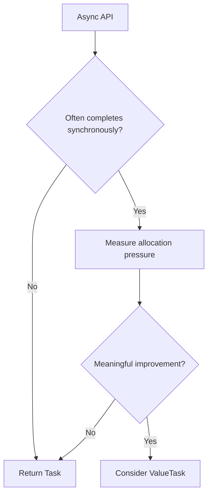

# Advanced C#/.NET — Principal Engineer Interview Scenarios

## Q1. When would you use `ValueTask` instead of `Task`?

### Answer
Use `ValueTask` when an async operation **frequently completes synchronously** and allocation pressure is measurable. `Task` remains the default because it is simpler and can be awaited multiple times. A `ValueTask` should generally be consumed once and should not be stored casually.

```csharp
public ValueTask<string> GetCachedValueAsync(string key)
{
    if (_cache.TryGetValue(key, out string? value))
        return ValueTask.FromResult(value!);

    return new ValueTask<string>(LoadFromStoreAsync(key));
}
```

### Interview trade-off
- `Task`: simpler, reusable, usually preferred.
- `ValueTask`: can reduce allocations for hot paths with synchronous completion.
- Measure first with profiling/benchmarks; do not optimize based only on theory.



## Q2. How would you prevent thread-pool starvation in ASP.NET Core?

### Answer
Avoid blocking calls such as `.Result`, `.Wait()`, synchronous database/network APIs, and unbounded parallel work. Use async I/O end-to-end, bounded concurrency, cancellation, and appropriate timeouts.

```csharp
public async Task<IReadOnlyList<Order>> GetOrdersAsync(
    IEnumerable<int> ids,
    CancellationToken cancellationToken)
{
    using var gate = new SemaphoreSlim(20);

    var tasks = ids.Select(async id =>
    {
        await gate.WaitAsync(cancellationToken);
        try { return await _client.GetOrderAsync(id, cancellationToken); }
        finally { gate.Release(); }
    });

    return await Task.WhenAll(tasks);
}
```

### Production checklist
1. Find synchronous blocking in traces.
2. Bound fan-out.
3. Propagate cancellation.
4. Set downstream timeouts.
5. Monitor request latency, thread-pool queue length and dependency latency.

### Official documentation
- https://learn.microsoft.com/en-us/dotnet/standard/asynchronous-programming-patterns/
- https://learn.microsoft.com/en-us/aspnet/core/fundamentals/best-practices
