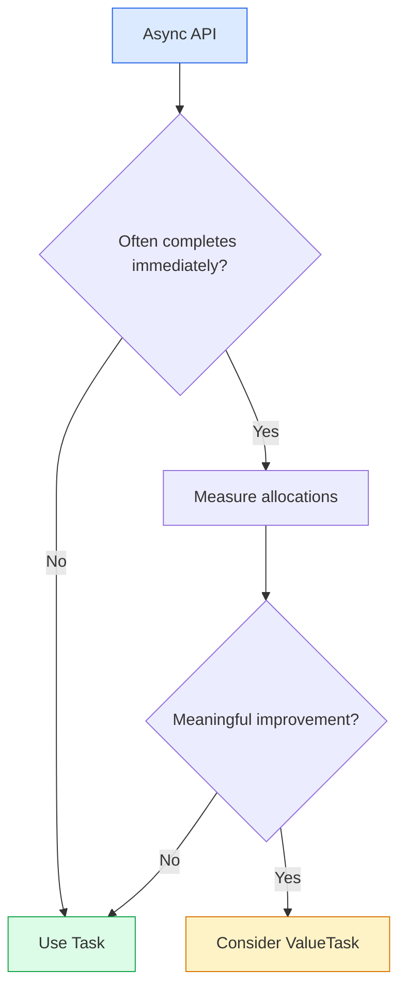
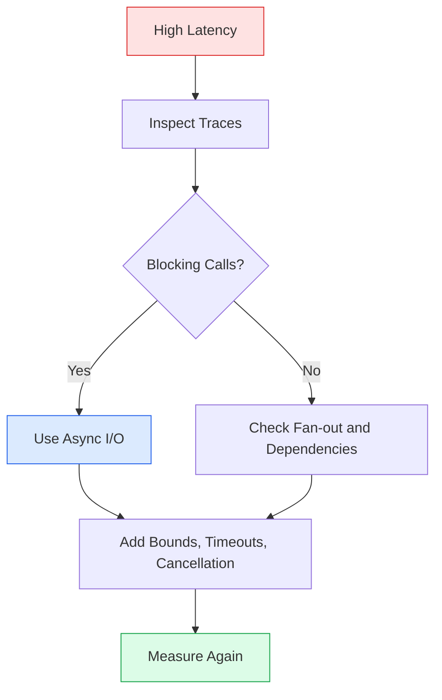

# 🎨 Advanced C#/.NET — Beginner-Friendly Principal Engineer Scenarios

> Learn each topic in simple language, then connect it to production engineering.

## 🟦 Question 1: When would you use `ValueTask` instead of `Task`?

### 🟢 Simple Explanation
Use `ValueTask` when an asynchronous operation often finishes immediately and profiling shows that allocations matter. **Use `Task` by default** because it is simpler and can be awaited or stored more freely.

### 💡 Practical Example
A cache lookup may return a value immediately. A cache miss may require a database call.

```csharp
public ValueTask<string> GetCachedValueAsync(string key)
{
    // Fast path: the value is already available.
    if (_cache.TryGetValue(key, out string? value))
        return ValueTask.FromResult(value!);

    // Slow path: load asynchronously from the store.
    return new ValueTask<string>(LoadFromStoreAsync(key));
}
```

### ⚖️ Interview Trade-off
- `Task`: easiest default and more flexible.
- `ValueTask`: useful for measured hot paths with frequent synchronous completion.
- Do not optimize prematurely; benchmark first.

### 🔄 Visual Decision Flow


## 🟩 Question 2: How would you prevent thread-pool starvation in ASP.NET Core?

### 🟢 Simple Explanation
Thread-pool starvation happens when available threads are blocked for too long. The application then struggles to process new requests.

### 🚫 Avoid
- `.Result` and `.Wait()` on asynchronous work.
- Synchronous network or database calls inside request handlers.
- Unlimited parallel tasks.

### 💻 Practical Example
```csharp
public async Task<IReadOnlyList<Order>> GetOrdersAsync(
    IEnumerable<int> ids,
    CancellationToken cancellationToken)
{
    using var gate = new SemaphoreSlim(20); // Bound concurrency.

    var tasks = ids.Select(async id =>
    {
        await gate.WaitAsync(cancellationToken);
        try
        {
            return await _client.GetOrderAsync(id, cancellationToken);
        }
        finally
        {
            gate.Release();
        }
    });

    return await Task.WhenAll(tasks);
}
```

### 🔄 Production Troubleshooting Flow


### 📋 Production Checklist
1. Find blocking calls in traces.
2. Bound fan-out with a concurrency limit.
3. Propagate cancellation.
4. Set downstream timeouts.
5. Monitor latency, thread-pool queue length, and dependency latency.

### 📚 Official Documentation
- [C# asynchronous programming](https://learn.microsoft.com/en-us/dotnet/csharp/asynchronous-programming/)
- [ASP.NET Core performance best practices](https://learn.microsoft.com/en-us/aspnet/core/fundamentals/best-practices)
