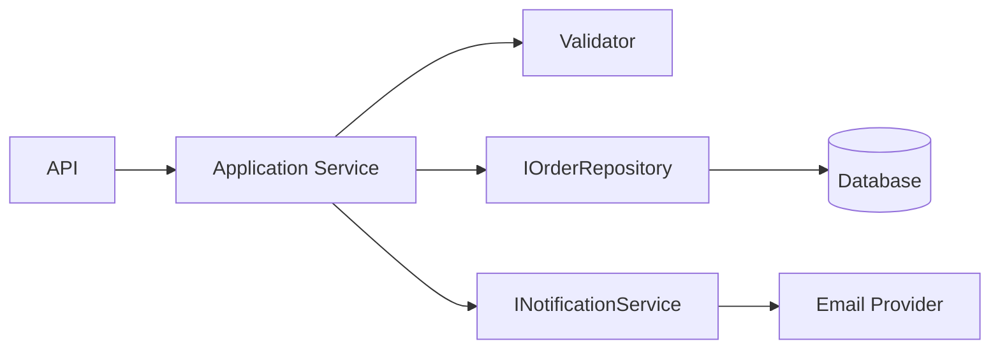

# SOLID — Advanced Design Scenarios

## Q1. A service handles validation, persistence, email, logging and retries. What would you change?

### Answer
It has multiple reasons to change. Separate business policy from infrastructure concerns and depend on focused abstractions at the application boundary.



Do not create interfaces only to satisfy SOLID. Introduce abstractions where they protect business policy from infrastructure volatility or enable useful substitution and testing.

## Q2. How do you recognize a Liskov Substitution Principle violation?

### Answer
If a subtype cannot honor the contract expected from the base abstraction, substitution is broken. Common signals include `NotSupportedException`, surprising side effects, stronger preconditions, or weaker postconditions.

```csharp
public interface IReadableStore
{
    Task<string> ReadAsync(string id);
}

public interface IWritableStore
{
    Task WriteAsync(string id, string value);
}
```

Splitting capabilities is often safer than forcing every implementation into one broad abstraction.

### Interview follow-up
Ask: What contract does the caller rely on, and can every implementation preserve it?

### Official documentation
- https://learn.microsoft.com/en-us/dotnet/core/extensions/dependency-injection
- https://learn.microsoft.com/en-us/dotnet/architecture/microservices/microservice-application-layer-web-api-design
