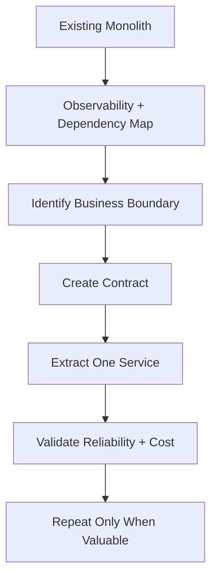

# Architecture — Principal Engineer Scenarios

## Q1. How would you evolve a monolith used by 50 teams without creating a distributed-monolith disaster?

### Answer
Start with business boundaries and measurable pain, not technology. Identify high-change domains, isolate them behind stable APIs/events, introduce observability and contract tests, then extract one bounded capability at a time.

### Principal-level trade-offs
- Keep low-change modules in the monolith.
- Prefer asynchronous events when temporal decoupling matters.
- Define ownership and SLOs before creating services.
- Measure deployment frequency, failure rate, latency and operational cost.

## Q2. When would you choose synchronous APIs over events?

Use synchronous calls when the caller needs an immediate decision or response and strong request-level consistency is valuable. Use events for temporal decoupling, fan-out, independent consumers and workflows that tolerate eventual consistency.

### Interview answer framework
**Requirement → consistency → latency → coupling → failure handling → replay → observability → cost.**

### Official documentation
- https://learn.microsoft.com/en-us/azure/architecture/guide/architecture-styles/microservices
- https://learn.microsoft.com/en-us/azure/architecture/guide/architecture-styles/event-driven
- https://learn.microsoft.com/en-us/azure/well-architected/
