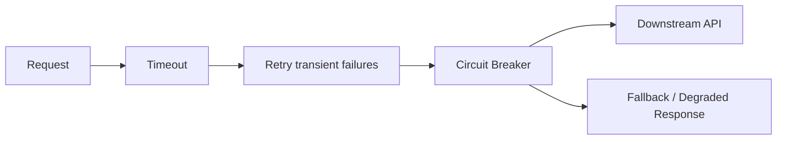

# .NET Resilience, Async Streams & Concurrency — Principal Engineer Q&A

## Q1. When would you use `IAsyncEnumerable<T>` instead of returning `Task<List<T>>`?
**Answer:** Use async streams when results can be produced incrementally, the dataset is large, or the consumer benefits from lower time-to-first-item and bounded memory. `Task<List<T>>` is simpler when the complete result is small and required atomically.

```csharp
public async IAsyncEnumerable<Order> StreamOrdersAsync(
    [EnumeratorCancellation] CancellationToken ct = default)
{
    await foreach (var order in repository.ReadOrdersAsync(ct))
        yield return order;
}
```

## Q2. How do you design retries safely?
Retry only transient failures, use bounded exponential backoff with jitter, and make the operation idempotent. Do not blindly retry validation errors, authentication failures, or non-idempotent writes.

```csharp
var delay = TimeSpan.FromMilliseconds(200);
for (var attempt = 1; attempt <= 4; attempt++)
{
    try { return await client.SendAsync(request, ct); }
    catch (HttpRequestException) when (attempt < 4)
    {
        await Task.Delay(delay + TimeSpan.FromMilliseconds(Random.Shared.Next(100)), ct);
        delay *= 2;
    }
}
```

## Q3. Principal scenario: downstream API latency suddenly doubles. What do you do?
**Answer:** Protect the service first: timeout budgets, cancellation propagation, bounded concurrency, circuit breaking and meaningful telemetry. Then determine whether the bottleneck is downstream saturation, connection exhaustion, DNS/TLS latency, payload size, or an application regression. Avoid simply increasing timeouts.



## Q4. Why is cancellation important in ASP.NET Core?
It prevents abandoned requests from continuing expensive database, HTTP or AI work after the caller has disconnected.

## Official docs
- https://learn.microsoft.com/dotnet/csharp/asynchronous-programming/async-streams
- https://learn.microsoft.com/aspnet/core/fundamentals/http-requests
- https://learn.microsoft.com/dotnet/core/extensions/http-resilience
