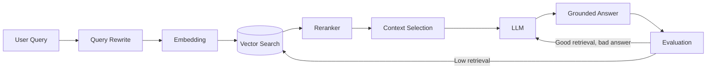
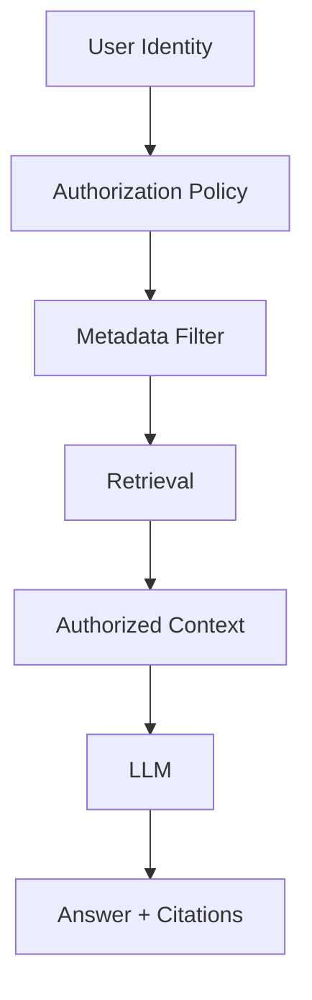

# GenAI / RAG — Production Interview Scenarios

## Q1. Your RAG system retrieves relevant documents but answers are still wrong. How do you debug it?

### Answer
Separate retrieval quality from generation quality. Measure query rewriting, chunking, embedding recall, reranking, context selection and answer grounding independently.

### Practical metrics
- Recall@K / precision@K for retrieval.
- NDCG or reranker quality.
- Faithfulness / groundedness.
- Answer correctness.
- Citation coverage.
- Latency, token usage and cost.

## Q2. How would you design secure enterprise RAG for documents with different permissions?

Never retrieve all documents and filter only after generation. Apply authorization-aware filtering during retrieval using tenant/user/group metadata, then pass only authorized chunks to the model.

### Threats to discuss
Prompt injection, data leakage, malicious documents, cross-tenant access, sensitive logging and insecure tool execution.

### Official documentation
- https://learn.microsoft.com/en-us/azure/ai-services/openai/concepts/rag
- https://learn.microsoft.com/en-us/azure/ai-services/openai/concepts/content-filter
- https://learn.microsoft.com/en-us/azure/architecture/ai-ml/guide/rag/rag
