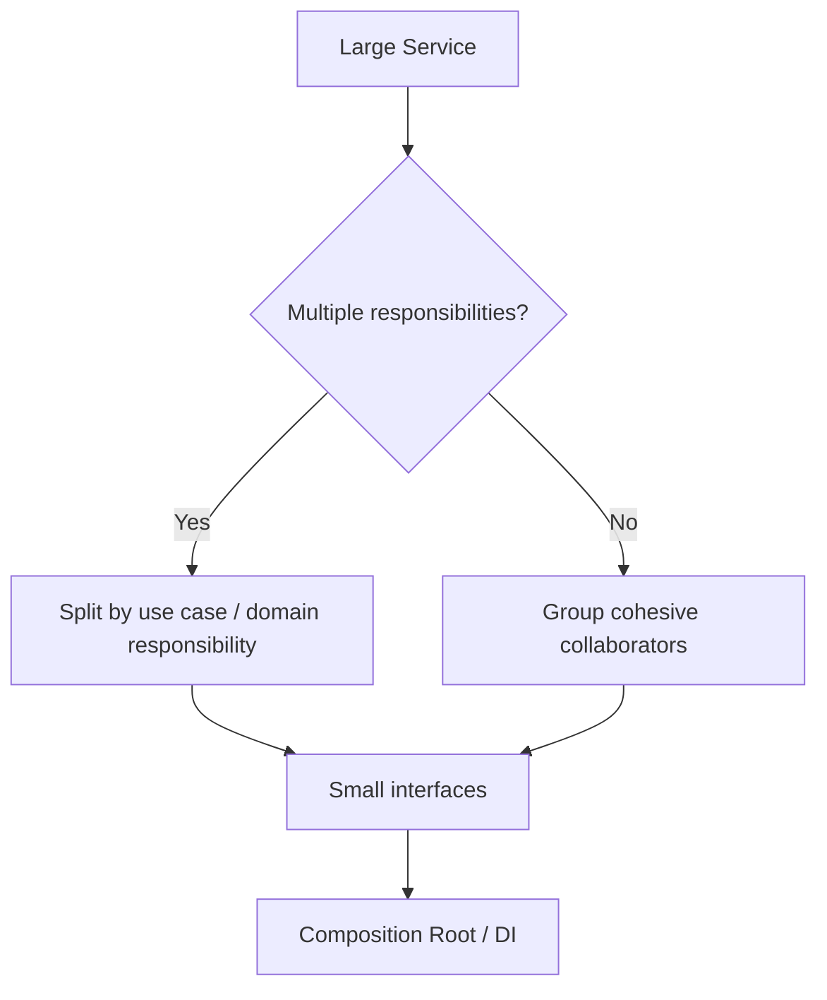

# SOLID: Composition, LSP & Maintainable Design — Interview Q&A

## Q1. Why prefer composition over inheritance in application architecture?
**Answer:** Composition makes behavior replaceable without creating deep type hierarchies. It reduces coupling and lets a class depend on focused interfaces.

```csharp
public interface IPriceCalculator { decimal Calculate(Order order); }

public sealed class CheckoutService(IPriceCalculator pricing)
{
    public decimal Total(Order order) => pricing.Calculate(order);
}
```

## Q2. Explain Liskov Substitution Principle with a real failure mode.
If callers depend on an abstraction's contract, a subtype must honor that contract. A subtype that throws `NotSupportedException` for a required base operation is often a design smell.

## Q3. Principal scenario: one service has 25 constructor dependencies. What do you do?
First identify whether the class has multiple responsibilities. Split use cases behind cohesive application services, move cross-cutting concerns into decorators/middleware, and use composition roots for dependency wiring. Do not hide dependencies behind a service locator merely to shorten the constructor.



## Q4. Is dependency injection itself SOLID?
No. DI is a technique that supports Dependency Inversion by allowing policy code to depend on abstractions while infrastructure implementations are supplied externally.

## Official docs
- https://learn.microsoft.com/dotnet/core/extensions/dependency-injection
- https://learn.microsoft.com/aspnet/core/fundamentals/dependency-injection
