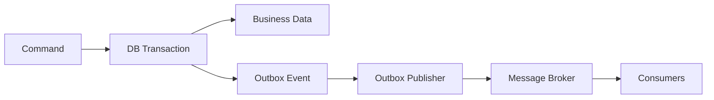

# Event-Driven Architecture & Transactional Outbox — Architect Q&A

## Q1. Why can a database transaction plus message publish create inconsistency?
A transaction may commit successfully while the broker publish fails, or the broker publish may succeed while the database transaction rolls back. The transactional outbox records the event in the same database transaction and publishes it asynchronously.



## Q2. Does the outbox guarantee exactly-once processing?
No. It improves reliable publication but consumers should still be idempotent because delivery can be duplicated. Use a stable event/message ID and a deduplication strategy where necessary.

```csharp
public async Task HandleAsync(OrderCreated message, CancellationToken ct)
{
    if (await processedMessages.ExistsAsync(message.Id, ct)) return;
    await ProcessOrderAsync(message, ct);
    await processedMessages.MarkProcessedAsync(message.Id, ct);
}
```

## Q3. Principal scenario: a team proposes Kafka for every integration. How do you respond?
Ask about ordering, throughput, replay, retention, consumer independence, operational maturity and business requirements. Prefer the simplest broker that satisfies the requirements; architecture is not improved by technology volume.

## Q4. When would you choose synchronous HTTP instead?
For request/response interactions where the caller needs an immediate answer and the dependency's latency and availability can fit the end-to-end SLO. Use asynchronous messaging when decoupling, buffering, fan-out or eventual consistency is valuable.

## Official docs
- https://learn.microsoft.com/azure/architecture/patterns/transactional-outbox
- https://learn.microsoft.com/azure/architecture/guide/architecture-styles/event-driven
