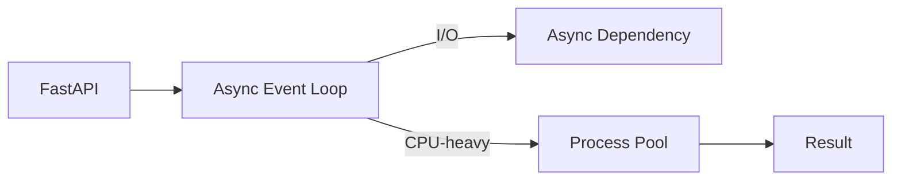

# Python — Backend Interview Scenarios

## Q1. How would you safely run CPU-heavy work from an async FastAPI endpoint?

### Answer
Do not block the event loop with CPU-heavy work. Move CPU-bound workloads to a process pool or external worker system. Async I/O is useful for network-bound work; it does not make CPU-heavy code non-blocking.

```python
from concurrent.futures import ProcessPoolExecutor
import asyncio

pool = ProcessPoolExecutor()

def calculate(value: int) -> int:
    return sum(i * i for i in range(value))

async def run_calculation(value: int) -> int:
    loop = asyncio.get_running_loop()
    return await loop.run_in_executor(pool, calculate, value)
```



## Q2. How do you design a resilient Python API client?

Use explicit timeouts, bounded retries with exponential backoff and jitter, connection reuse, cancellation, structured logging and idempotency where retries can repeat an operation.

```python
import asyncio

async def retry(operation, attempts=3):
    for attempt in range(attempts):
        try:
            return await operation()
        except TimeoutError:
            if attempt == attempts - 1:
                raise
            await asyncio.sleep(0.2 * (2 ** attempt))
```

### Principal-level point
Retries are not automatically resilience. They can amplify an outage. Combine retry budgets with timeouts, circuit breaking, rate limits and observability.

### Official documentation
- https://docs.python.org/3/library/asyncio.html
- https://fastapi.tiangolo.com/async/
