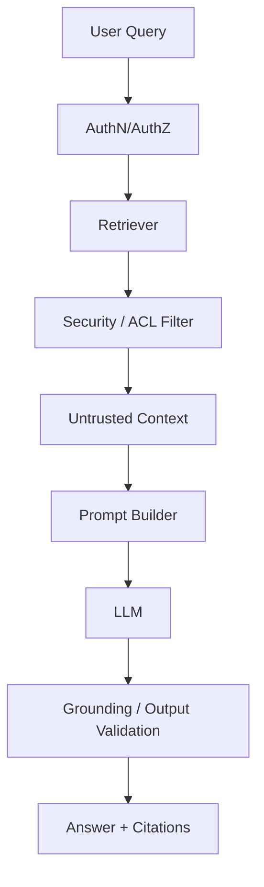

# GenAI / RAG Evaluation, Security & Production QA

## Q1. How do you evaluate a RAG system beyond LLM answer quality?
Measure retrieval quality and generation quality separately. Useful signals include context precision/recall, groundedness, answer relevance, citation correctness, latency, token usage and failure rate. Maintain a curated evaluation set representing real user intents and adversarial cases.

## Q2. How do you defend RAG against prompt injection in retrieved documents?
Treat retrieved text as untrusted data, not instructions. Separate system/developer instructions from retrieved context, constrain tools by policy, validate tool arguments, apply authorization before retrieval and avoid allowing retrieved text to redefine system behavior.



## Q3. Why can increasing top-k make RAG worse?
More chunks can introduce irrelevant or contradictory context, consume the token budget and dilute high-signal evidence. Tune retrieval using evaluation data rather than assuming more context is better.

## Q4. Principal scenario: users report confident but incorrect answers. What is your investigation sequence?
Check retrieval misses first, then chunking/metadata filters, reranking, prompt construction, model behavior and citation validation. Capture the query, retrieved document IDs, scores, final prompt metadata and response evaluation signals with privacy controls.

## Practical retrieval contract
```python
class RetrievedChunk:
    def __init__(self, document_id: str, text: str, score: float):
        self.document_id = document_id
        self.text = text
        self.score = score
```

## Official docs
- https://learn.microsoft.com/azure/ai-foundry/openai/concepts/evaluation
- https://learn.microsoft.com/azure/ai-services/openai/concepts/retrieval-augmented-generation
- https://learn.microsoft.com/azure/ai-foundry/openai/concepts/content-filter
