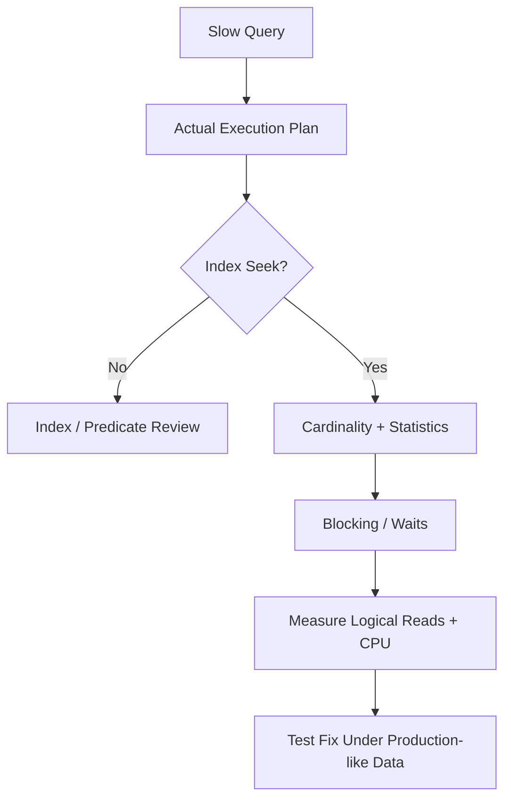

# SQL — Performance and Data Consistency Scenarios

## Q1. A query suddenly becomes slow after the table grows from 10 million to 500 million rows. What do you investigate?

### Answer
Check the actual execution plan, cardinality estimates, index usage, logical reads, spills, blocking and parameter sensitivity. Verify statistics and whether the query is returning more data than necessary.



### Avoid premature fixes
Do not blindly add indexes. Every index has storage and write-maintenance cost.

## Q2. How would you implement an idempotent database write for a message consumer?

Use a business/event idempotency key with a unique constraint and perform the state change atomically. If the same message arrives again, the unique key prevents a duplicate effect.

```sql
CREATE UNIQUE INDEX UX_OrderEvents_EventId
ON OrderEvents(EventId);

INSERT INTO OrderEvents(EventId, OrderId, CreatedAt)
VALUES (@EventId, @OrderId, SYSUTCDATETIME());
```

### Interview follow-up
Discuss transaction boundaries, duplicate delivery, retries, dead-letter handling and what happens if the database commit succeeds but the acknowledgement is lost.

### Official documentation
- https://learn.microsoft.com/en-us/sql/relational-databases/sql-server-index-design-guide
- https://learn.microsoft.com/en-us/sql/relational-databases/performance/execution-plans
- https://learn.microsoft.com/en-us/sql/t-sql/statements/create-index-transact-sql
