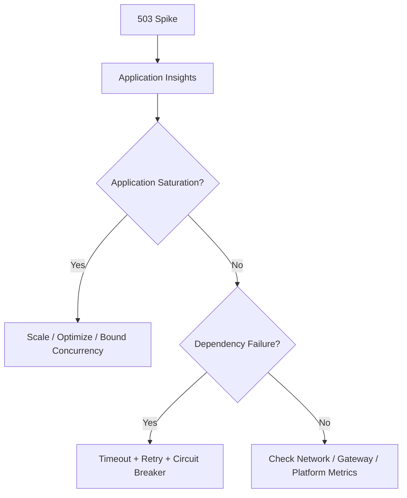

# Azure PaaS — Principal Engineer Scenarios

## Q1. An Azure-hosted API has intermittent 503s during traffic spikes. How do you approach it?

### Answer
First establish whether the bottleneck is the application, platform, dependency or networking layer. Correlate request telemetry with CPU, memory, instance count, dependency latency, throttling and platform health.

### Design principles
Use autoscaling based on meaningful signals, health probes, timeouts, bounded retries, graceful degradation and clear SLOs. Scaling cannot fix an inherently overloaded downstream dependency.

## Q2. How would you secure service-to-service access without storing secrets?

Prefer Microsoft Entra managed identities where supported. Grant least-privilege roles to the workload identity and use Azure Key Vault for secrets that genuinely cannot be eliminated.

### Official documentation
- https://learn.microsoft.com/en-us/azure/active-directory/managed-identities-azure-resources/overview
- https://learn.microsoft.com/en-us/azure/azure-monitor/app/app-insights-overview
- https://learn.microsoft.com/en-us/azure/well-architected/reliability/principles
