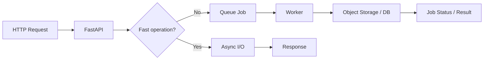

# Python & FastAPI Async Production — Interview Q&A

## Q1. Why can an async FastAPI endpoint still block the server?
`async def` does not make CPU-bound or blocking synchronous calls non-blocking. A blocking library call inside the event loop can prevent other requests from progressing.

```python
from fastapi import FastAPI
import asyncio

app = FastAPI()

@app.get('/health')
async def health():
    await asyncio.sleep(0.01)  # yields control
    return {'status': 'ok'}
```

For CPU-heavy work, use a worker/process model appropriate to the workload instead of occupying the event loop.

## Q2. Principal scenario: latency rises only during report generation. What do you inspect?
Separate CPU time, database time, external I/O and serialization time. Inspect event-loop blocking, connection pool saturation, worker utilization and payload size. Then move expensive work to background workers or a queue when the operation does not need to remain synchronous.



## Q3. How should dependencies such as database sessions be scoped?
Use FastAPI dependency injection to create and clean up request-scoped resources. Do not create a global mutable database session shared by concurrent requests.

## Official docs
- https://fastapi.tiangolo.com/async/
- https://docs.python.org/3/library/asyncio.html
- https://fastapi.tiangolo.com/tutorial/dependencies/
