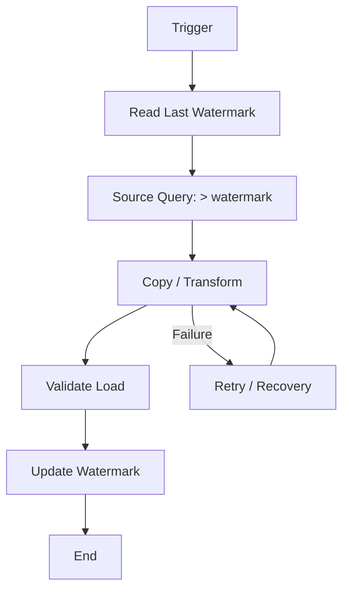

# Azure Data Factory — Advanced Interview Scenarios

## Q1. How do you implement an incremental pipeline when the source has millions of rows?

### Answer
Use a watermark such as `LastModifiedDate` or a monotonically increasing key. Persist the last successful watermark and query only the next range. Make the load idempotent so rerunning a failed window is safe.

## Q2. How would you design an ADF pipeline for late-arriving data?

Separate ingestion from business processing. Land raw data first, track ingestion metadata, and use a reprocessing window or event-driven correction path for records that arrive after the normal watermark.

### Production concerns
- Exactly-once business effect rather than assuming exactly-once delivery.
- Retry-safe writes.
- Schema drift handling.
- Pipeline run correlation IDs.
- Data-quality checks and quarantine.
- Cost control through partitioning and parallelism.

### Interview follow-up
Ask how the source exposes change tracking, whether deletes matter, the expected lateness window, and whether the target requires strong consistency.

### Official documentation
- https://learn.microsoft.com/en-us/azure/data-factory/concepts-pipelines-activities
- https://learn.microsoft.com/en-us/azure/data-factory/tutorial-incremental-copy-overview
- https://learn.microsoft.com/en-us/azure/data-factory/concepts-integration-runtime
