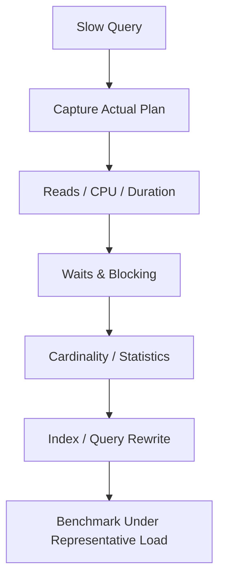

# SQL Server Window Functions, Sargability & Performance — Q&A

## Q1. When should you use a window function instead of GROUP BY?
Use a window function when you need an aggregate or ranking while retaining individual rows. `GROUP BY` collapses rows; window functions preserve the row grain.

```sql
SELECT
    CustomerId,
    OrderId,
    OrderDate,
    ROW_NUMBER() OVER (
        PARTITION BY CustomerId
        ORDER BY OrderDate DESC
    ) AS rn
FROM Orders;
```

## Q2. What is a non-sargable predicate?
A predicate is commonly considered non-sargable when applying an expression to the indexed column prevents efficient index-seek use.

```sql
-- Often non-sargable
WHERE YEAR(OrderDate) = 2026;

-- Prefer a range
WHERE OrderDate >= '20260101'
  AND OrderDate <  '20270101';
```

## Q3. Principal scenario: a query changed from 200 ms to 8 seconds. What do you check?
Compare execution plans, cardinality estimates, row counts, logical reads, waits, parameter sensitivity, statistics freshness, index changes and concurrent blocking. Do not add an index before identifying the actual bottleneck.



## Q4. Why can a covering index help but also hurt?
It can reduce lookups and I/O for a read-heavy query, but increases storage and write maintenance. Index design must consider the workload, not a single query.

## Official docs
- https://learn.microsoft.com/sql/relational-databases/performance/monitor-and-tune-for-performance
- https://learn.microsoft.com/sql/t-sql/queries/select-over-clause-transact-sql
- https://learn.microsoft.com/sql/relational-databases/indexes/indexes
