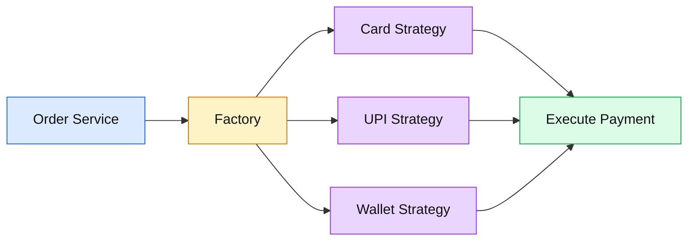
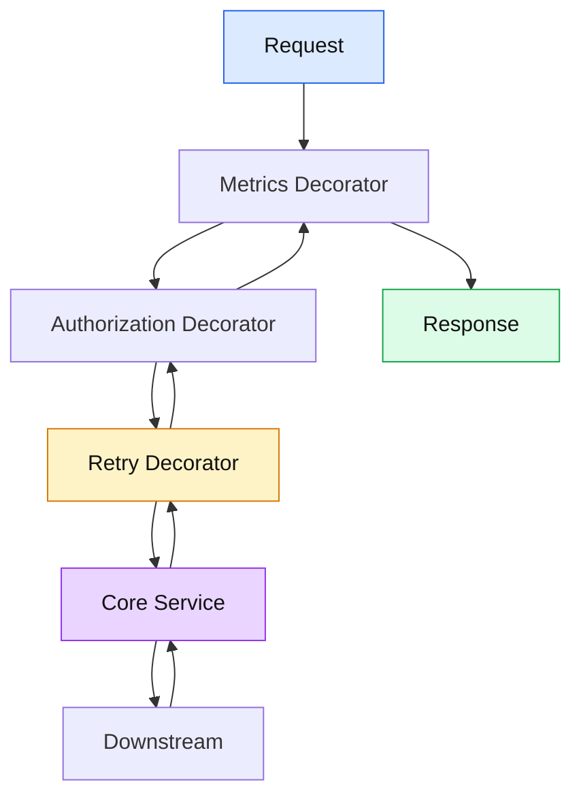
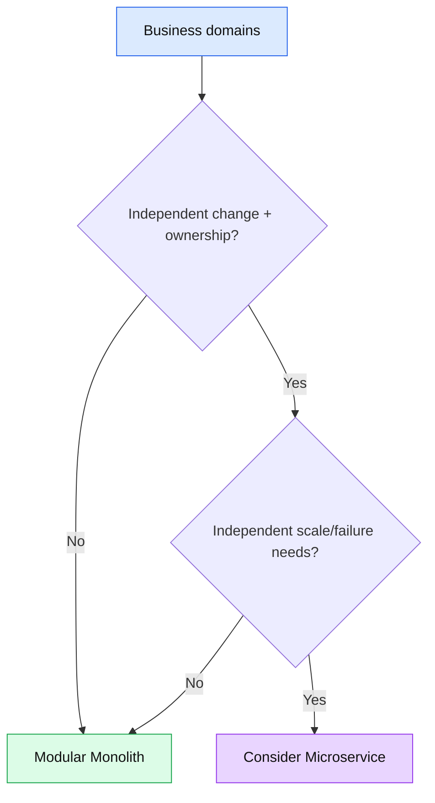

# 🧠 Advanced C#/.NET + SOLID + Design Patterns Interview Q&A

> Principal Engineer focus: choose the simplest design that preserves correctness, testability, performance, and changeability.

## 🟡 Q1. When would you prefer composition over inheritance?

🟢 **Answer:** Prefer composition when behavior varies independently from the object's identity or when inheritance would create fragile coupling. Inject a collaborator and delegate behavior instead of building a deep hierarchy.

```csharp
public interface IRetryPolicy
{
    Task<T> ExecuteAsync<T>(Func<Task<T>> action, CancellationToken ct);
}

public sealed class PaymentService(IRetryPolicy retryPolicy)
{
    public Task<PaymentResult> ChargeAsync(CancellationToken ct) =>
        retryPolicy.ExecuteAsync(() => ChargeProviderAsync(ct), ct);

    private static Task<PaymentResult> ChargeProviderAsync(CancellationToken ct) =>
        Task.FromResult(new PaymentResult(true));
}

public sealed record PaymentResult(bool Success);
```

🟣 **Interview tip:** Say: “Inheritance models an is-a relationship; composition lets behavior change independently.”

---

## 🟡 Q2. Strategy vs Factory: what problem does each solve?

🟢 **Answer:** Strategy encapsulates interchangeable behavior. Factory encapsulates creation of an object. They are often used together: a factory selects a strategy, while the strategy performs the operation.



---

## 🟡 Q3. How do you avoid a service becoming a God class?

🟢 **Answer:** Identify unrelated reasons to change, extract cohesive domain/application services, move infrastructure behind ports/adapters, and keep orchestration separate from detailed business rules.

🔴 **Warning:** Splitting one class into ten classes without meaningful boundaries only creates indirection.

---

## 🟡 Q4. How would you design an idempotent command handler?

🟢 **Answer:** Give the command a stable idempotency key, persist the processing result atomically with the business effect when possible, and return the existing result for duplicate requests.

```csharp
public async Task<OrderResult> HandleAsync(
    CreateOrderCommand command,
    CancellationToken ct)
{
    var existing = await repository.FindByIdempotencyKeyAsync(command.Key, ct);
    if (existing is not null)
        return existing;

    var order = new Order(command.CustomerId, command.Amount);
    await repository.SaveAsync(order, command.Key, ct);
    return new OrderResult(order.Id);
}
```

🟣 **Principal Engineer answer:** “Exactly-once delivery is usually not the right assumption. I design at-least-once processing with idempotent business effects.”

---

## 🟡 Q5. What is a useful SOLID test for an abstraction?

🟢 **Answer:** Ask whether the abstraction represents a stable business or technical boundary, whether implementations can honour the same contract, and whether consumers actually benefit from substitution. If every consumer knows implementation details, the abstraction is probably weak.

---

## 🟡 Q6. Scenario: latency doubled after introducing decorators. What do you investigate?

🟢 **Answer:** Trace the call chain and measure each decorator. Look for duplicate serialization, repeated logging, synchronous blocking, extra network calls, and accidental retries. Keep decorators for cross-cutting behavior only when the operational cost is justified.



---

## 🟡 Q7. What is the difference between `lock`, `SemaphoreSlim`, and async coordination?

🟢 **Answer:** `lock` is for synchronous mutual exclusion and cannot be awaited inside the critical section. `SemaphoreSlim` can coordinate asynchronous callers because `WaitAsync` can be awaited. Use the narrowest synchronization boundary possible.

```csharp
private readonly SemaphoreSlim gate = new(1, 1);

public async Task RefreshAsync(CancellationToken ct)
{
    await gate.WaitAsync(ct);
    try
    {
        await RefreshCacheAsync(ct);
    }
    finally
    {
        gate.Release();
    }
}
```

🔗 **Official docs:** https://learn.microsoft.com/en-us/dotnet/standard/threading/overview-of-synchronization-primitives

---

## 🟡 Q8. Principal Engineer scenario: a team wants a microservice for every bounded context.

🟢 **Answer:** I would not approve service count from a diagram alone. First identify bounded contexts, team ownership, independent deployment needs, data ownership, scaling differences, failure isolation, and operational maturity. A modular monolith can be the better first architecture when those boundaries are not yet proven.



## 🔗 Official documentation

- [.NET dependency injection](https://learn.microsoft.com/en-us/dotnet/core/extensions/dependency-injection)
- [C# async programming](https://learn.microsoft.com/en-us/dotnet/csharp/asynchronous-programming/)
- [Threading and synchronization](https://learn.microsoft.com/en-us/dotnet/standard/threading/overview-of-synchronization-primitives)
- [ASP.NET Core middleware](https://learn.microsoft.com/en-us/aspnet/core/fundamentals/middleware/)
