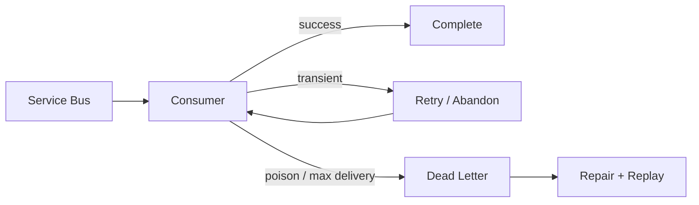

# Azure PaaS & Service Bus Reliability — Architect Q&A

## Q1. How do you design an Azure Service Bus consumer for duplicate delivery?
Assume at-least-once delivery. Make handlers idempotent using a business operation ID or message ID, persist processing state where required, and complete the message only after durable processing succeeds.

```csharp
public async Task HandleAsync(OrderCreated message, CancellationToken ct)
{
    if (await store.IsProcessedAsync(message.Id, ct)) return;
    await orderService.ApplyAsync(message, ct);
    await store.MarkProcessedAsync(message.Id, ct);
}
```

## Q2. What is the difference between retry and dead-lettering?
Retry gives transient failures another opportunity. Dead-lettering moves messages that cannot be processed successfully under defined conditions out of the normal flow for inspection or controlled recovery.



## Q3. Principal scenario: downstream API is unavailable for 20 minutes. What should the architecture do?
Stop creating an unbounded retry storm. Use timeout budgets, bounded retries, circuit breaking, queue-based buffering where business semantics allow it, and operational alerts. Define whether delayed processing is acceptable against the business SLO.

## Q4. Why is autoscaling not a complete reliability strategy?
Scaling increases capacity but cannot fix a saturated downstream dependency, hot partition, poison-message loop, bad query plan or retry storm. Autoscaling must be paired with backpressure and dependency protection.

## Official docs
- https://learn.microsoft.com/azure/service-bus-messaging/service-bus-messaging-overview
- https://learn.microsoft.com/azure/architecture/best-practices/retry-service-specific
- https://learn.microsoft.com/azure/architecture/framework/resiliency/overview
