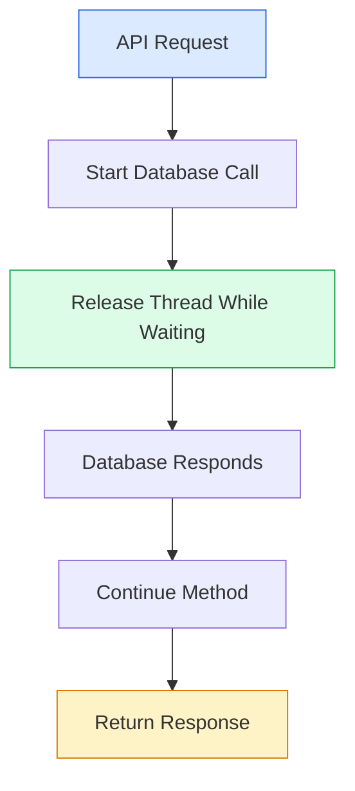
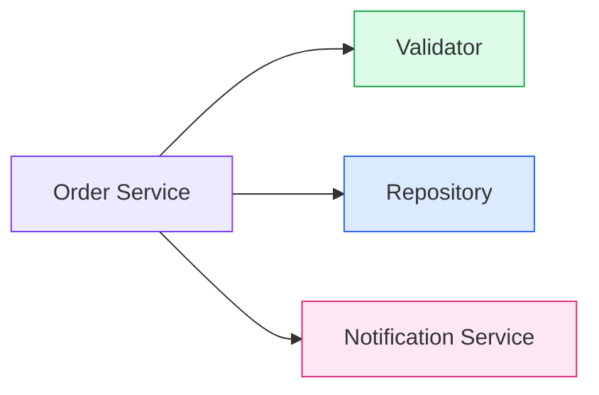
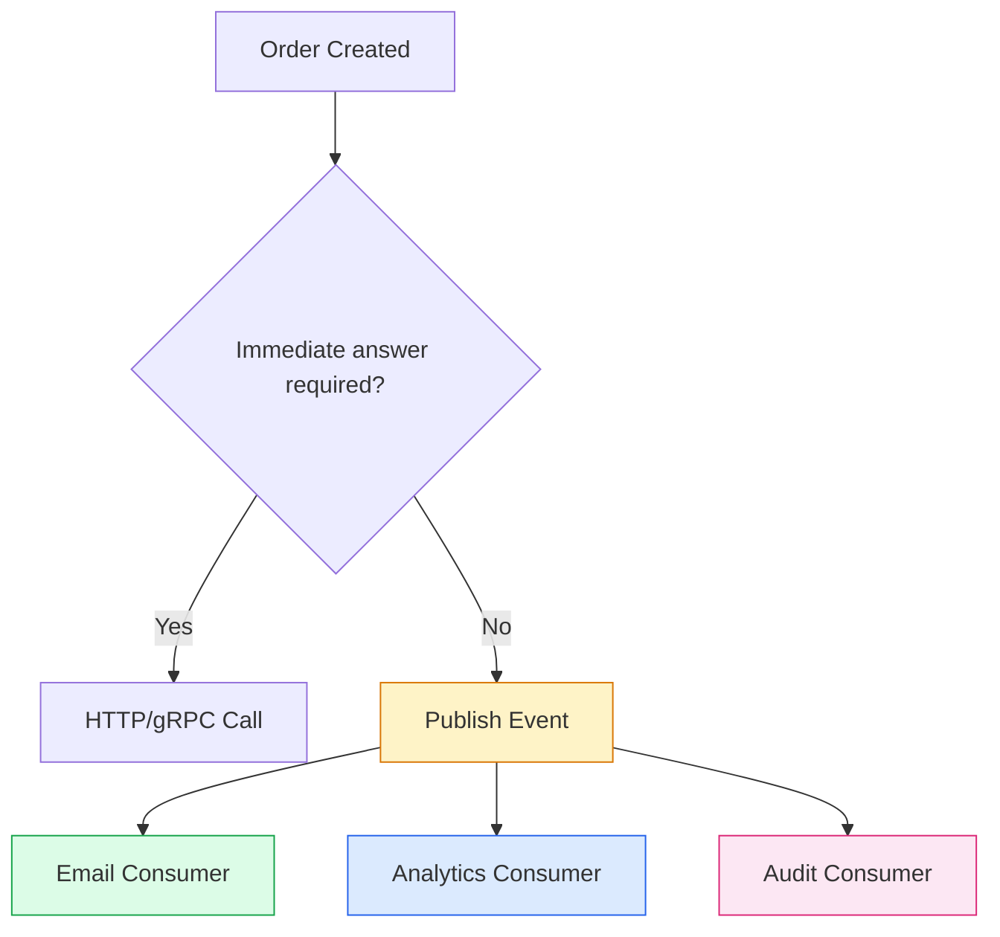
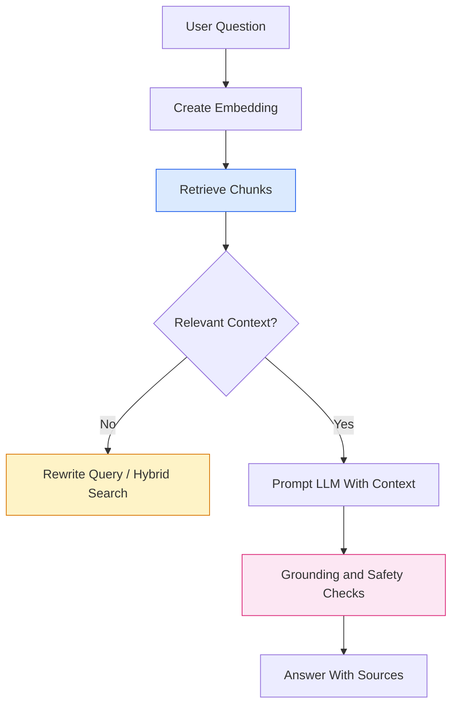
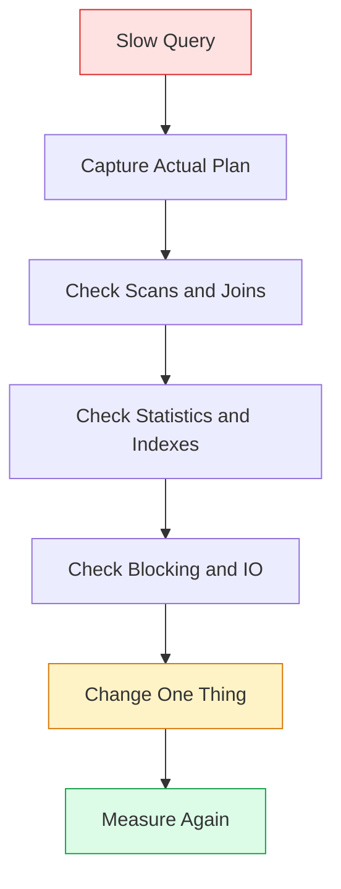
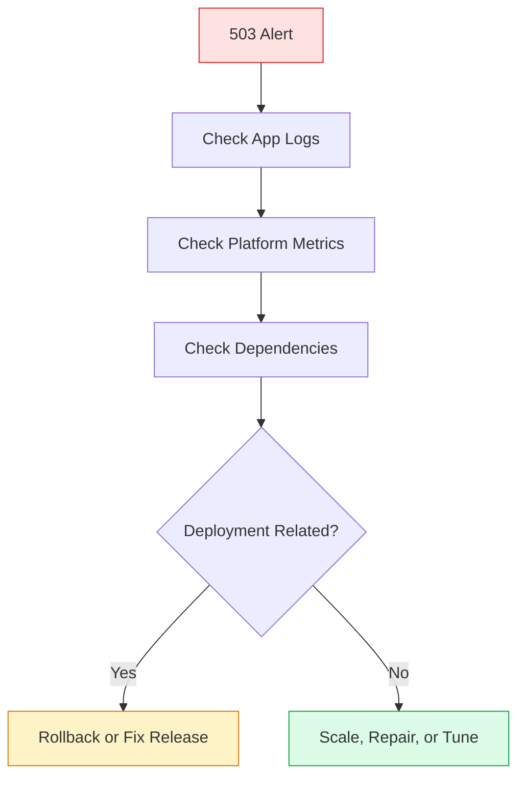
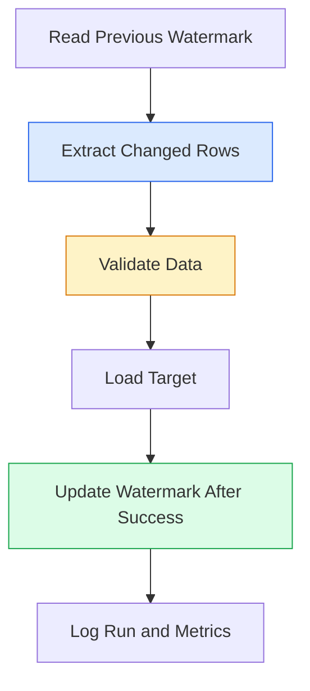
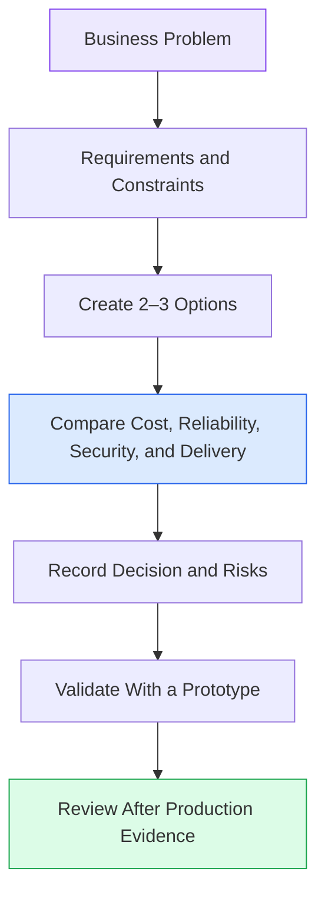
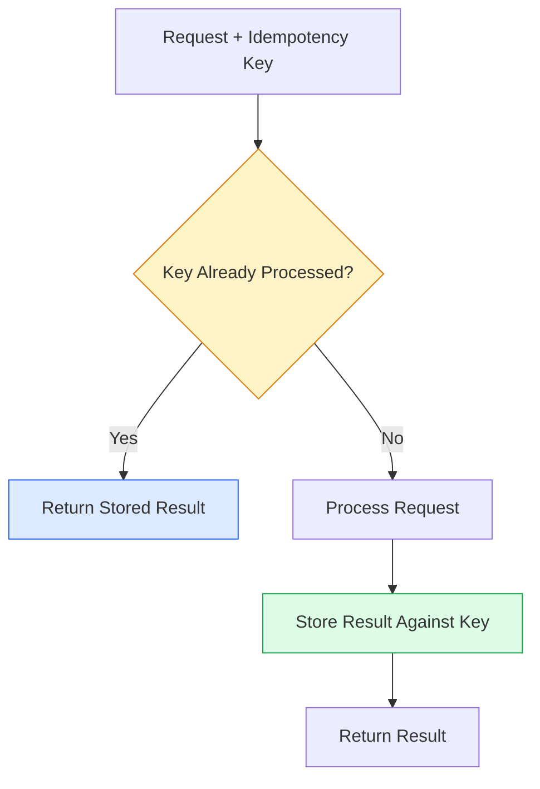

# 🌈 Colorful Interview Playbook

> Beginner-friendly revision notes for Principal Engineers and Architects. Each question follows: **simple explanation → practical example → visual flow → interview tip**.

---

## 🟦 Question 1: Why should we use `async` and `await` in .NET?

### 🟢 Simple Explanation
`async` and `await` allow an application to wait for slow work—such as a database or HTTP call—without blocking a thread.

### 💡 Practical Example
A web API requests customer data. While the database responds, the server can handle other requests.

```csharp
public async Task<Customer?> GetCustomerAsync(
    int id,
    CancellationToken cancellationToken)
{
    // Await I/O instead of blocking with .Result or .Wait().
    return await _repository.GetByIdAsync(id, cancellationToken);
}
```

### 🔄 Visual Flow


### 🎯 Interview Tip
Use asynchronous I/O for scalability. Do not use `async` merely to make CPU-heavy work faster.

📚 [Official .NET async documentation](https://learn.microsoft.com/en-us/dotnet/csharp/asynchronous-programming/)

---

## 🟩 Question 2: What does the Single Responsibility Principle mean?

### 🟢 Simple Explanation
A class should have one clear reason to change. It should not validate orders, save data, send emails, and create reports all together.

### 💻 Practical Design
```csharp
public sealed class OrderValidator
{
    public bool IsValid(Order order) => order.Items.Count > 0;
}

public sealed class OrderRepository
{
    public Task SaveAsync(Order order) => Task.CompletedTask;
}
```

### 🔄 Visual Flow


### 🎯 Interview Tip
Explain that separation improves testing, maintenance, and independent change.

📚 [Microsoft dependency injection guidance](https://learn.microsoft.com/en-us/dotnet/core/extensions/dependency-injection)

---

## 🟨 Question 3: When should an API publish an event instead of calling another service directly?

### 🟢 Simple Explanation
Use a direct call when the caller needs an immediate answer. Use an event when work can happen later and services should be loosely coupled.



### 🎯 Interview Tip
Discuss delivery guarantees, retries, duplicate events, ordering, and observability.

📚 [Azure Architecture Center](https://learn.microsoft.com/en-us/azure/architecture/)

---

## 🟧 Question 4: Why can a RAG system return an incorrect answer?

### 🟢 Simple Explanation
A RAG system may retrieve the wrong documents, retrieve too little context, use stale data, or generate an answer that is not supported by the retrieved content.

### 🔍 Troubleshooting Steps
1. Check document permissions.
2. Inspect chunk size and overlap.
3. Evaluate retrieval relevance.
4. Add citations and answer-grounding checks.
5. Log the query, retrieved chunks, and model response safely.



📚 [Azure AI Search documentation](https://learn.microsoft.com/en-us/azure/search/)

---

## 🟪 Question 5: What is the difference between a Python coroutine and a thread?

### 🟢 Simple Explanation
A coroutine is cooperative asynchronous work managed by an event loop. A thread is an operating-system execution unit. Coroutines are useful for I/O; CPU-heavy work usually needs processes or specialized workers.

```python
import asyncio

async def fetch_value() -> str:
    await asyncio.sleep(0.1)  # Simulates non-blocking I/O.
    return "done"

async def main() -> None:
    result = await fetch_value()
    print(result)

asyncio.run(main())
```

### 🎯 Interview Tip
Mention that async does not automatically make CPU-bound calculations faster.

📚 [Python asyncio documentation](https://docs.python.org/3/library/asyncio.html)

---

## 🟥 Question 6: How do you investigate a slow SQL query?

### 🟢 Simple Explanation
Do not immediately add indexes. First inspect the execution plan, filters, joins, row estimates, scans, blocking, and data volume.



📚 [SQL Server query performance documentation](https://learn.microsoft.com/en-us/sql/relational-databases/performance/)

---

## 🟦 Question 7: How do you diagnose HTTP 503 errors in Azure App Service?

### 🟢 Simple Explanation
A 503 means the service is temporarily unable to handle the request. Investigate application crashes, startup failures, exhausted resources, deployment problems, and dependency failures.

### 🛠️ Practical Checklist
- Review Application Insights failures and dependency telemetry.
- Check CPU, memory, restarts, and health checks.
- Verify configuration and managed identity permissions.
- Compare the issue with the latest deployment.
- Add a safe rollback plan.



📚 [Azure App Service troubleshooting](https://learn.microsoft.com/en-us/azure/app-service/)

---

## 🟩 Question 8: How do you design an incremental Azure Data Factory pipeline?

### 🟢 Simple Explanation
Instead of copying every row every day, store a watermark such as `LastModifiedDate` or an increasing ID and load only new or changed records.



### 🎯 Interview Tip
Explain idempotency: rerunning a failed pipeline should not create duplicate target data.

📚 [Azure Data Factory documentation](https://learn.microsoft.com/en-us/azure/data-factory/)

---

## 🟫 Question 9: How does a Principal Engineer make an architecture decision?

### 🟢 Simple Explanation
A Principal Engineer connects business goals to technical choices. The decision should document constraints, alternatives, trade-offs, risks, and how success will be measured.

### 🧭 Decision Flow


### 🎯 Interview Tip
Avoid saying one architecture is always best. Explain why the choice fits the specific constraints.

📚 [Azure Well-Architected Framework](https://learn.microsoft.com/en-us/azure/well-architected/)

---

## 🟨 Question 10: What makes an operation idempotent?

### 🟢 Simple Explanation
An operation is idempotent when repeating the same request produces the same final result as performing it once.

### 💡 Example
A payment or order API can accept an `Idempotency-Key`. If the same key is received again, the service returns the original result instead of creating another order.



### 🎯 Interview Tip
Discuss unique constraints, transaction boundaries, retries, and expiration policies for stored keys.

📚 [Microsoft REST API guidance](https://learn.microsoft.com/en-us/azure/architecture/best-practices/api-design)

---

## ⭐ Quick Revision Pattern

For almost every Principal Engineer interview question, answer in this order:

1. **🟢 Define it simply.**
2. **💡 Give a real-world example.**
3. **🔄 Draw the flow.**
4. **⚖️ Explain trade-offs.**
5. **🛡️ Mention production concerns.**
6. **📚 Reference official documentation.**
