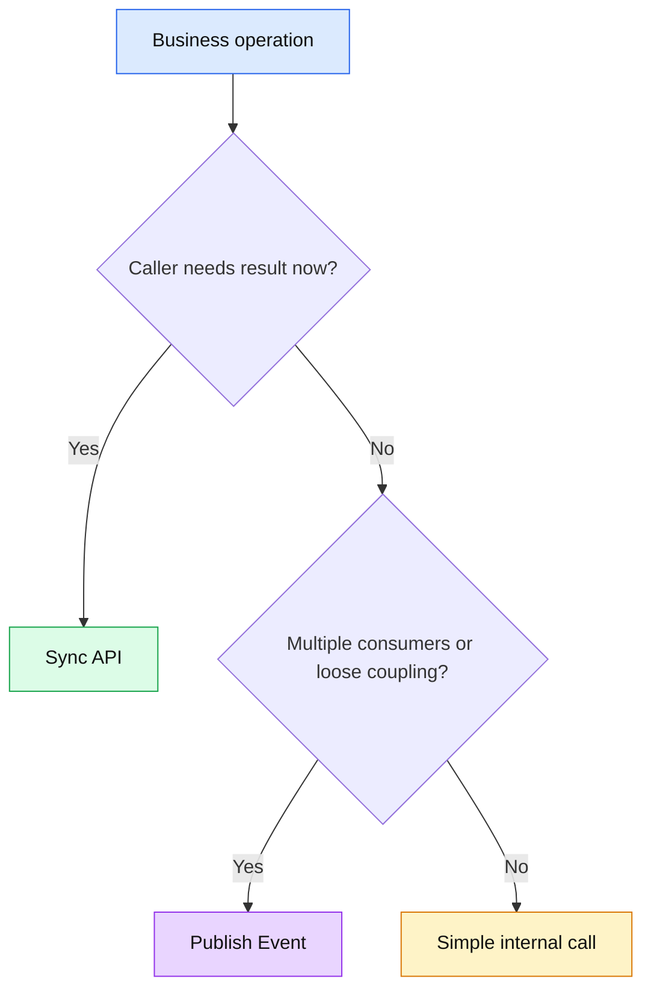
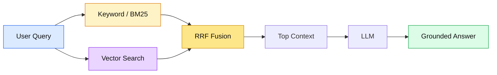
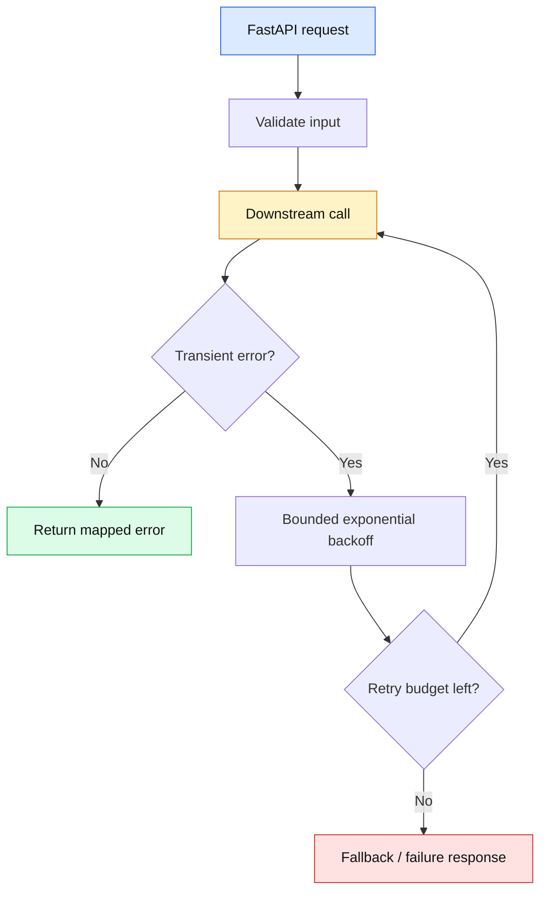

# 🏗️ Architecture + GenAI/RAG + Python Principal Engineer Q&A

## Architecture

### 🟡 Q1. How do you choose synchronous API calls vs events?

🟢 **Answer:** Use synchronous calls when the caller needs an immediate response and the dependency is part of the request contract. Use events when work can be asynchronous, when loose coupling is valuable, or when multiple consumers need the fact. Do not use events merely to hide a slow dependency.



### 🟡 Q2. Scenario: an event consumer is processing the same message twice. What do you do?

🟢 **Answer:** Treat duplicate delivery as normal. Persist a message/event ID or business idempotency key, enforce uniqueness at the durable store, and make side effects repeat-safe. Add dead-letter handling and replay tooling.

### 🟡 Q3. How do you explain CAP theorem to an architect interviewer?

🟢 **Answer:** Under a network partition, a distributed system cannot simultaneously guarantee both strong consistency and availability for every operation. In practice, the design chooses where consistency, availability, and business correctness matter most rather than saying “CAP means pick two” for every normal condition.

---

## GenAI / RAG

### 🟡 Q4. Why can hybrid retrieval outperform vector-only retrieval?

🟢 **Answer:** Vector search is strong for semantic similarity, while lexical search is strong for exact identifiers, names, codes, and domain terms. Hybrid retrieval executes both and combines rankings with Reciprocal Rank Fusion (RRF). citeturn0search0turn0search2



### 🟡 Q5. Scenario: RAG answers are fluent but cite the wrong document. How do you debug it?

🟢 **Answer:** Separate retrieval quality from generation quality. Inspect query rewriting, filters, ACLs, chunk boundaries, top-k recall, hybrid ranking, reranking, and citation mapping. Build a golden evaluation set with expected supporting documents before changing the prompt.

### 🟡 Q6. How would you enforce tenant isolation in enterprise RAG?

🟢 **Answer:** Carry tenant/user authorization context into retrieval, apply server-side filters before returning candidates, store document ACL metadata with the indexed content, and validate authorization again before generation if the architecture has multiple trust boundaries. Never rely on the LLM to enforce access control.

🔴 **Critical:** “Prompt says only answer from tenant A” is not a security boundary.

### 🟡 Q7. How do you reduce RAG latency without blindly lowering quality?

🟢 **Answer:** Measure retrieval, reranking, prompt construction, model generation, and network latency separately. Cache safe reusable work, reduce unnecessary candidate volume, use hybrid retrieval selectively, stream generation, and choose model/context sizes based on measured quality and latency.

---

## Python

### 🟡 Q8. Why can async Python still be slow?

🟢 **Answer:** `asyncio` helps with I/O-bound concurrency but does not make CPU-heavy Python code parallel. A CPU-bound function can block the event loop. Move expensive CPU work to a process pool or an appropriate worker service.

```python
import asyncio

async def fetch(url: str, client):
    response = await client.get(url, timeout=10)
    response.raise_for_status()
    return response.json()

async def fetch_many(urls, client):
    return await asyncio.gather(*(fetch(url, client) for url in urls))
```

🟣 **Interview tip:** Explain that concurrency improves waiting efficiency; it does not magically reduce CPU complexity.

### 🟡 Q9. How do you design a resilient FastAPI dependency call?

🟢 **Answer:** Set timeouts, propagate cancellation where supported, classify transient vs permanent errors, use bounded retries with jitter, and expose metrics for latency and failure rate. Never retry indefinitely.



### 🟡 Q10. Principal scenario: Python service has high memory usage after a deployment.

🟢 **Answer:** Compare heap/profile snapshots before and after deployment, inspect global caches, retained references, large response buffering, unbounded queues, and object lifetimes. Correlate memory growth with request rate and deployment version before changing GC settings.

## 🔗 Official documentation

- [Azure AI Search hybrid search](https://learn.microsoft.com/en-us/azure/search/hybrid-search-how-to-query)
- [Azure AI Search RRF](https://learn.microsoft.com/en-us/azure/search/hybrid-search-ranking)
- [Azure Architecture Center — RAG retrieval](https://learn.microsoft.com/en-us/azure/architecture/ai-ml/guide/rag/rag-information-retrieval)
- [Python asyncio](https://docs.python.org/3/library/asyncio.html)
- [FastAPI documentation](https://fastapi.tiangolo.com/)
