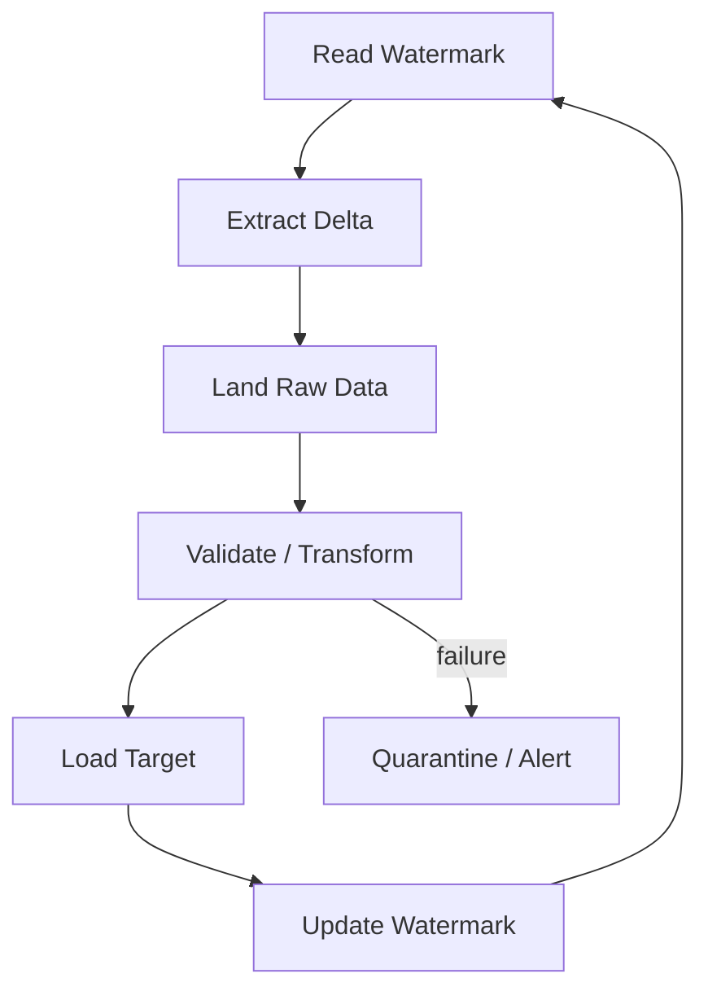

# Azure Data Factory: Watermarks, Incremental Loads & Idempotency — Q&A

## Q1. How do you design an incremental ADF pipeline?
Persist a durable watermark such as `LastModifiedUtc` or a source change token. Read the previous watermark, extract the bounded source range, load it, validate the result, and advance the watermark only after successful processing.



## Q2. Why should the watermark update happen after the load?
If it advances before the target commit and the load fails, the next run can skip data permanently. The watermark represents successfully processed data, not merely data read from the source.

## Q3. Principal scenario: a pipeline is retried after a partial failure. How do you prevent duplicates?
Design the target write as idempotent. Use deterministic business keys, staging tables, `MERGE`/upsert where appropriate, partition replacement, or run IDs. Never rely solely on the pipeline retry mechanism for data correctness.

```sql
MERGE dbo.CustomerTarget AS T
USING dbo.CustomerStage AS S
ON T.CustomerId = S.CustomerId
WHEN MATCHED THEN
    UPDATE SET T.Name = S.Name, T.ModifiedUtc = S.ModifiedUtc
WHEN NOT MATCHED THEN
    INSERT (CustomerId, Name, ModifiedUtc)
    VALUES (S.CustomerId, S.Name, S.ModifiedUtc);
```

## Q4. What operational metrics matter?
Pipeline duration, activity failures, source/target row counts, watermark lag, retry count, data-quality failures and throughput. Alert on business impact rather than only infrastructure errors.

## Official docs
- https://learn.microsoft.com/azure/data-factory/concepts-pipelines-activities
- https://learn.microsoft.com/azure/data-factory/tutorial-incremental-copy-overview
- https://learn.microsoft.com/azure/data-factory/monitor-visually
