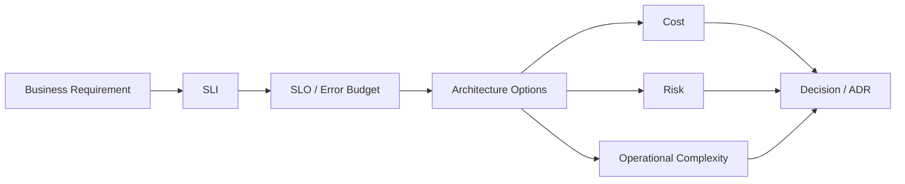

# Principal Engineer / Architect: SLOs, Capacity & Trade-offs

## Q1. What is the difference between an SLA, SLO and SLI?
An **SLI** is the measured signal, such as successful request percentage or p95 latency. An **SLO** is the target for that signal. An **SLA** is a broader customer/business commitment, often with contractual consequences.

## Q2. Scenario: product wants 99.99% availability but budget is fixed. What do you do?
Translate availability into an error budget and quantify the engineering cost of additional redundancy. Present options: active-active, active-passive, reduced dependency count, graceful degradation and improved recovery automation. The Principal-level answer is a trade-off with measurable consequences, not simply "make it highly available."

## Q3. How do you capacity-plan an API?
Estimate request rate, payload size, CPU/memory cost, downstream limits and peak-to-average ratio. Load-test representative traffic, establish saturation indicators and keep headroom. Validate assumptions against production telemetry.

## Q4. Architect scenario: two teams disagree between microservices and a modular monolith. How do you decide?
Compare team boundaries, independent deployment needs, scaling isolation, domain coupling, operational maturity, data ownership and failure modes. If independent scaling/deployment is not a real requirement, a modular monolith can reduce distributed-system complexity while preserving boundaries.

## Q5. What belongs in an Architecture Decision Record?
Context, decision, alternatives considered, consequences, assumptions and the reason the decision was made. ADRs should capture durable architectural reasoning, not implementation minutiae.

## Official docs
- https://learn.microsoft.com/azure/well-architected/reliability/overview
- https://learn.microsoft.com/azure/architecture/framework/resiliency/overview
- https://learn.microsoft.com/azure/architecture/guide/architecture-styles/microservices
