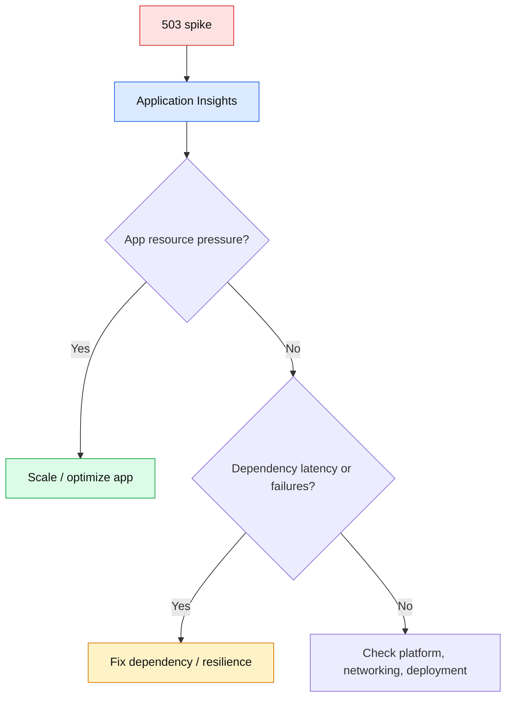
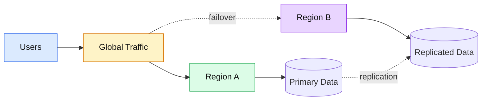
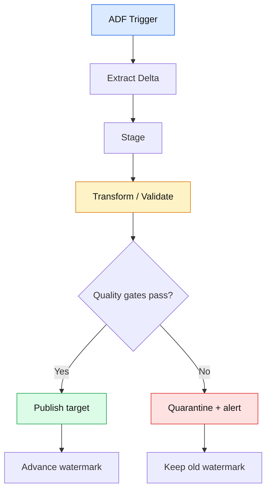

# ☁️ SQL + Azure PaaS + ADF Architect Interview Q&A

## SQL

### 🟡 Q1. Why can an index make a query slower?

🟢 **Answer:** Indexes improve reads only when the optimizer can use them effectively. Every index adds storage, write/maintenance cost, and potentially extra page work. Review actual execution plans and workload patterns instead of indexing every filtered column.

```sql
CREATE INDEX IX_Order_Customer_Status
ON dbo.Orders(CustomerId, Status)
INCLUDE (OrderDate, TotalAmount);
```

🟣 **Interview tip:** Discuss selectivity, predicate order, covering columns, write cost, and actual execution plans.

### 🟡 Q2. Scenario: a query is fast in SSMS but slow in production.

🟢 **Answer:** Compare data volume, statistics, parameter values, indexes, compatibility level, concurrency, blocking, resource pressure, and execution plans. Do not assume the SQL text alone explains the difference.

### 🟡 Q3. How do you make a batch upsert idempotent?

🟢 **Answer:** Define a stable business key, stage the incoming batch, deduplicate it, and perform an atomic `MERGE` or separate update/insert transaction according to the database's correctness and concurrency requirements. Record the batch ID for reconciliation.

```sql
BEGIN TRANSACTION;

-- Simplified interview example: staging is already validated.
UPDATE target
SET target.Amount = source.Amount,
    target.UpdatedAt = SYSUTCDATETIME()
FROM dbo.OrderTarget target
JOIN dbo.OrderStage source ON source.OrderId = target.OrderId;

INSERT dbo.OrderTarget (OrderId, Amount, UpdatedAt)
SELECT s.OrderId, s.Amount, SYSUTCDATETIME()
FROM dbo.OrderStage s
WHERE NOT EXISTS
(
    SELECT 1 FROM dbo.OrderTarget t WHERE t.OrderId = s.OrderId
);

COMMIT;
```

---

## Azure PaaS

### 🟡 Q4. Scenario: Azure App Service returns intermittent 503 during a traffic spike. How do you investigate?

🟢 **Answer:** Start with timestamped request failures and dependency telemetry. Check CPU/memory, instance count, request queue, connection exhaustion, downstream latency, platform health, deployment changes, and autoscale timing. Distinguish application overload from a dependency failure before scaling blindly.



### 🟡 Q5. Why use managed identity instead of storing an Azure credential?

🟢 **Answer:** Managed identity removes application-managed secrets for supported Azure resource access. Grant the identity only the required RBAC permissions and monitor access. This reduces secret rotation and leakage risk.

### 🟡 Q6. How would you design an Azure PaaS application for zone or regional failure?

🟢 **Answer:** Define the recovery objective first. Then choose zone redundancy, geo-replication, multi-region deployment, traffic failover, data replication, and backup/restore based on RTO/RPO and cost. A second region is not automatically useful if the data layer cannot recover consistently.



---

## Azure Data Factory

### 🟡 Q7. How do you handle schema drift in an ingestion platform?

🟢 **Answer:** Separate expected evolution from breaking changes. Detect schema changes, validate against a contract, quarantine unexpected records when necessary, and version transformations. Do not silently map a breaking source change into the target.

### 🟡 Q8. Scenario: ADF Copy succeeds but downstream data quality checks fail.

🟢 **Answer:** Do not advance the business checkpoint merely because the copy activity succeeded. Treat validation as part of the batch commit contract. Quarantine or roll back according to target semantics, preserve the run ID, and make replay deterministic.



### 🟡 Q9. Principal Architect scenario: when would you choose ADF vs Azure Functions for orchestration?

🟢 **Answer:** Choose ADF when the primary problem is managed data integration, movement, scheduling, metadata-driven pipelines, and data transformation. Choose Functions when custom event-driven application logic is the primary concern. They can coexist: ADF orchestrates data movement while Functions handles specialized business logic.

### 🟡 Q10. What makes a data pipeline production-grade?

🟢 **Answer:** Idempotency, checkpointing, data-quality gates, schema-change handling, retry policy, dead-letter/quarantine paths, observability, lineage, security, cost controls, and deterministic replay. A pipeline that only succeeds on the happy path is not production-ready.

## 🔗 Official documentation

- [Azure SQL documentation](https://learn.microsoft.com/en-us/azure/azure-sql/)
- [Azure App Service](https://learn.microsoft.com/en-us/azure/app-service/)
- [Azure managed identities](https://learn.microsoft.com/en-us/entra/identity/managed-identities-azure-resources/overview)
- [Azure Well-Architected Framework](https://learn.microsoft.com/en-us/azure/well-architected/)
- [Azure Data Factory overview](https://learn.microsoft.com/en-us/azure/data-factory/introduction)
- [ADF incremental copy](https://learn.microsoft.com/en-us/azure/data-factory/tutorial-incremental-copy-portal)
