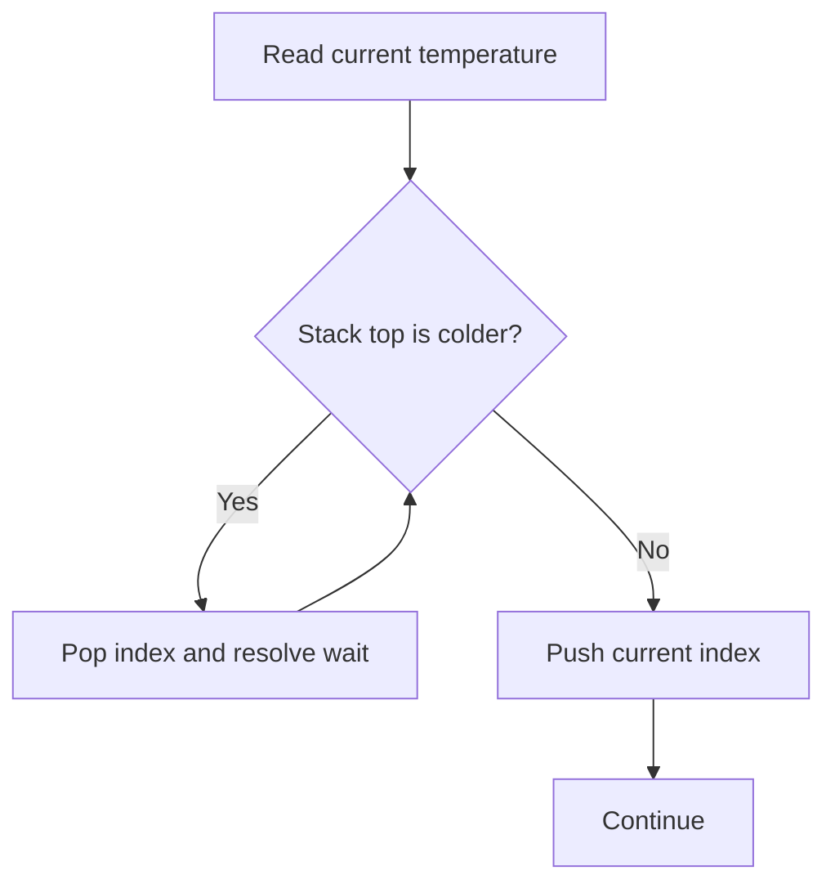

# 🧠 LeetCode Pattern-Based Interview Practice — C#

> **Goal:** Build pattern recognition for coding interviews. Each problem includes intuition, readable C#, complexity, and an interview follow-up.

## 🎨 Legend
- 🟡 **Problem**
- 🟢 **Approach**
- 🔵 **Code**
- 🟣 **Interview follow-up**
- 🔴 **Common mistake**

---

## 1. Longest Substring Without Repeating Characters

🟡 **Difficulty:** Medium  
🔗 [LeetCode #3](https://leetcode.com/problems/longest-substring-without-repeating-characters/)

🟢 **Approach:** Use a sliding window and store the latest index of each character. When a duplicate appears, move the left boundary beyond its previous position.

🔵 **C# Solution**

```csharp
public static int LengthOfLongestSubstring(string s)
{
    var lastSeen = new Dictionary<char, int>();
    int left = 0;
    int best = 0;

    for (int right = 0; right < s.Length; right++)
    {
        char current = s[right];

        if (lastSeen.TryGetValue(current, out int previousIndex))
            left = Math.Max(left, previousIndex + 1);

        lastSeen[current] = right;
        best = Math.Max(best, right - left + 1);
    }

    return best;
}
```

**Complexity:** O(n) time, O(k) space, where k is the character set size.  
🟣 **Follow-up:** How would you adapt the solution for Unicode grapheme clusters?

---

## 2. Product of Array Except Self

🟡 **Difficulty:** Medium  
🔗 [LeetCode #238](https://leetcode.com/problems/product-of-array-except-self/)

🟢 **Approach:** Build prefix products in the result array, then multiply by suffix products. This avoids division and uses O(1) extra space apart from the output.

🔵 **C# Solution**

```csharp
public static int[] ProductExceptSelf(int[] nums)
{
    int[] result = new int[nums.Length];
    int prefix = 1;

    for (int i = 0; i < nums.Length; i++)
    {
        result[i] = prefix;
        prefix *= nums[i];
    }

    int suffix = 1;
    for (int i = nums.Length - 1; i >= 0; i--)
    {
        result[i] *= suffix;
        suffix *= nums[i];
    }

    return result;
}
```

**Complexity:** O(n) time, O(1) auxiliary space.  
🔴 **Common mistake:** Using division fails when zeros are present and may violate the problem constraint.

---

## 3. Daily Temperatures

🟡 **Difficulty:** Medium  
🔗 [LeetCode #739](https://leetcode.com/problems/daily-temperatures/)

🟢 **Approach:** Use a monotonic decreasing stack of indices. When the current temperature is warmer, resolve all colder days on the stack.

🔵 **C# Solution**

```csharp
public static int[] DailyTemperatures(int[] temperatures)
{
    int[] answer = new int[temperatures.Length];
    var stack = new Stack<int>();

    for (int i = 0; i < temperatures.Length; i++)
    {
        while (stack.Count > 0 &&
               temperatures[i] > temperatures[stack.Peek()])
        {
            int previous = stack.Pop();
            answer[previous] = i - previous;
        }

        stack.Push(i);
    }

    return answer;
}
```

**Complexity:** O(n) time because each index is pushed and popped once; O(n) space.  
🟣 **Follow-up:** Explain where a monotonic stack can be used in stock prices, capacity planning, or nearest-greater-value problems.



---

## 4. Number of Islands

🟡 **Difficulty:** Medium  
🔗 [LeetCode #200](https://leetcode.com/problems/number-of-islands/)

🟢 **Approach:** Every unvisited land cell starts one island. Run DFS/BFS to mark all connected land cells as visited.

🔵 **C# Solution**

```csharp
public static int NumIslands(char[][] grid)
{
    int rows = grid.Length;
    int columns = grid[0].Length;
    int islands = 0;
    int[][] directions =
    {
        new[] { 1, 0 }, new[] { -1, 0 },
        new[] { 0, 1 }, new[] { 0, -1 }
    };

    void FloodFill(int row, int column)
    {
        if (row < 0 || row >= rows || column < 0 || column >= columns ||
            grid[row][column] != '1')
            return;

        grid[row][column] = '0';

        foreach (var direction in directions)
        {
            FloodFill(row + direction[0], column + direction[1]);
        }
    }

    for (int row = 0; row < rows; row++)
    {
        for (int column = 0; column < columns; column++)
        {
            if (grid[row][column] == '1')
            {
                islands++;
                FloodFill(row, column);
            }
        }
    }

    return islands;
}
```

**Complexity:** O(rows × columns) time and O(rows × columns) worst-case recursion space.  
🔴 **Production note:** For very large grids, prefer iterative BFS/DFS to avoid stack overflow.

---

## 5. Course Schedule

🟡 **Difficulty:** Medium  
🔗 [LeetCode #207](https://leetcode.com/problems/course-schedule/)

🟢 **Approach:** Model prerequisites as a directed graph. A cycle means the courses cannot be completed. Kahn’s algorithm uses indegrees and a queue.

🔵 **C# Solution**

```csharp
public static bool CanFinish(int numCourses, int[][] prerequisites)
{
    var graph = Enumerable.Range(0, numCourses)
        .Select(_ => new List<int>())
        .ToArray();

    int[] indegree = new int[numCourses];

    foreach (var prerequisite in prerequisites)
    {
        int course = prerequisite[0];
        int dependency = prerequisite[1];
        graph[dependency].Add(course);
        indegree[course]++;
    }

    var queue = new Queue<int>();
    for (int i = 0; i < numCourses; i++)
    {
        if (indegree[i] == 0)
            queue.Enqueue(i);
    }

    int completed = 0;
    while (queue.Count > 0)
    {
        int current = queue.Dequeue();
        completed++;

        foreach (int next in graph[current])
        {
            if (--indegree[next] == 0)
                queue.Enqueue(next);
        }
    }

    return completed == numCourses;
}
```

**Complexity:** O(V + E) time and space.  
🟣 **Architect follow-up:** Where would dependency graphs appear in a deployment orchestrator or workflow engine?

---

## 6. Merge Intervals

🟡 **Difficulty:** Medium  
🔗 [LeetCode #56](https://leetcode.com/problems/merge-intervals/)

🟢 **Approach:** Sort intervals by start time. Merge the current interval when its start is less than or equal to the previous end.

🔵 **C# Solution**

```csharp
public static int[][] Merge(int[][] intervals)
{
    if (intervals.Length <= 1)
        return intervals;

    var sorted = intervals.OrderBy(x => x[0]).ToArray();
    var merged = new List<int[]> { sorted[0] };

    foreach (var current in sorted.Skip(1))
    {
        int[] last = merged[^1];

        if (current[0] <= last[1])
        {
            last[1] = Math.Max(last[1], current[1]);
        }
        else
        {
            merged.Add(current);
        }
    }

    return merged.ToArray();
}
```

**Complexity:** O(n log n) time for sorting and O(n) space.  
🟣 **Real-world use:** Merging maintenance windows, reservations, time ranges, or deployment blackout periods.

---

## 7. Kth Largest Element in an Array

🟡 **Difficulty:** Medium  
🔗 [LeetCode #215](https://leetcode.com/problems/kth-largest-element-in-an-array/)

🟢 **Approach:** Maintain a min-heap of size k. The heap root is the kth largest element seen so far.

🔵 **C# Solution**

```csharp
public static int FindKthLargest(int[] nums, int k)
{
    var minHeap = new PriorityQueue<int, int>();

    foreach (int number in nums)
    {
        minHeap.Enqueue(number, number);

        if (minHeap.Count > k)
            minHeap.Dequeue();
    }

    return minHeap.Peek();
}
```

**Complexity:** O(n log k) time and O(k) space.  
🟣 **Architect follow-up:** Explain how the same pattern supports top-k logs, most-used APIs, or highest-value events in a streaming system.

---

## 8. Binary Search in Rotated Sorted Array

🟡 **Difficulty:** Medium  
🔗 [LeetCode #33](https://leetcode.com/problems/search-in-rotated-sorted-array/)

🟢 **Approach:** At least one half of the array is sorted. Identify the sorted half and decide whether the target belongs to it.

🔵 **C# Solution**

```csharp
public static int Search(int[] nums, int target)
{
    int left = 0;
    int right = nums.Length - 1;

    while (left <= right)
    {
        int middle = left + (right - left) / 2;

        if (nums[middle] == target)
            return middle;

        if (nums[left] <= nums[middle])
        {
            if (nums[left] <= target && target < nums[middle])
                right = middle - 1;
            else
                left = middle + 1;
        }
        else
        {
            if (nums[middle] < target && target <= nums[right])
                left = middle + 1;
            else
                right = middle - 1;
        }
    }

    return -1;
}
```

**Complexity:** O(log n) time and O(1) space.  
🔴 **Common mistake:** Using `(left + right) / 2` can overflow for large integer indexes; use the safe midpoint formula.

---

## 9. Coin Change

🟡 **Difficulty:** Medium  
🔗 [LeetCode #322](https://leetcode.com/problems/coin-change/)

🟢 **Approach:** Bottom-up dynamic programming. `dp[amount]` stores the minimum number of coins needed to create that amount.

🔵 **C# Solution**

```csharp
public static int CoinChange(int[] coins, int amount)
{
    int[] dp = Enumerable.Repeat(amount + 1, amount + 1).ToArray();
    dp[0] = 0;

    for (int current = 1; current <= amount; current++)
    {
        foreach (int coin in coins)
        {
            if (coin <= current)
            {
                dp[current] = Math.Min(
                    dp[current],
                    dp[current - coin] + 1);
            }
        }
    }

    return dp[amount] > amount ? -1 : dp[amount];
}
```

**Complexity:** O(amount × number of coins) time and O(amount) space.  
🟣 **Follow-up:** Explain why a greedy strategy does not always produce the minimum number of coins.

---

## 10. LRU Cache

🟡 **Difficulty:** Medium  
🔗 [LeetCode #146](https://leetcode.com/problems/lru-cache/)

🟢 **Approach:** Combine a dictionary for O(1) lookup with a doubly linked list for O(1) eviction and recency updates.

🔵 **C# Implementation**

```csharp
public sealed class LruCache
{
    private readonly int _capacity;
    private readonly Dictionary<int, LinkedListNode<(int Key, int Value)>> _map = new();
    private readonly LinkedList<(int Key, int Value)> _list = new();

    public LruCache(int capacity) => _capacity = capacity;

    public int Get(int key)
    {
        if (!_map.TryGetValue(key, out var node))
            return -1;

        _list.Remove(node);
        _list.AddFirst(node);
        return node.Value.Value;
    }

    public void Put(int key, int value)
    {
        if (_map.TryGetValue(key, out var existing))
        {
            existing.Value = (key, value);
            _list.Remove(existing);
            _list.AddFirst(existing);
            return;
        }

        var node = new LinkedListNode<(int Key, int Value)>((key, value));
        _list.AddFirst(node);
        _map[key] = node;

        if (_map.Count <= _capacity)
            return;

        var leastRecent = _list.Last!;
        _map.Remove(leastRecent.Value.Key);
        _list.RemoveLast();
    }
}
```

**Complexity:** O(1) average time for `Get` and `Put`; O(capacity) space.  
🟣 **Principal Engineer follow-up:** Discuss thread safety, distributed caching, cache stampede protection, TTL, and consistency when converting this into a production service.

---

## 11. Word Break

🟡 **Difficulty:** Medium  
🔗 [LeetCode #139](https://leetcode.com/problems/word-break/)

🟢 **Approach:** `dp[i]` indicates whether the first i characters can be segmented into dictionary words.

🔵 **C# Solution**

```csharp
public static bool WordBreak(string s, IList<string> wordDict)
{
    var words = wordDict.ToHashSet();
    bool[] dp = new bool[s.Length + 1];
    dp[0] = true;

    for (int end = 1; end <= s.Length; end++)
    {
        for (int start = 0; start < end; start++)
        {
            if (dp[start] && words.Contains(s[start..end]))
            {
                dp[end] = true;
                break;
            }
        }
    }

    return dp[s.Length];
}
```

**Complexity:** O(n²) substring checks in the basic implementation, with additional hashing costs depending on string length.  
🟣 **Follow-up:** How could a trie improve prefix matching for a large dictionary?

---

## 12. Lowest Common Ancestor of a Binary Tree

🟡 **Difficulty:** Medium  
🔗 [LeetCode #236](https://leetcode.com/problems/lowest-common-ancestor-of-a-binary-tree/)

🟢 **Approach:** If the current node is null, p, or q, return it. Recursively search both subtrees. If both sides return a node, the current node is the lowest common ancestor.

🔵 **C# Solution**

```csharp
public class TreeNode
{
    public int Val;
    public TreeNode? Left;
    public TreeNode? Right;

    public TreeNode(int val) => Val = val;
}

public static TreeNode? LowestCommonAncestor(
    TreeNode? root,
    TreeNode p,
    TreeNode q)
{
    if (root is null || root == p || root == q)
        return root;

    TreeNode? left = LowestCommonAncestor(root.Left, p, q);
    TreeNode? right = LowestCommonAncestor(root.Right, p, q);

    if (left is not null && right is not null)
        return root;

    return left ?? right;
}
```

**Complexity:** O(n) time and O(h) recursion space, where h is tree height.  
🟣 **Architect follow-up:** Compare recursive traversal with iterative traversal for deep or untrusted trees.

---

## 🧩 Pattern Recognition Cheat Sheet

| Signal in the problem | Likely pattern |
|---|---|
| Longest/shortest contiguous range | Sliding window |
| Next greater/smaller value | Monotonic stack |
| Sorted input or search space | Binary search / two pointers |
| Dependencies and prerequisites | Graph + topological sort |
| Minimum/maximum over repeated choices | Dynamic programming |
| Top K / streaming ranking | Heap / priority queue |
| Overlapping ranges | Sort + merge intervals |
| Constant-time lookup + eviction order | Hash map + linked list |

## 🧪 Interview Answer Framework

1. Clarify constraints and edge cases.
2. State the brute-force approach briefly.
3. Identify the optimized pattern.
4. Explain the invariant before coding.
5. Write readable code with meaningful names.
6. Validate with an example and boundary cases.
7. State time and space complexity.
8. Discuss production considerations if asked.

## 📚 Official References

- [LeetCode Problem Set](https://leetcode.com/problemset/)
- [C# Language Reference](https://learn.microsoft.com/en-us/dotnet/csharp/language-reference/)
- [PriorityQueue<TElement,TPriority>](https://learn.microsoft.com/en-us/dotnet/api/system.collections.generic.priorityqueue-2)
- [Dictionary<TKey,TValue>](https://learn.microsoft.com/en-us/dotnet/api/system.collections.generic.dictionary-2)
- [LinkedList<T>](https://learn.microsoft.com/en-us/dotnet/api/system.collections.generic.linkedlist-1)
