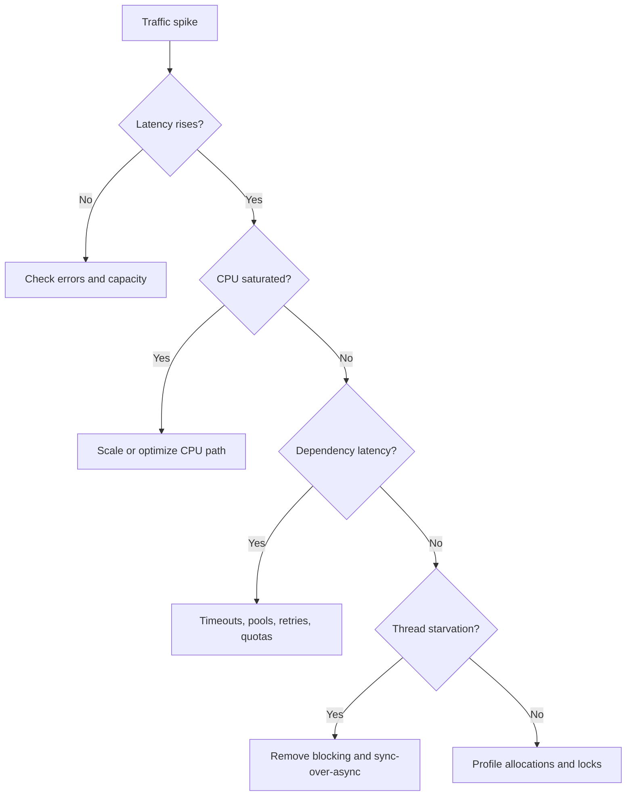

# Advanced .NET Async, Concurrency & Resilience — Principal Engineer Q&A

## 1. When would you use `Task`, `ValueTask`, `IAsyncEnumerable<T>` and `Channel<T>`?

**Answer:**
- `Task<T>` is the default abstraction for asynchronous work and is easiest to compose.
- `ValueTask<T>` can reduce allocations when an operation frequently completes synchronously, but should not be used by default.
- `IAsyncEnumerable<T>` is appropriate for streaming results without buffering the entire dataset.
- `Channel<T>` is useful for producer/consumer pipelines with explicit back-pressure.

### Practical example: bounded producer/consumer
```csharp
var channel = Channel.CreateBounded<Order>(new BoundedChannelOptions(500)
{
    FullMode = BoundedChannelFullMode.Wait,
    SingleReader = true,
    SingleWriter = false
});

await channel.Writer.WriteAsync(order, cancellationToken);
await foreach (var item in channel.Reader.ReadAllAsync(cancellationToken))
{
    await ProcessAsync(item, cancellationToken);
}
```

**Principal-level point:** bounded concurrency is a reliability feature. It prevents an upstream burst from becoming unlimited memory growth or downstream saturation.

## 2. How do you design retry logic without creating a retry storm?

Use bounded retries, exponential backoff, jitter, cancellation, and an explicit retry policy based on failure type. Do not retry validation errors, authentication failures, or most 4xx responses. Prefer idempotent operations or idempotency keys before retrying writes.

```csharp
static TimeSpan Backoff(int attempt) =>
    TimeSpan.FromMilliseconds(Math.Min(10_000, 200 * Math.Pow(2, attempt)));

for (var attempt = 0; attempt < 4; attempt++)
{
    try { return await SendAsync(ct); }
    catch (HttpRequestException) when (attempt < 3)
    {
        var jitter = Random.Shared.Next(0, 250);
        await Task.Delay(Backoff(attempt) + TimeSpan.FromMilliseconds(jitter), ct);
    }
}
throw new InvalidOperationException("Unreachable");
```

## 3. Scenario: an API is healthy at low load but times out at 10x traffic. What do you inspect?

1. Request rate, latency percentiles and saturation.
2. Thread-pool starvation and sync-over-async calls.
3. Connection-pool limits and downstream quotas.
4. Queue depth and consumer throughput.
5. GC pauses and allocation rate.
6. Database connection pool, locks and slow queries.
7. Retry amplification.
8. Autoscale latency and instance limits.

### Mermaid diagnosis flow


## 4. What is the difference between cancellation and timeout?

A timeout is a policy deciding how long an operation may run. Cancellation is a cooperative signal that work should stop. In .NET, a timeout can be implemented with `CancellationTokenSource.CancelAfter`, but cancellation may also originate from a client disconnect, shutdown, or parent operation.

**Interview signal:** propagate `CancellationToken` through every I/O boundary rather than creating unrelated tokens deep inside business code.

## Official documentation
- https://learn.microsoft.com/dotnet/csharp/asynchronous-programming/
- https://learn.microsoft.com/dotnet/core/extensions/channels
- https://learn.microsoft.com/dotnet/api/system.threading.cancellationtoken
