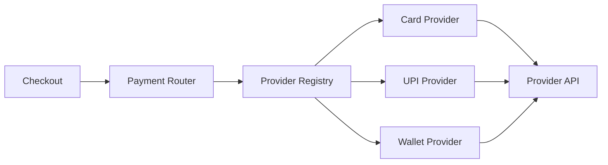

# Production Design Patterns in C# — Interview Q&A

## 1. Strategy vs Factory: what problem does each solve?

**Strategy** selects interchangeable behavior; **Factory** centralizes object creation. They are often used together: a factory selects a strategy implementation and dependency injection supplies its dependencies.

```csharp
public interface IPricingStrategy
{
    decimal Calculate(Order order);
}

public sealed class StandardPricing : IPricingStrategy
{
    public decimal Calculate(Order order) => order.Total;
}

public sealed class PremiumPricing : IPricingStrategy
{
    public decimal Calculate(Order order) => order.Total * 0.90m;
}

public sealed class PricingService(IEnumerable<IPricingStrategy> strategies)
{
    public decimal Quote(Order order, IPricingStrategy strategy) => strategy.Calculate(order);
}
```

## 2. When is Decorator better than inheritance?

Decorator is preferable when cross-cutting behavior must be composed dynamically without creating a subclass for every combination. Typical examples are caching, metrics, authorization, retries and logging around an application service.

```csharp
public sealed class MetricsDecorator(IOrderService inner, IMetrics metrics) : IOrderService
{
    public async Task<Order> GetAsync(Guid id, CancellationToken ct)
    {
        using var timer = metrics.Start("orders.get");
        return await inner.GetAsync(id, ct);
    }
}
```

## 3. Scenario: a service has 15 `if/else` branches for payment providers. How would you refactor it?

Use a provider interface plus a registry keyed by capability/provider type. Keep selection separate from execution. Add contract tests so every provider satisfies the same behavior.



## 4. How do you avoid turning patterns into over-engineering?

Start from a change pressure, not a pattern name. Introduce an abstraction when there is a stable boundary, multiple implementations, a testability need, or a clear volatility axis. Avoid interfaces with only one implementation unless they represent a meaningful architectural boundary.

## Principal-level discussion
A good answer explains **why the pattern reduces coupling**, what new complexity it introduces, and when the pattern should be removed. Design patterns are tools, not architecture by themselves.

## Official documentation
- https://learn.microsoft.com/dotnet/architecture/
- https://learn.microsoft.com/dotnet/core/extensions/dependency-injection
