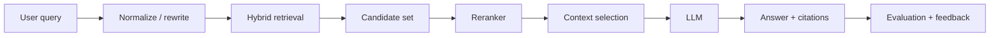

# RAG Retrieval, Evaluation & Production — Principal Engineer Q&A

## 1. Why can a RAG system hallucinate even when the answer is grounded?

Retrieval quality and generation quality are separate failure modes. The retriever may return incomplete or conflicting evidence; the prompt may not force evidence use; the model may over-generalize; or the application may fail to preserve citations and provenance.

A production design should measure retrieval and generation independently.

## 2. How would you improve a RAG system with poor recall?

Start with query analysis and retrieval metrics before changing the model. Inspect chunk boundaries, metadata filters, embedding model, top-k, hybrid lexical/vector retrieval, synonyms and document freshness. Then add reranking if the candidate set has relevant documents but poor ordering.



## 3. What metrics should a Principal Engineer define?

**Retrieval:** Recall@K, Precision@K, MRR or nDCG where appropriate.

**Generation:** answer correctness, faithfulness/groundedness, citation correctness, refusal correctness and task success.

**System:** p50/p95 latency, token usage, cost per successful answer, cache hit rate and failure rate.

The key is to maintain a curated evaluation dataset containing representative questions, expected evidence and acceptable answers.

## 4. Scenario: users report that answers became worse after increasing top-k from 5 to 30. Why?

More context is not automatically better. The context window may contain distractors, duplicated passages or contradictory versions. The model may pay attention to irrelevant passages and increase token cost. Compare retrieval recall against reranked precision and use a context budget.

## 5. How should enterprise RAG handle document authorization?

Authorization must be enforced during retrieval, not merely hidden from the final prompt. Propagate user/tenant claims into retrieval filters and verify that every returned chunk is accessible to the requesting principal.

**Security rule:** never use an unrestricted vector index and rely on the LLM to avoid unauthorized content.

## Practical evaluation skeleton
```python
from dataclasses import dataclass

@dataclass
class RetrievalCase:
    question: str
    relevant_doc_ids: set[str]


def recall_at_k(case: RetrievalCase, retrieved: list[str], k: int) -> float:
    hits = set(retrieved[:k]) & case.relevant_doc_ids
    return len(hits) / max(1, len(case.relevant_doc_ids))
```

## Official documentation
- https://learn.microsoft.com/azure/ai-services/openai/concepts/retrieval-augmented-generation
- https://learn.microsoft.com/azure/search/retrieval-augmented-generation-overview
