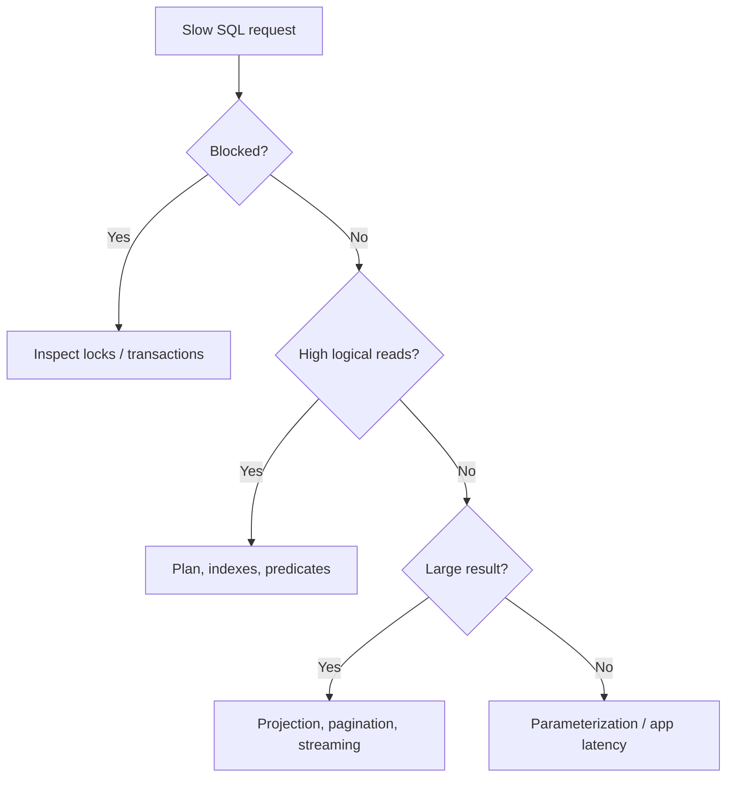

# Advanced SQL: Window Functions, Isolation & Concurrency

## 1. How would you return the latest order per customer?

Use `ROW_NUMBER()` rather than a correlated subquery when the requirement is explicitly ranking rows inside each customer partition.

```sql
WITH ranked AS
(
    SELECT
        CustomerId,
        OrderId,
        OrderDate,
        ROW_NUMBER() OVER
        (
            PARTITION BY CustomerId
            ORDER BY OrderDate DESC, OrderId DESC
        ) AS rn
    FROM Orders
)
SELECT CustomerId, OrderId, OrderDate
FROM ranked
WHERE rn = 1;
```

## 2. What is the difference between `ROW_NUMBER`, `RANK` and `DENSE_RANK`?

`ROW_NUMBER` gives every row a unique sequence. `RANK` gives ties the same rank and leaves gaps. `DENSE_RANK` gives ties the same rank without gaps.

## 3. Scenario: a transaction occasionally reads data that another transaction is changing. How do you reason about isolation?

First identify the business consistency requirement. Then choose the lowest isolation level that satisfies it. Understand dirty reads, non-repeatable reads, phantom reads and write conflicts. On SQL Server, row-versioning options such as Read Committed Snapshot Isolation can reduce reader/writer blocking while changing the consistency model.

## 4. Why can an index make writes slower?

Every insert/update/delete may require maintenance of affected indexes. An index can improve read latency while increasing storage, write amplification and maintenance cost. Measure workload-level impact rather than indexing every filtered column.

## 5. Principal scenario: a query is fast in SSMS but slow from production API calls.

Check parameterization/parameter-sensitive plans, connection settings, transaction scope, blocking, network latency, result-set size, application-side mapping and connection-pool behavior. Capture the actual query and execution plan from the production workload before changing indexes.

### Mermaid decision flow


## Official documentation
- https://learn.microsoft.com/sql/t-sql/queries/select-over-clause-transact-sql
- https://learn.microsoft.com/sql/connect/jdbc/understanding-isolation-levels
- https://learn.microsoft.com/sql/relational-databases/sql-server-index-design-guide
