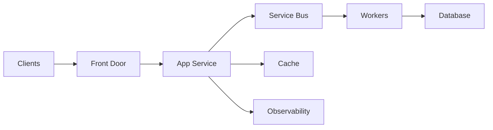

# Azure PaaS Reliability — Principal Engineer Scenario Q&A

## 1. Scenario: an Azure App Service API must survive a regional dependency outage.

Design for dependency isolation rather than assuming every service is always available. Use health-aware routing where appropriate, durable messaging for asynchronous work, retries with jitter, circuit breakers, idempotency and a tested disaster-recovery plan.



## 2. What is the difference between availability and resiliency?

Availability describes whether the service is usable at a point in time. Resiliency describes the ability to withstand and recover from failures while maintaining an acceptable level of service.

## 3. How do you prevent Service Bus consumers from processing the same message twice?

Assume at-least-once delivery. Make processing idempotent using a business key or message ID, persist processing state transactionally where possible, and design poison-message handling with dead-letter queues.

```csharp
public async Task HandleAsync(OrderCreated message, CancellationToken ct)
{
    if (await store.AlreadyProcessedAsync(message.EventId, ct))
        return;

    await orderService.ApplyAsync(message, ct);
    await store.MarkProcessedAsync(message.EventId, ct);
}
```

## 4. Scenario: autoscaling increases instances but latency remains high.

Ask whether the bottleneck is actually scalable. A shared database, downstream API quota, storage partition, connection pool or serialized lock can cap throughput regardless of compute instances.

**Principal answer:** identify the constrained resource and its scaling dimension before adding more compute.

## 5. What should be observable?

Track request rate, error rate, p50/p95/p99 latency, dependency latency, queue depth/age, saturation, throttling, retries and business-level success metrics. Correlate requests with distributed traces and stable correlation IDs.

## Official documentation
- https://learn.microsoft.com/azure/architecture/framework/resiliency/
- https://learn.microsoft.com/azure/service-bus-messaging/message-transfers-locks-settlement
- https://learn.microsoft.com/azure/azure-monitor/app/distributed-tracing
- https://learn.microsoft.com/azure/frontdoor/front-door-overview
