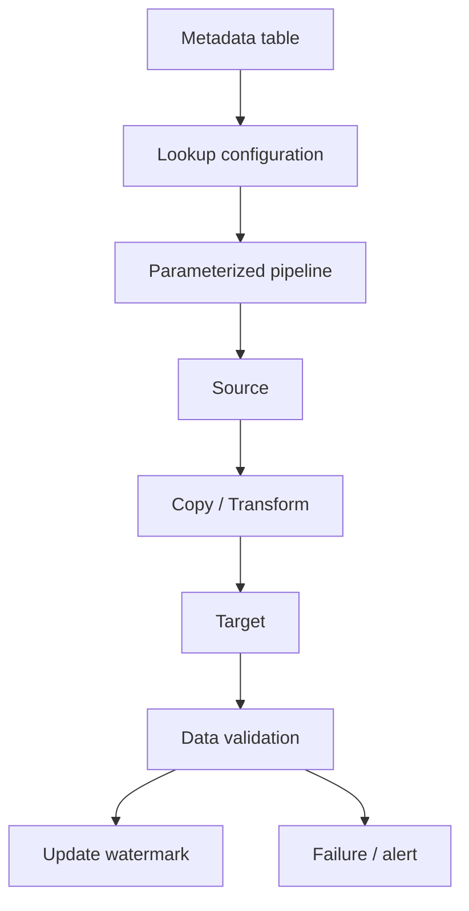

# Azure Data Factory — Operational Excellence Interview Q&A

## 1. How do you design an ADF pipeline that can safely restart?

Make each stage idempotent, persist watermarks/checkpoints, separate extraction from loading where useful, and avoid using a single mutable global state. A rerun should not duplicate data.

## 2. Scenario: a daily incremental pipeline suddenly processes 3x data.

Check source watermark logic, late-arriving data, duplicate keys, schema changes, trigger overlap, partition distribution and downstream retries. Compare activity input/output counts with historical baselines.

## 3. How would you implement a metadata-driven ingestion framework?

Store source configuration in a control table: source object, destination, load type, watermark column, last successful watermark, partition strategy and validation rules. A generic pipeline reads metadata and uses parameters to execute the correct copy/transformation path.

## 4. How do you handle schema drift?

Treat schema drift as a controlled compatibility problem. Detect changes, validate whether they are additive or breaking, quarantine unexpected payloads when necessary, and version downstream contracts. Do not silently allow a breaking schema change into critical reporting tables.

## 5. Principal scenario: pipeline succeeds but data is wrong.

Operational success is not data correctness. Add row-count reconciliation, uniqueness checks, null/range validation, freshness checks and source-to-target control totals. Publish data-quality metrics and fail or quarantine data according to business criticality.

## 6. How do you reduce ADF cost?

Measure activity duration and integration runtime utilization. Reduce unnecessary data movement, use appropriate partitioning, avoid tiny-file explosions, reuse metadata-driven pipelines and tune transformation compute. Optimize for cost per successful data product, not only pipeline duration.

## Official documentation
- https://learn.microsoft.com/azure/data-factory/introduction
- https://learn.microsoft.com/azure/data-factory/continuous-integration-delivery
- https://learn.microsoft.com/azure/data-factory/copy-activity-overview
- https://learn.microsoft.com/azure/data-factory/monitor-visually
