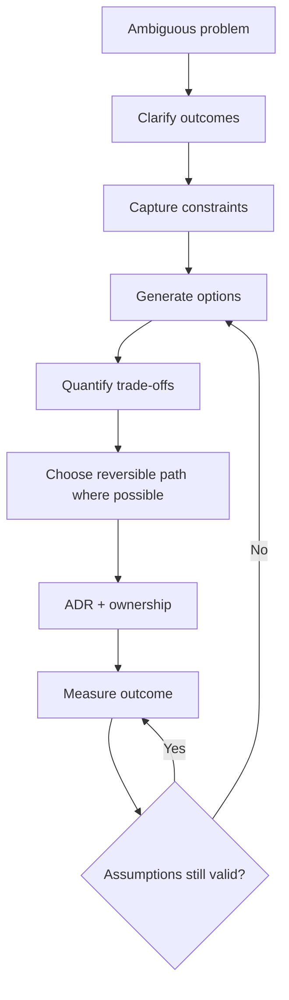

# Principal Engineer & Architect — Trade-offs, Leadership and Execution

## 1. Scenario: two teams disagree between microservices and a modular monolith. What do you do?

Do not choose from ideology. Compare team ownership, deployment independence, scaling boundaries, data ownership, failure isolation, operational maturity and expected change rate. A modular monolith is often the lower-risk starting point when independent scaling and deployment are not yet justified.

## 2. How do you communicate an architecture decision?

Write an ADR containing context, constraints, decision, alternatives considered, consequences, operational impact and rollback/migration strategy. Make the decision discoverable and time-box assumptions that need validation.

## 3. Scenario: a high-performing team repeatedly misses delivery commitments.

Investigate system constraints rather than immediately blaming execution: unclear scope, dependency queues, unstable priorities, architecture debt, test environments, production support load and unrealistic estimates. Establish measurable flow metrics and remove the largest bottleneck.

## 4. What distinguishes a Principal Engineer from a senior implementer?

A Principal Engineer improves outcomes beyond one codebase: they clarify ambiguous problems, make high-leverage technical decisions, manage cross-team dependencies, reduce systemic risk, create reusable engineering mechanisms and communicate trade-offs to technical and business stakeholders.

## 5. Architecture review checklist

- Business capability and success metrics
- Functional/non-functional requirements
- Availability, latency and throughput targets
- Data ownership and consistency
- Security and identity boundaries
- Failure modes and recovery
- Cost and capacity model
- Observability and operations
- Deployment and rollback
- Migration path
- Team ownership and long-term maintainability

## 6. Strong interview answer pattern

Use **Context → Constraints → Options → Decision → Trade-offs → Execution → Metrics → Lessons**. This prevents Principal-level answers from becoming a list of technologies.

## Official documentation
- https://learn.microsoft.com/azure/architecture/guide/architecture-styles/
- https://learn.microsoft.com/azure/well-architected/
