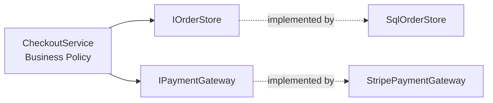

# SOLID: Dependency Inversion in Production — Interview Q&A

## Question
A business service directly creates `SqlConnection`, calls a REST client, and writes audit logs. Which SOLID principle is violated and how would you redesign it?

### Answer
The strongest violation is Dependency Inversion Principle (DIP). High-level business policy should depend on abstractions, while infrastructure implements those abstractions. Dependency Injection then supplies the implementations.

```csharp
public interface IOrderStore
{
    Task SaveAsync(Order order, CancellationToken ct);
}

public interface IPaymentGateway
{
    Task ChargeAsync(decimal amount, CancellationToken ct);
}

public sealed class CheckoutService
{
    private readonly IOrderStore store;
    private readonly IPaymentGateway payments;

    public CheckoutService(IOrderStore store, IPaymentGateway payments)
        => (this.store, this.payments) = (store, payments);

    public async Task CheckoutAsync(Order order, CancellationToken ct)
    {
        await payments.ChargeAsync(order.Total, ct);
        await store.SaveAsync(order, ct);
    }
}
```

## Dependency Direction


## Principal/Architect Follow-ups
- How many interfaces are too many?
- When does an abstraction become accidental complexity?
- Where should transaction boundaries live?
- How do you keep domain code independent from Azure SDK types?

## Practical Rule
Do not create interfaces mechanically for every class. Introduce an abstraction when it protects a meaningful architectural boundary, enables substitution/testing, or isolates volatile infrastructure.

## Official Documentation
- https://learn.microsoft.com/dotnet/core/extensions/dependency-injection
- https://learn.microsoft.com/aspnet/core/fundamentals/dependency-injection
