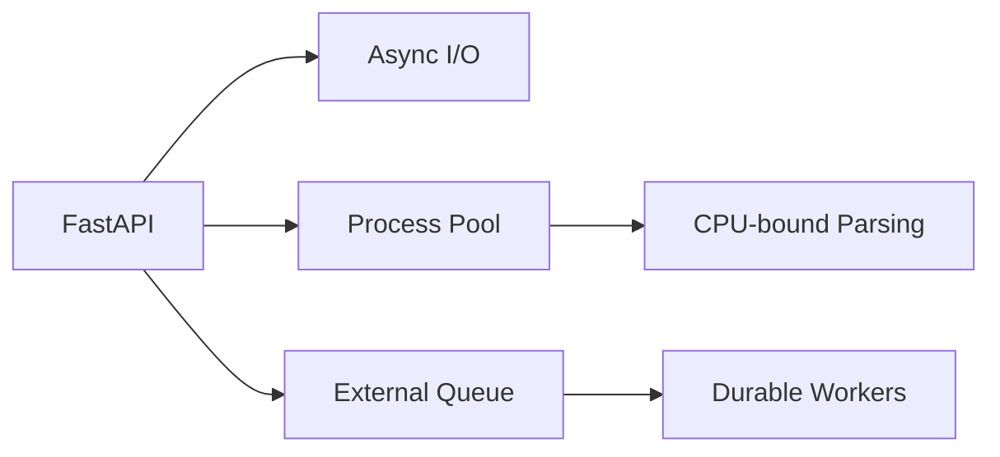

# Python + FastAPI Production Concurrency — Interview Q&A

## Scenario
A FastAPI endpoint performs a CPU-heavy PDF parsing operation and latency of unrelated requests suddenly increases. Why?

### Answer
An `async def` endpoint does not make CPU-bound work asynchronous. CPU-heavy work executed directly on the event-loop thread can block other requests. Move CPU-heavy work to a process pool or an external worker system. Use async I/O for network/database operations.

```python
from fastapi import FastAPI
from concurrent.futures import ProcessPoolExecutor
import asyncio

app = FastAPI()
pool = ProcessPoolExecutor(max_workers=4)

def parse_pdf(path: str) -> dict:
    # CPU-bound work
    return expensive_parse(path)

@app.get("/documents/{doc_id}")
async def parse(doc_id: str):
    loop = asyncio.get_running_loop()
    result = await loop.run_in_executor(pool, parse_pdf, f"/data/{doc_id}.pdf")
    return result
```

## Architecture


## Principal Follow-ups
- When should a process pool become a queue-based worker service?
- How do you implement graceful shutdown?
- How do you apply request timeouts and cancellation?
- Which workloads benefit from async versus multiprocessing?

## Production Checklist
- Keep blocking libraries off the event loop.
- Set timeouts on outbound calls.
- Use structured logging and correlation IDs.
- Bound concurrency rather than spawning unlimited tasks.

## Official Documentation
- https://fastapi.tiangolo.com/async/
- https://docs.python.org/3/library/asyncio.html
- https://docs.python.org/3/library/concurrent.futures.html
