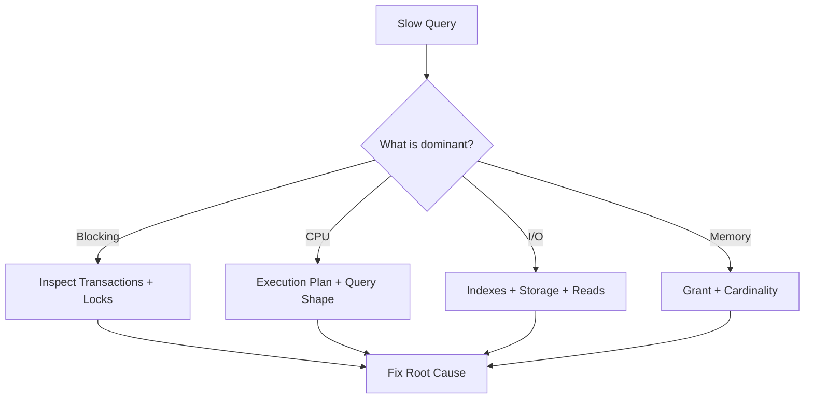

# SQL Performance & Concurrency — Architect Interview Q&A

## Scenario
A query that normally takes 200 ms suddenly takes 20 seconds under load. CPU is moderate, but many sessions are waiting. What do you investigate first?

### Answer
Inspect the wait profile, blocking chains, execution plan, recent statistics/index changes, parameter sensitivity, and transaction duration. Do not assume an index is the answer before identifying the dominant wait.

## Useful Diagnostic Query (SQL Server)
```sql
SELECT
    r.session_id,
    r.status,
    r.wait_type,
    r.wait_time,
    r.blocking_session_id,
    r.cpu_time,
    r.logical_reads,
    t.text AS sql_text
FROM sys.dm_exec_requests AS r
CROSS APPLY sys.dm_exec_sql_text(r.sql_handle) AS t
WHERE r.session_id <> @@SPID;
```

## Architecture Thinking


## Principal Follow-ups
- Why can adding an index make writes worse?
- What is the trade-off between snapshot isolation and locking?
- How do you detect a missing or stale statistic?
- How would you diagnose parameter-sensitive plans?

## Official Documentation
- https://learn.microsoft.com/sql/relational-databases/system-dynamic-management-views/sys-dm-exec-requests-transact-sql
- https://learn.microsoft.com/sql/relational-databases/performance-monitor/sql-server-statistics
- https://learn.microsoft.com/sql/relational-databases/sql-server-transaction-locking-and-row-versioning-guide
