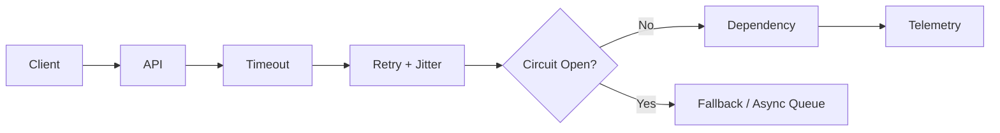

# Azure PaaS Resiliency & Messaging — Architect Q&A

## Scenario
An API calls three downstream services. One dependency becomes slow and causes request threads to pile up. How do you design for failure?

### Answer
Use explicit timeouts, bounded retries with exponential backoff and jitter, circuit breakers, bulkheads/concurrency limits, and asynchronous messaging where synchronous coupling is unnecessary. Retries must be limited and only applied to transient failures; otherwise they amplify an outage.

## Resilient Flow


## Azure Service Bus Example
```csharp
await sender.SendMessageAsync(
    new ServiceBusMessage(BinaryData.FromObjectAsJson(command))
    {
        Subject = "OrderCreated",
        MessageId = command.OrderId.ToString()
    },
    cancellationToken);
```

Use a stable `MessageId` and idempotent consumers when duplicate delivery is possible.

## Principal Follow-ups
- Why is retrying every HTTP 500 dangerous?
- When would you choose Service Bus versus Event Hubs?
- How do you design dead-letter processing?
- Which SLOs determine scaling and failover decisions?

## Official Documentation
- https://learn.microsoft.com/azure/service-bus-messaging/service-bus-messaging-overview
- https://learn.microsoft.com/azure/architecture/best-practices/retry-service-specific
- https://learn.microsoft.com/azure/architecture/framework/resiliency/overview
