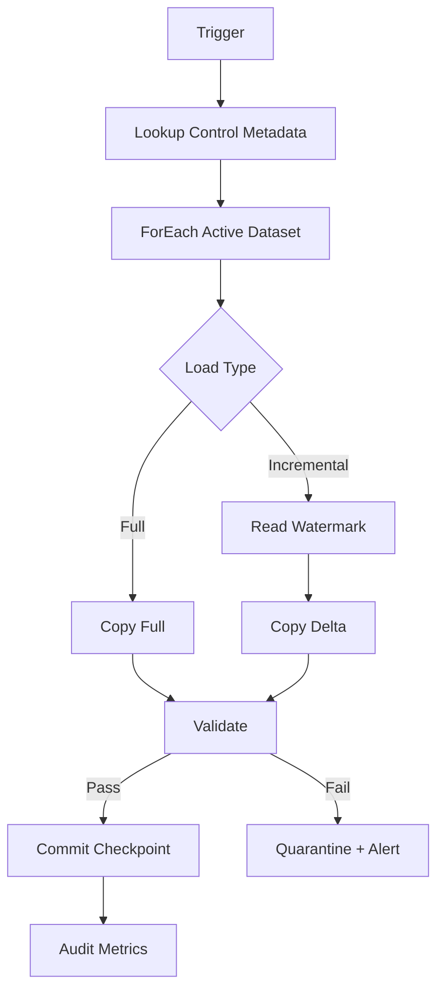

# Azure Data Factory: Metadata-Driven & Idempotent Pipelines

## Scenario
You must ingest 500 tables from multiple databases every night. Source schemas evolve, loads must be restartable, and operations wants one reusable pipeline. How do you design it?

### Answer
Use a metadata/control table containing source object, destination, load strategy, watermark column, last successful watermark, enabled state, and data-quality rules. A generic ADF pipeline reads metadata and invokes parameterized copy activities. Persist checkpoints only after successful processing.

## Pipeline Flow


## Example Control Table
```sql
CREATE TABLE ingestion_control
(
    pipeline_name varchar(100) NOT NULL,
    source_schema varchar(128) NOT NULL,
    source_table varchar(128) NOT NULL,
    watermark_column varchar(128) NULL,
    last_successful_watermark datetime2 NULL,
    load_type varchar(20) NOT NULL,
    is_active bit NOT NULL
);
```

## Architect-Level Answers
**How do you make retries safe?** Make each load deterministic and idempotent. Write to a staging area, validate, then merge/commit using a stable business key or batch identifier.

**How do you handle schema drift?** Define an explicit contract for critical columns. Allow controlled additive changes where safe, but quarantine breaking changes rather than silently changing downstream semantics.

**How do you operate it?** Capture pipeline/run IDs, row counts, duration, watermark, source/destination, validation results, and error category in an audit store.

## Official Documentation
- https://learn.microsoft.com/azure/data-factory/introduction
- https://learn.microsoft.com/azure/data-factory/copy-activity-overview
- https://learn.microsoft.com/azure/data-factory/monitor-visually
