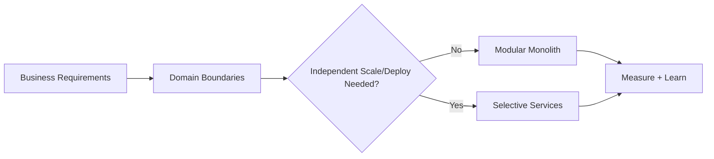
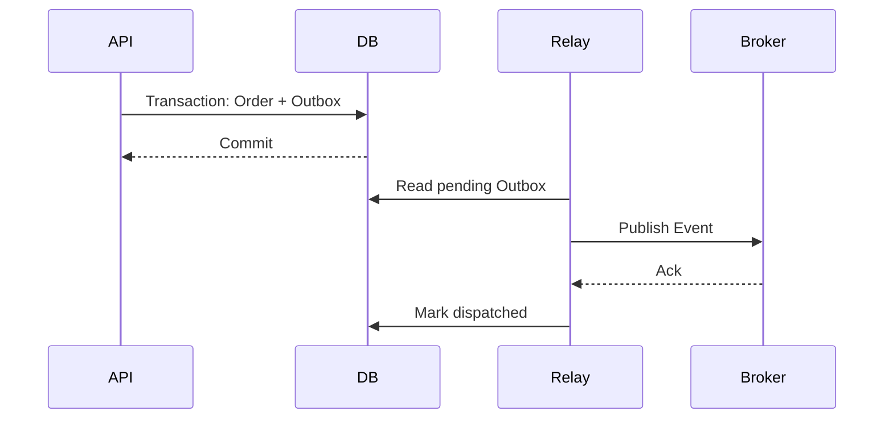

# Principal Engineer & Architect: Architecture Trade-off Scenarios

## Scenario 1 — Microservices vs Modular Monolith
A team proposes 20 microservices for a new product because the company uses Kubernetes everywhere. What do you challenge?

### Strong Answer
Start with domain boundaries, team topology, deployment independence, scaling differences, failure isolation, and operational maturity. A modular monolith can be the better initial architecture when the domain is still changing rapidly and independent scaling is not yet required.

## Scenario 2 — Eventual Consistency
An order service writes to its database and publishes an event. What happens if the database commit succeeds but publishing fails?

### Strong Answer
Avoid a naive dual write. Use the transactional outbox pattern: commit business state and an outbox record in one transaction, then asynchronously publish the outbox message and mark it dispatched. Consumers remain idempotent.

## Scenario 3 — Architecture Decision
Two teams disagree between PostgreSQL and Cosmos DB. How do you decide?

### Strong Answer
Write explicit decision criteria: consistency model, access patterns, relational constraints, partitioning, throughput, latency, operational model, cost, team expertise, and failure requirements. Record assumptions in an ADR and define what evidence would invalidate the decision.

## Principal-Level Follow-ups
- How do you influence a team without direct authority?
- How do you balance delivery pressure against technical risk?
- What belongs in an ADR versus a coding standard?
- How do you recognize architecture that is over-engineered?
- How would you communicate a major architecture change to executives?

## Official Documentation
- https://learn.microsoft.com/azure/architecture/guide/architecture-styles
- https://learn.microsoft.com/azure/architecture/patterns/transactional-outbox
- https://learn.microsoft.com/azure/architecture/patterns
