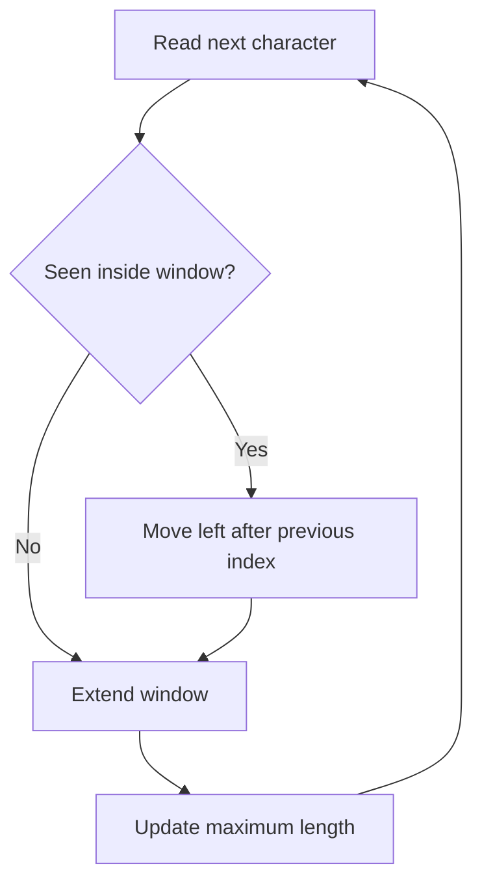

# 🟡 12. Longest Substring Without Repeating Characters

🔗 [LeetCode Problem](https://leetcode.com/problems/longest-substring-without-repeating-characters/)  
**Difficulty:** Medium  
**Pattern:** Sliding Window + Hash Set

## 🟦 Problem
Given a string, return the length of the longest substring without repeating characters.

Example: `abcabcbb` → `3` (`abc`)

## 🟢 Approach
Maintain a window `[left, right]`. When a duplicate appears, move `left` beyond the previous position of that character.

## 💻 C# Solution
```csharp
public static int LengthOfLongestSubstring(string s)
{
    var lastSeen = new Dictionary<char, int>();
    int left = 0;
    int best = 0;

    for (int right = 0; right < s.Length; right++)
    {
        char current = s[right];

        if (lastSeen.TryGetValue(current, out int previous)
            && previous >= left)
        {
            left = previous + 1;
        }

        lastSeen[current] = right;
        best = Math.Max(best, right - left + 1);
    }

    return best;
}
```

## ⏱️ Complexity
- Time: `O(n)`
- Space: `O(min(n, character-set-size))`

## 🟠 Interview Follow-ups
- How would you support Unicode grapheme clusters?
- Why is moving `left` directly better than removing characters one by one?
- How would you adapt this for a bounded window?

## 🔄 Flow

