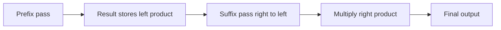

# 🟡 13. Product of Array Except Self

🔗 [LeetCode Problem](https://leetcode.com/problems/product-of-array-except-self/)  
**Difficulty:** Medium  
**Pattern:** Prefix/Suffix Products

## 🟦 Problem
Return an array where each element equals the product of all input elements except itself. Do not use division.

Example: `[1,2,3,4]` → `[24,12,8,6]`

## 🟢 Approach
Store prefix products in the result, then multiply each result value by a running suffix product.

## 💻 C# Solution
```csharp
public static int[] ProductExceptSelf(int[] nums)
{
    int[] result = new int[nums.Length];
    int prefix = 1;

    for (int i = 0; i < nums.Length; i++)
    {
        result[i] = prefix;
        prefix *= nums[i];
    }

    int suffix = 1;
    for (int i = nums.Length - 1; i >= 0; i--)
    {
        result[i] *= suffix;
        suffix *= nums[i];
    }

    return result;
}
```

## ⏱️ Complexity
- Time: `O(n)`
- Auxiliary space: `O(1)` excluding the output array

## 🟠 Interview Follow-ups
- How do zero values affect the solution?
- What integer overflow risks exist?
- How would you implement this with `long` or checked arithmetic?

## 🔄 Flow

