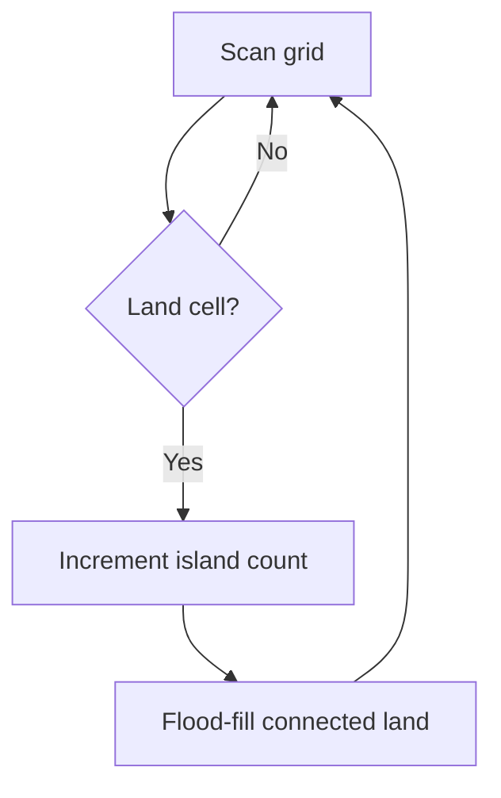

# 🟡 14. Number of Islands

🔗 [LeetCode Problem](https://leetcode.com/problems/number-of-islands/)  
**Difficulty:** Medium  
**Pattern:** Graph Traversal / DFS

## 🟦 Problem
Count connected groups of `'1'` cells in a 2D grid. Cells connect horizontally and vertically.

## 🟢 Approach
Whenever an unvisited land cell is found, increment the count and flood-fill its island using DFS.

## 💻 C# Solution
```csharp
public static int NumIslands(char[][] grid)
{
    int count = 0;

    for (int r = 0; r < grid.Length; r++)
    {
        for (int c = 0; c < grid[r].Length; c++)
        {
            if (grid[r][c] != '1') continue;

            count++;
            Dfs(grid, r, c);
        }
    }

    return count;
}

private static void Dfs(char[][] grid, int r, int c)
{
    if (r < 0 || r >= grid.Length ||
        c < 0 || c >= grid[r].Length ||
        grid[r][c] != '1') return;

    grid[r][c] = '0';
    Dfs(grid, r + 1, c);
    Dfs(grid, r - 1, c);
    Dfs(grid, r, c + 1);
    Dfs(grid, r, c - 1);
}
```

## ⏱️ Complexity
- Time: `O(rows × columns)`
- Space: `O(rows × columns)` worst-case recursion stack

## 🟠 Interview Follow-ups
- When should iterative BFS/DFS be preferred?
- How can you avoid stack overflow for a very large grid?
- How would you count island perimeter or largest island area?

## 🔄 Flow

